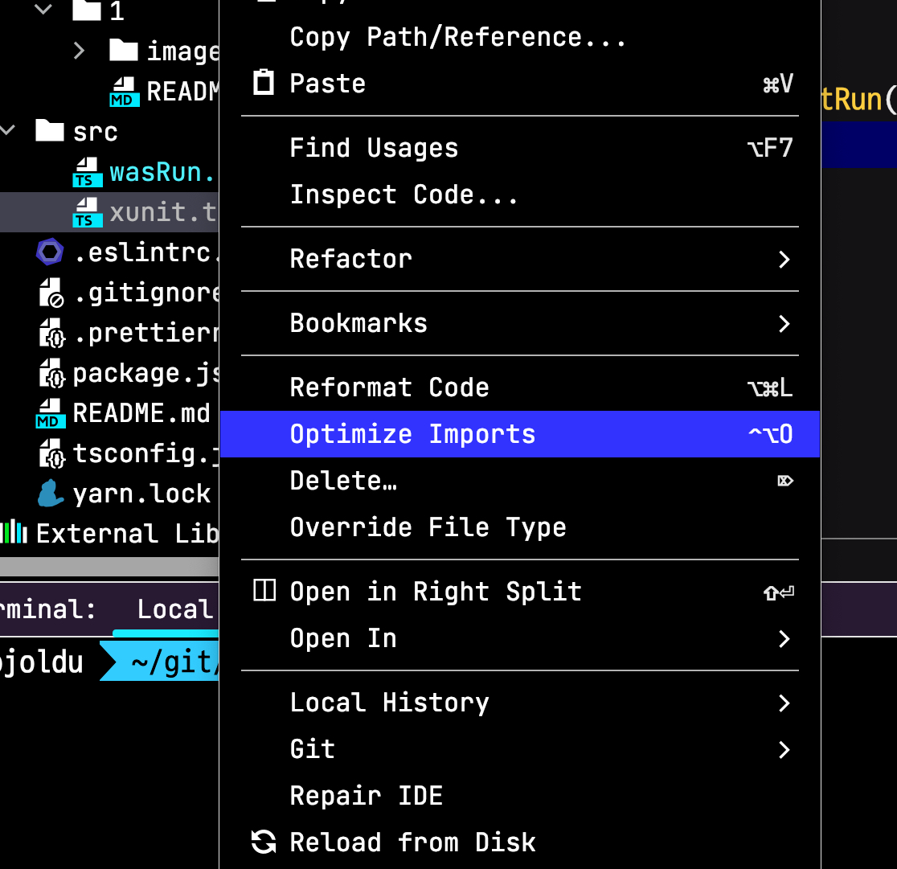
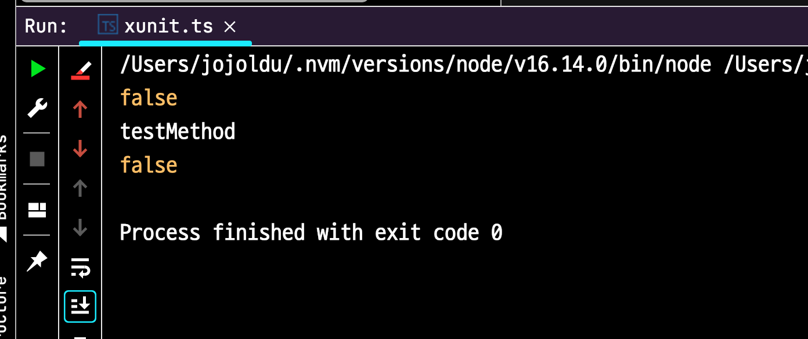

# WebStorm에서 TypeScript 파일 단독으로 실행하기

WebStorm에서 기본적으로는 TypeScript 파일만 단독으로 실행할 수는 없다.  



단독으로 실행이 필요할 경우 JS 파일로 컴파일 후, 실행해야만 한다.

* [Run server-side TypeScript with Node.js](https://www.jetbrains.com/help/webstorm/running-and-debugging-typescript.html#d38b8993)

이 과정이 개발의 흐름을 많이 끊기 때문에 일반적인 JavaScript 파일을 실행하듯이 TypeScript 실행 환경이 필요하다.  

## 개선

TypeScript 파일만 단독으로 수행하기 개별 플러그인만 설치하면 가능하다.

* [Run Configuration for TypeScript](https://plugins.jetbrains.com/plugin/10841-run-configuration-for-typescript/)

해당 플러그인 설치후, 프로젝트에 `ts-node` 를 설치한다.

```bash
yarn add --dev ts-node
```

그리고 TS 파일을 다시 한번 우클릭 해보면?  
다음과 같이 `Run/Debug` 실행 버튼이 생성된 것을 확인할 수 있다.


해당 버튼을 클릭해 실제로 수행해본다.  
그럼 다음과 같이 정상적으로 TS 파일이 컴파일 되어 실행되는 것을 확인할 수 있다.

