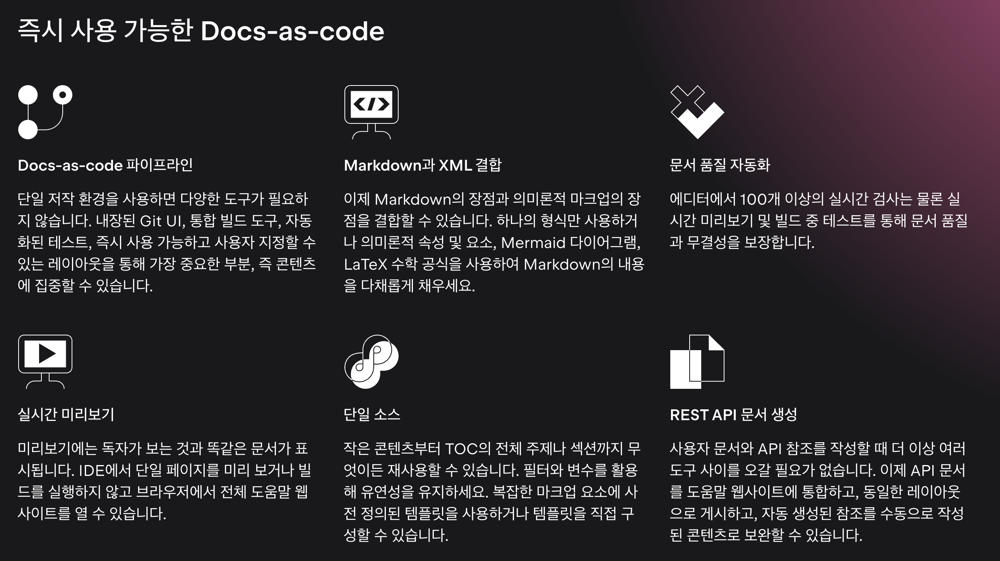

# Writerside 시작하기

IntelliJ 와 PyCharm 등 개발도구로 유명한 젯브레인에서 이번에 **문서 작성 도구**를 출시했다.  

원래도 마크다운, 아스키독을 사용하기 위해 VS Code를 활용하던 내 입장에서는 굉장히 매력적인 도구가 출시된 느낌이다.  
젯브레인 특유의 사용성과 단축키를 좋아해서 안그래도 VS Code를 대신해서 Fleet를 고려하던 중이였다.  
다만, Fleet 은 **아직까지 마크다운 기능을 정상적으로 지원하고 있지 않다**.  
그래서 여전히 VS Code에 종속된 글쓰기를 하던 중에 적당한 도구가 생긴셈이다.  

## 소개

- "문서 작성에 최적화된 가장 강력한 개발 환경"
- Docs-as-Code : 통합 작성환경에서 모든 것을 한번에 처리 가능. Git UI, 내장 빌드 도구, 테스트자동화, 커스텀 레이아웃 등
- Markdown 과 XML을 동시에 지원하며, 둘을 결합하여 작성하는 것도 가능
- 100개 이상의 on-the-fly 인스펙션을 제공. 실시간 미리보기 및 빌드중 테스트로 품질과 무결성 보장
- REST API 자동 생성
- 현재 Early Access Program으로 무료 공개중. 공식 릴리즈후에도 무료버전을 제공할 예정이라 계속 무료로 이용 가능
- 지금은 웹 버전 문서를 빌드하지만, PDF 출력도 지원할 예정