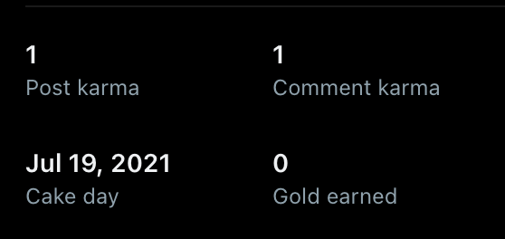

# 글로벌 전략 - 2024

## 커뮤니티 활동

### 레딧 활동

레딧은 카르마와 커뮤니티를 이해해야한다.

일부 커뮤니티는 **댓글을 쓰는 것 조차 카르마가 필요**하다.  
그래서 다른 커뮤니티에서 카르마를 적립해야만 활동이 가능했다.
개발 관련 대형 커뮤니티 중 댓글은 별도의 카르마 없이 작성가능한 곳들이 있어서 이들에서 댓글 카르마를 쌓으면 된다.
- [webdev](https://www.reddit.com/r/webdev/)

### Grammarly 도움 받기

[Grammarly](https://www.grammarly.com/) 를 통해 번역된 결과에 대한 문법 보정을 받는다.  
크롬 플러그인으로 Grammarly를 설치해서 사용하면 레딧에서 작성중인 모든 글, 댓글에 대해 실시간으로 문법 보정을 받을 수 있다.  
작성완료 하기 전 한번 문법 검사를 하고 작성을 하면 훨씬 더 수려한 문장으로 커뮤니티 활동이 가능하다.

