# 네이버 블로그에 쿠팡파트너스 적용하기

여자친구의 쿠팡파트너스 도입을 돕기 위해 정리합니다.  
네이버 블로그를 갖고 있지만, 네이버 애드포스트로는 만족스럽지 못한 분들은 쿠팡 파트너스를 한번 고려해보시는걸 추천드립니다.  
  
쿠팡파트너스의 경우 클릭당 수익은 아니며, 링크를 통해 구매된 물건의 3 ~ 8%의 중개료를 돌려주는 방식입니다.  
  
> 상품리뷰를 전문적으로 하시는 분들에겐 딱 맞는 광고 상품인것 같습니다.  

여튼 이 쿠팡 파트너스를 어떻게 네이버 블로그에서 사용하는지 공유드리겠습니다.  

> [네이버 블로그](https://section.blog.naver.com/BlogHome.nhn)와 [쿠팡 파트너스](https://partners.coupang.com)는 이미 가입된 상태여야만 합니다.

## 1. 위젯 등록

먼저 블로그 화면 사이드바에 노출될 위젯을 등록하겠습니다.  
자신의 블로그 관리 화면으로 이동합니다.

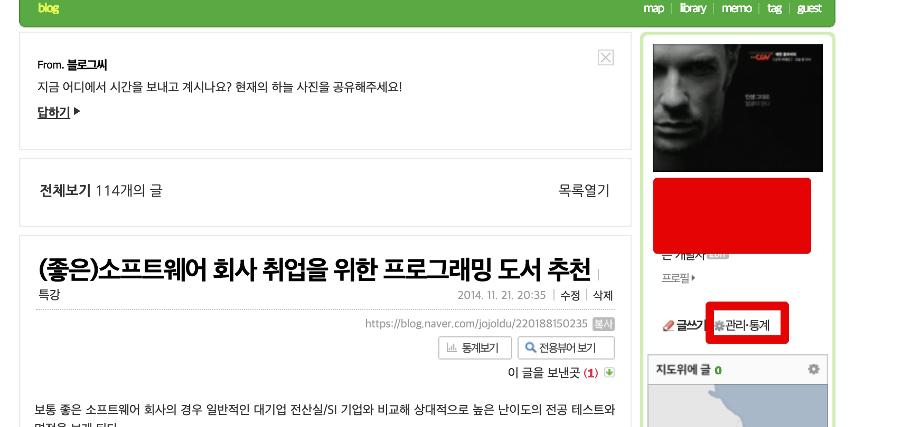

관리 화면에서 꾸미기 설정 -> 디자인 설정 -> 레이아웃 위젯 설정 순으로 버튼을 클릭합니다

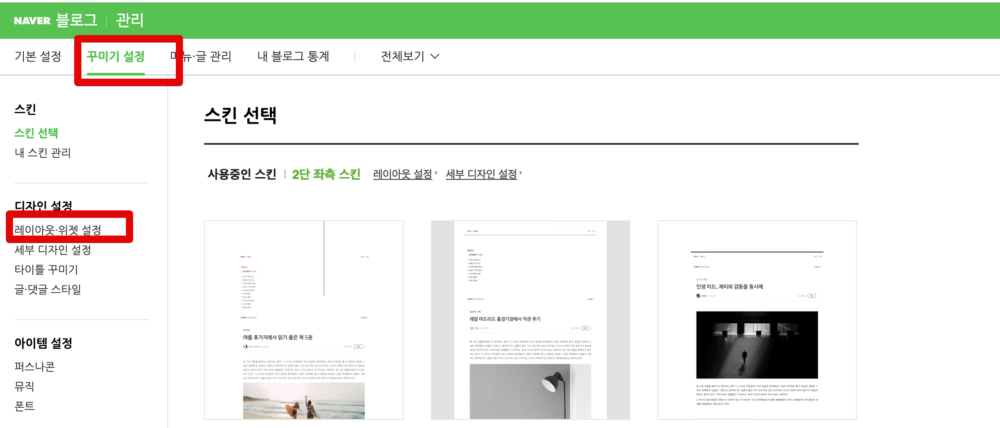

그럼 전체 레이아웃을 디자인할 수 있는 편집 화면으로 이동하는데요.  
여기서 우측 하단에 있는 **위젯직접등록**버튼을 클릭합니다.

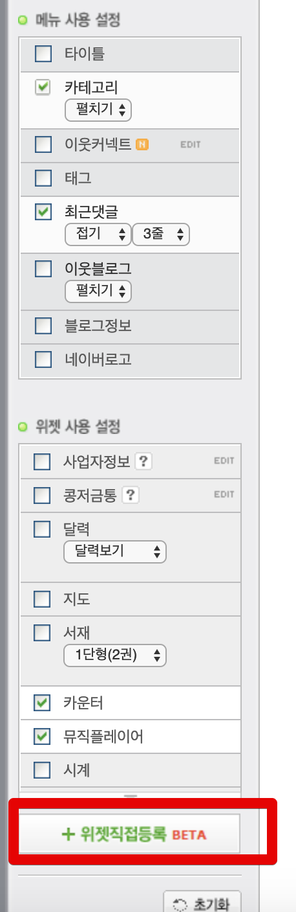

위젯 등록 화면이 뜨면 잠깐 화면을 두고, 새로운 인터넷 브라우저를 열어 쿠팡 파트너스로 이동합니다.  
  
쿠팡 파트너스에서는 **상품 링크** -> **배너** 를 차례로 클릭합니다.

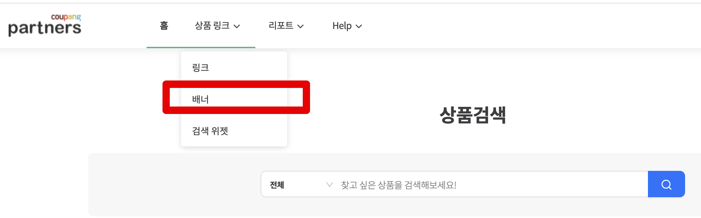

배너에서 본인이 **항상 블로그 사이드바에 노출시키고 싶은 카테고리**를 선택합니다.

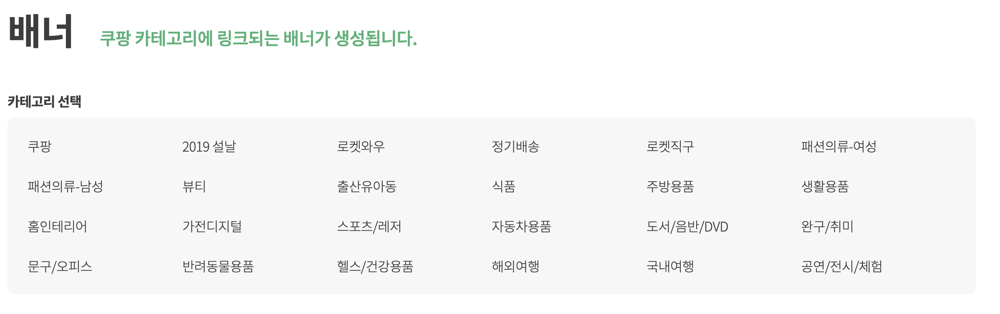

그럼 아래와 같이 여러 형태의 배너가 나오는데, 여기서는 사이드바에 어울리는 160*600을 선택합니다.  
그리고 HTML 코드를 그대로 복사합니다.

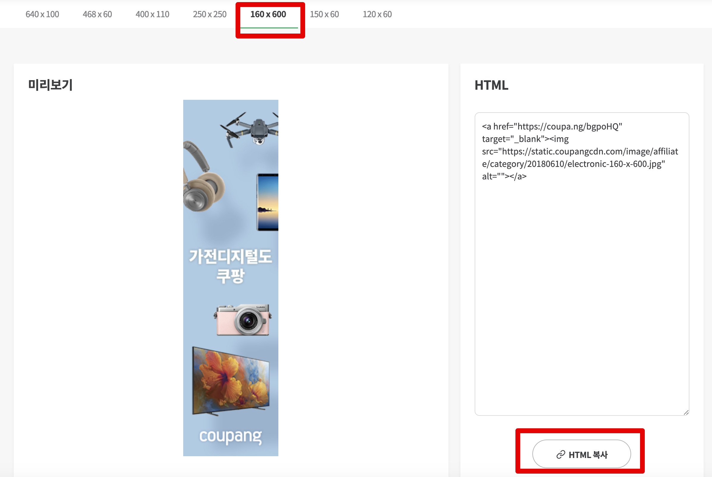

복사한 HTML코드를 좀 전에 열어둔 위젯 등록 창에 붙여넣습니다.

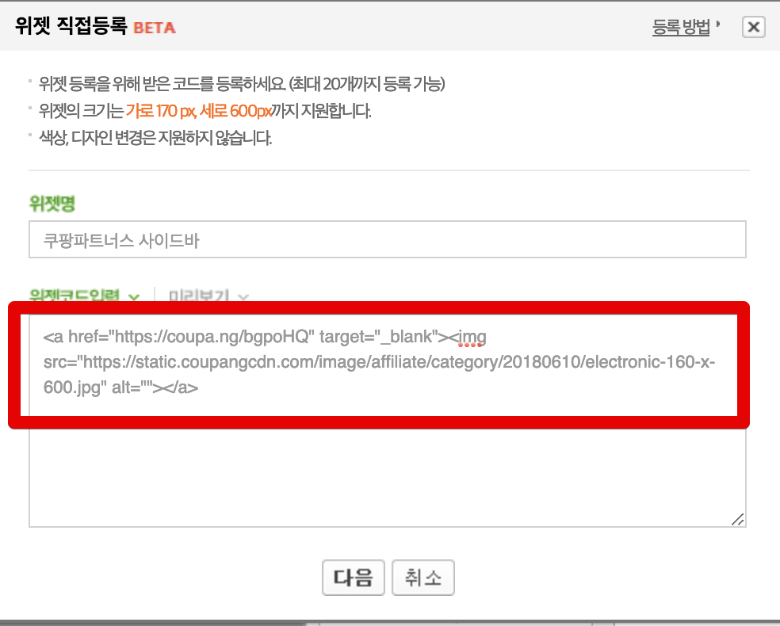

저장하시면 위젯 화면 **사이드바 가장 하단**에 노출됩니다.

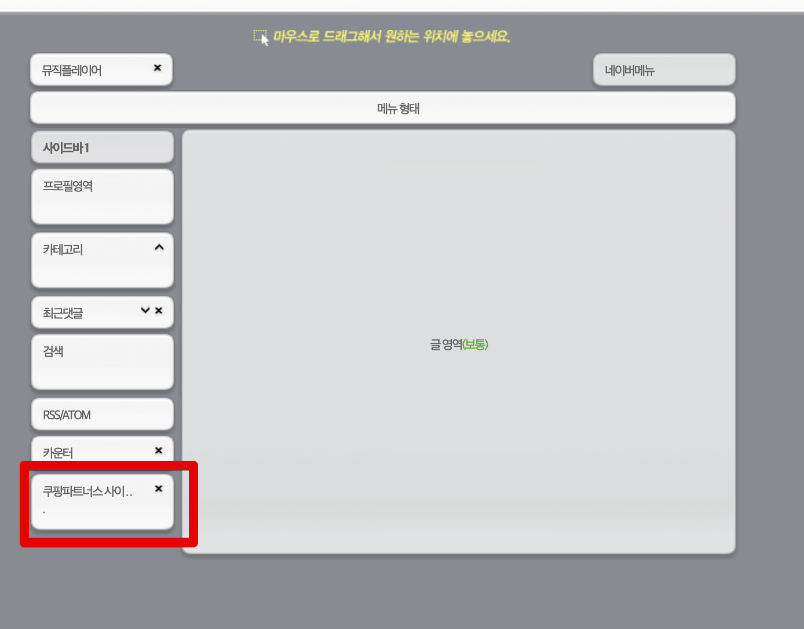

이 위젯을 원하는 위치로 이동시킨뒤 저장하시면 

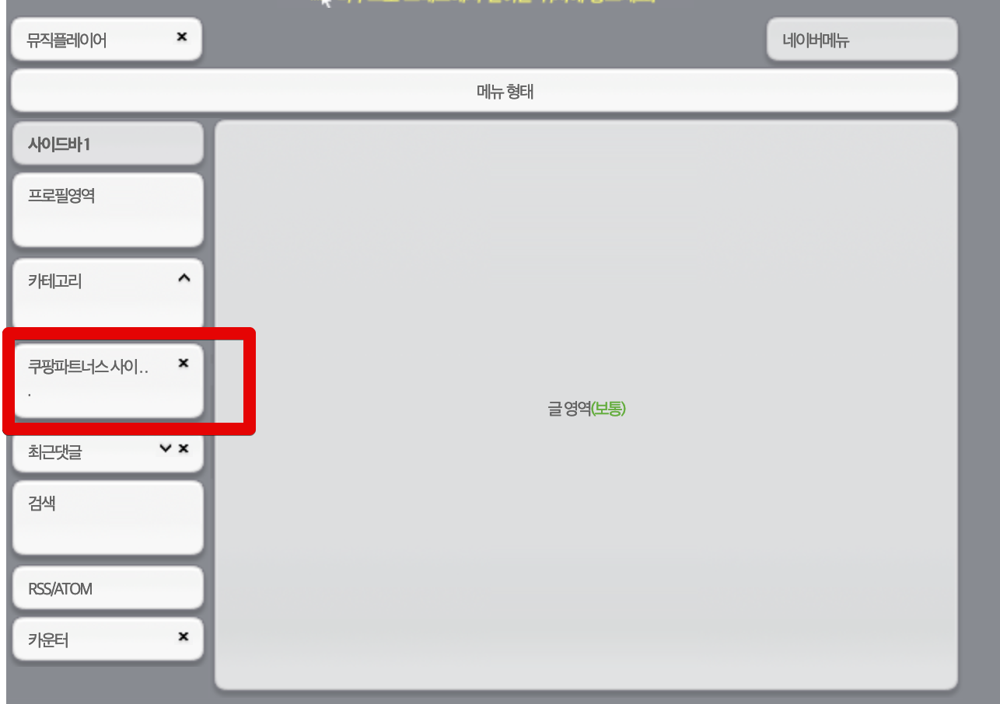

정상적으로 블로그에 노출됩니다.

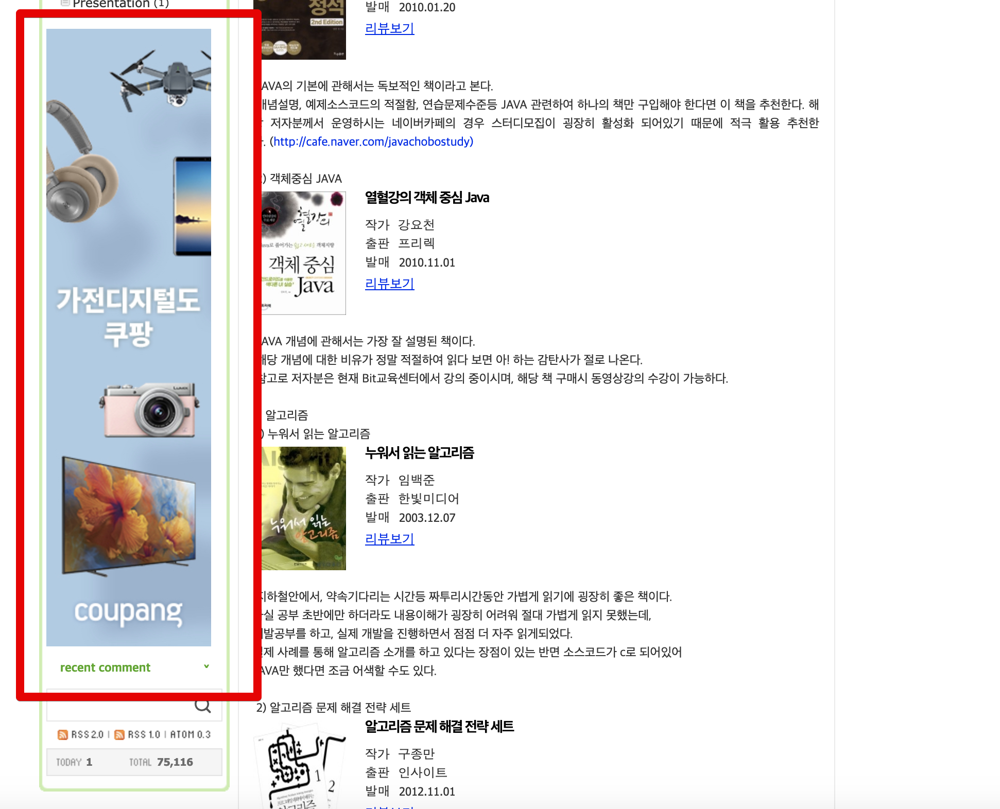

## 2. 링크 등록

두번째는 사이드바 외에 **글 본문에 노출**시키는 방법입니다.  
쿠팡 파트너스에서 이번엔 상품 링크에서 **링크**를 선택합니다.

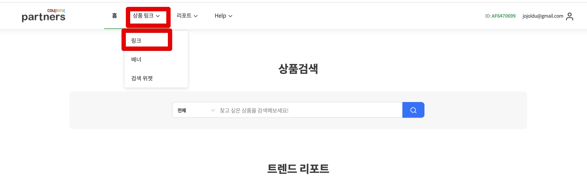

아래와 같이 상품검색 화면이 나오면 블로그에 등록하고 싶은 상품을 검색합니다.

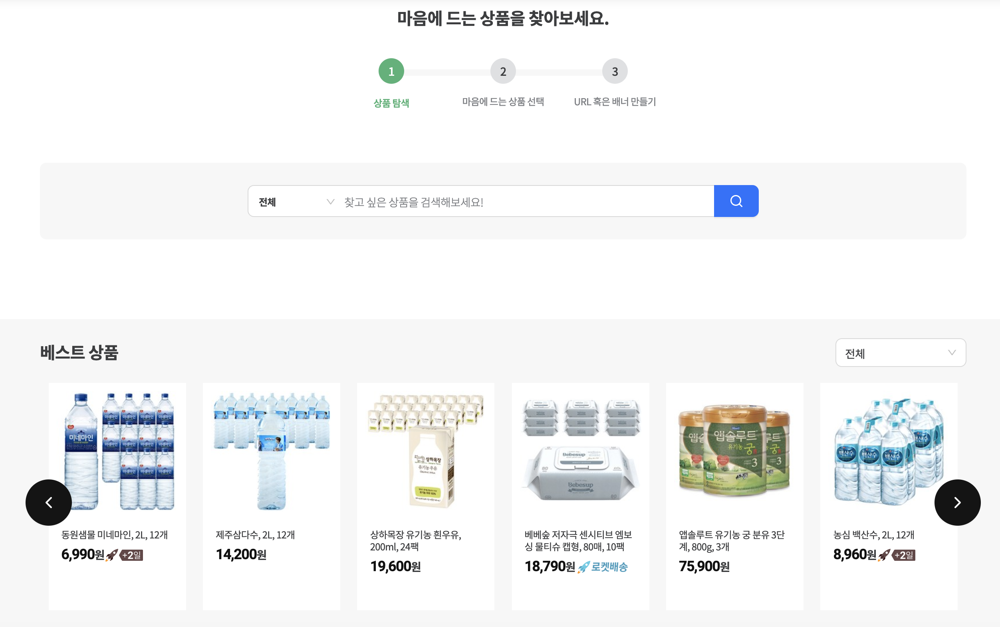

저는 여기서 LG Gram을 선택했고, **링크 생성**을 클릭합니다.

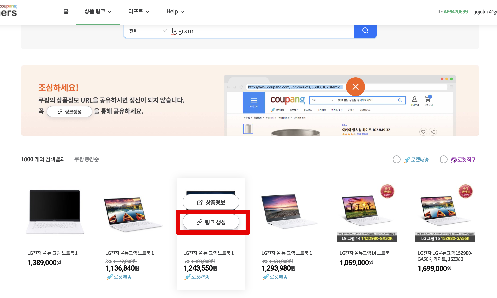

그럼 아래와 같이 다양한 방식의 링크를 제공해주는데요.  
네이버 본문에 넣기에는 단순 URL이 가장 좋습니다.  
저 역시 여기서 **URL 복사** 버튼을 클릭합니다.

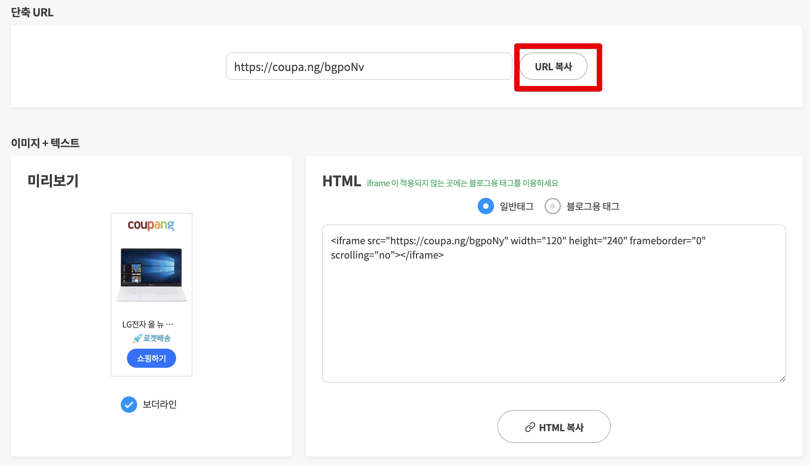

복사한 URL을 작성하고 계신 네이버 글 본문에 추가합니다.  
이때 편집바에 있는 **링크** 버튼을 클릭해서 링크를 추가합니다.
(이렇게 해야 화면에 상품 이미지가 생성됩니다.)

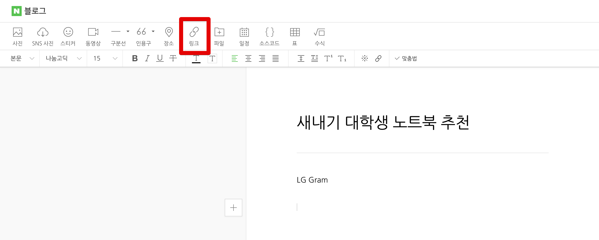

아래와 같이 링크 URL을 넣고 Enter를 치면!

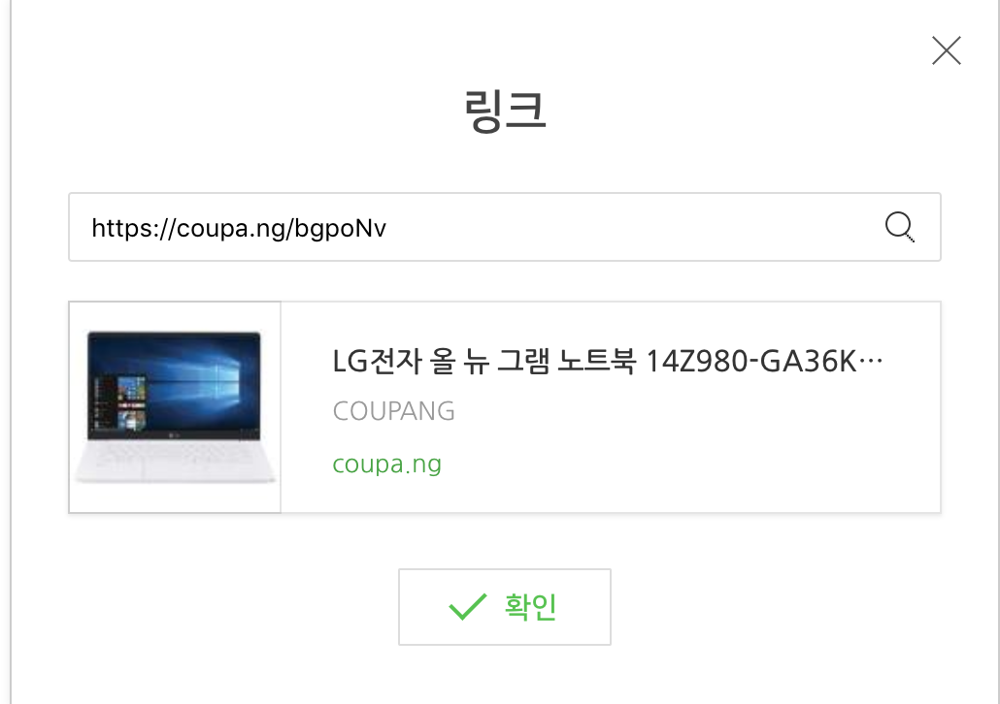

상품 이미지가 본문에 추가됩니다.

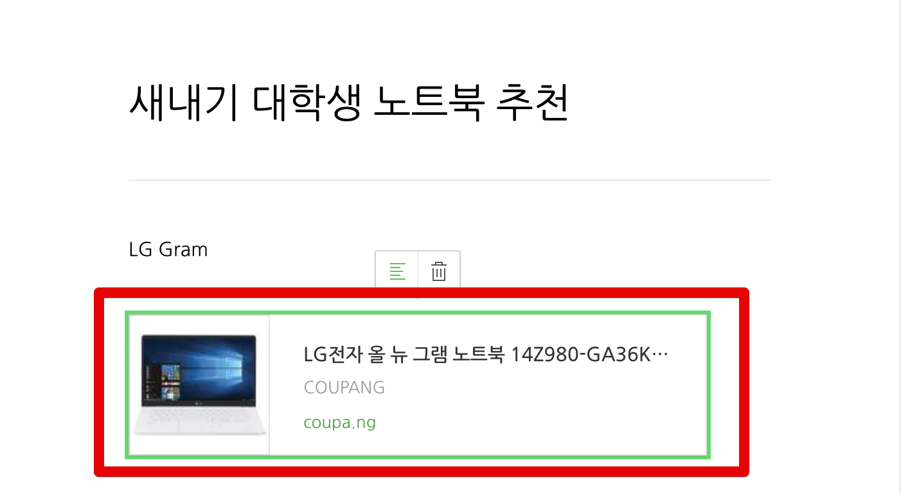

저장까지 해보시면 실제로 노출되는 것을 확인할 수 있습니다.

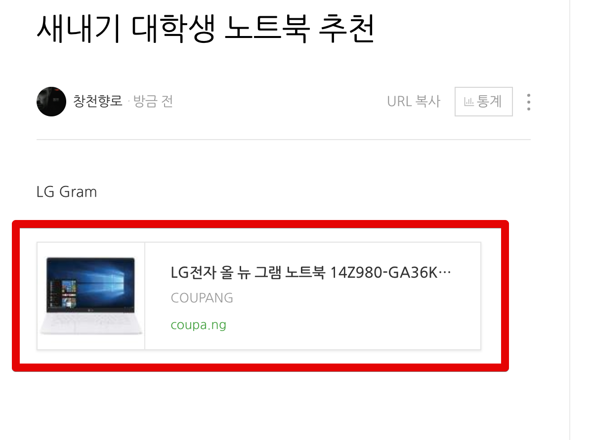