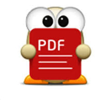
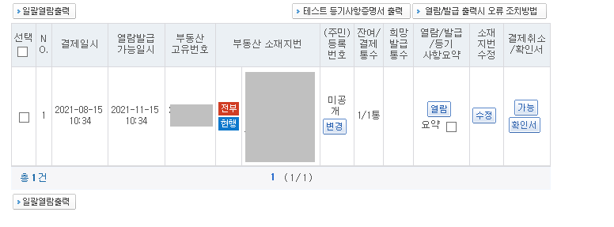
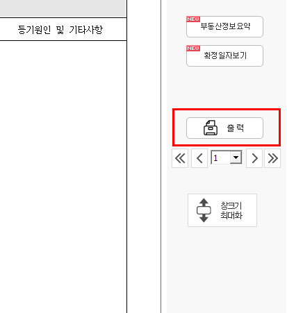
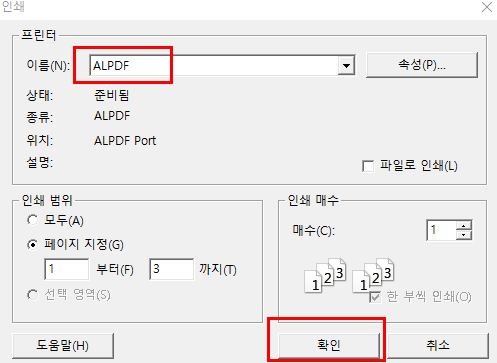
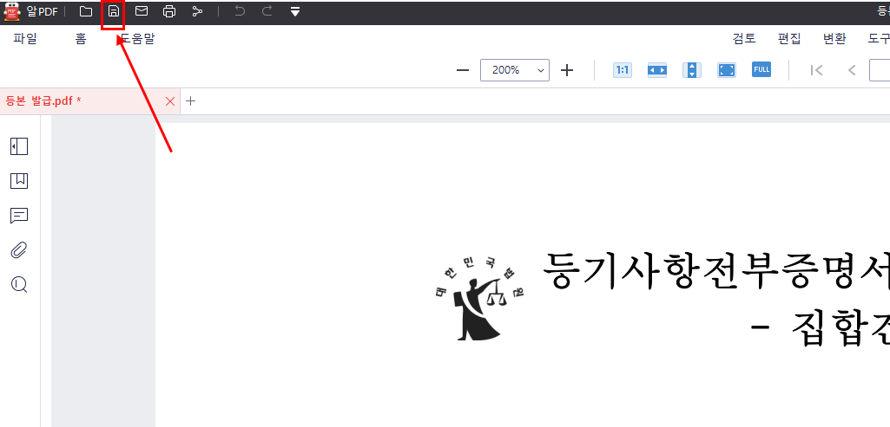

# (Windows) 프린터 없을 때 PDF로 인쇄 대체하기

부동산 등기를 비롯해서 공공 사이트를 통해 서류를 뽑을때 프린터가 없는 경우 제대로 뽑을 수가 없는데요.  
이럴때 [알 PDF](https://www.altools.co.kr/download/alpdf.aspx)를 이용하면 인쇄를 PDF로 대체할 수가 있습니다.  

> 최근 이사를 하는 지인이 이걸 몰라해서 작성하게 되었습니다.

진행하시기전에 알 PDF가 설치되어있어야 합니다.

* [알 PDF](https://www.altools.co.kr/download/alpdf.aspx)

알 PDF 가 설치되어 있으면, 바로 등기부등본을 통해 진행해보겠습니다.

## 방법

등기부 등본 열람 화면에서 열람을 선택하면

아래와 같이 출력 버튼이 있는데요.

여기서 프린터 선택 화면에서 **ALPDF**를 선택합니다.  

그리고 출력 혹은 확인 버튼을 클릭해 인쇄를 하게 되면,  
아래와 같이 알 PDF로 문서가 열람 됩니다.   
이를 PC에 저장하면 PDF로 저장 완료 됩니다.

