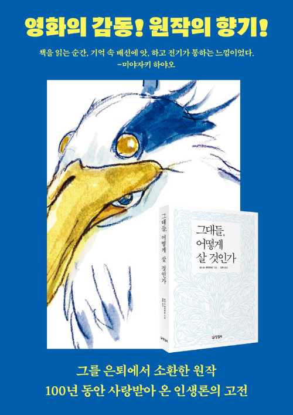

# 그대들, 어떻게 살 것인가 (요시노 겐자부로)

최근 미야자키 하야오 감독님의 "그대들은 어떻게 살 것인가" 영화가 개봉된다는 소식을 들었다.  
제목이 너무 낯익어서 찾아봤더니 [미야자키 하야오 감독님이 이 책을 오마주해서](https://book.asahi.com/article/14953353) 영화를 만들었다고 한다.  

대학생일때 도서관에서 빌려서 읽었던 책인데, 당시에는 책 내용이 너무 가식적이라고 생각했었다.  
중2병이 늦게 와서 그랬는지 모르겠지만, 그땐 되게 시니컬했고 그만큼 이런 내용에 거부감이 있었다.  
그래서 책을 읽고나서는 "이런 책을 왜 사람들이 좋아하는지 모르겠다" 라는 생각을 했었다.    

그러다가 취업 준비, 이직 준비, 여러 주변의 변화 등이 있었는데, 이런 변화들이 있을때마다 이 책의 내용이 떠올랐다.  
그리고 나는 어떤 어른이 되고 싶은지, 어떤 사람이 되고 싶은지에 대한 생각을 하게 되었다.  
  
이 책을 보면 주인공인 코페르의 성장 과정이 담겨있는데, 이 성장 과정에서 코페르의 삼촌이 주인공이 고민에 빠질때마다 다양한 주제의 이야기들을 해주면서 올바른 성장을 도와준다.  
주인공 보다는 주인공에게 이런 이야기를 해주는 코페르의 삼촌이 되고 싶었다.  
  
새 책을 사서 다시 한번 읽어보면서 밑줄을 그었다.

## 밑줄

> 나를 중심으로 사물을 생각하고 판단하려는 성질은 어른이 되어서도 남아 있단다.  
> 네가 어른이 되면 알겠지만 자기 중심의 사고에서 벗어난 사람은 이 넓은 세상에서도 아주 드물단다.  
> 더구나 이해득실이 맞물린 상황에서는 내 입장을 떠나 진실을 있는 그대로 판단하고 받아들이기가 무척 어려워.  
> 그런 상황에서 코페르니쿠스적인 사고를 할 수 있는 사람이라면 위대하다고 존경받아 마땅하지.  
> 하지만 현실에서는 많은 사람들이 자기 입장에만 빠져 눈에 보이는 진실을 외면하고 자기에게 유리한 것만 바라보려고 한단다.  
> 내 입장만 생각해서 사물을 판단한다면 세상의 참된 진실과는 끝내 마주할 수 없단다.  
> p.25

 

> 뉴턴이 위대한 것은 중력과 인력의 성질이 똑같지 않을까, 하고 의심했기 때문만은 아니야.  
> 작은 것을 의심하는 데서 시작해 깊이 고민하고 노력하여 실제 그것을 확인했기 때문이기도 해.  
> 뉴턴은 겨우 3,4미터 높이에서 떨어진 사과를 보고 저 사과가 어디까지 높이 올라가도 지금처럼 떨어질까, 하며 궁금해하다가 결국 거대한 사상과 맞딱뜨리게 되었지.  
> 당연한 것을 생각하는 건 절대로 우습지 않아.  
> 알고 있다고 믿었던 어떤 것을 좀 더 깊이 파헤치고 생각하다 보면 절대로 알고 있었다는 말을 하지 못하게 되는 거란다.  
> p.74 

 

> 생산하는 사람이 없다면 그것을 맛보고 즐기면서 소비하는 사람도 없어.  
> 무엇인가를 만드는 행위야말로 사람을 사람답게 만들어주는 가장 높은 가치란다.  
> 학문도, 예술도 그것을 만들어내는 사람들이 받아들리고 즐기는 사람들보다 훨씬 중요하단다.  
> 세상 사람들이 멸시하는 이들 가운데 네가 머리를 숙이고 존경해야 할 사람들이 많다는 것도 깨닫게 될거야.  
> p.125

 

> 사람은 한 번 행동하고 나면 두 번 다시 되돌릴 수 없다는 것을 뼈저리게 느꼈다.  
> 내가 한 일을 아는 사람이 없다고 해도 내가 알고 있고, 내가 잊었다고 해도 내가 저지른 일인 만큼 그런 행동을 했다는 사실은 내 안에서 사라지지 않는다.  
> 아무리 긴 시간이 지나도 내가 그때 그런 인간이었다는 것을 지워버릴 방법이 없다.  
> p.196

 

> 사람이 살면서 만나는 사건들은 모두 한 번뿐이며 두 번 다시 되풀이되지 않는다는 것을 돌층계 사건에서 배웠기 때문에 내안에 들어 있는 좋은 생각과 아름다운 감정들이 무엇보다 소중하다는 것을 알게 되었지.  
> 돌층계에서 그 일을 겪지 않았다면 이런 것은 훨씬 더 나이가 들어서 알게 되었을지도 몰라.  
> 그렇게 후회해서 중요한 것을 알게 된다면 그 경험은 절대로 나쁜 게 아니야.  
> 그런 일을 겪으면서 인생을 가치 있게 만들어 가는 거란다.  
> 너도 그만큼 훌륭한 인간이 되는 거고.  
> 그러니까 무슨 일을 하더라도 너 자신에게 실망해서는 안 돼.  
> p.214

 

> "자신을 불쌍하다고 말하는 사람들은 대부분 위대하다."  
> 자신을 불쌍하다고 인식하는 것은 위대해지고 싶기 때문이다.  
> 스스로를 불쌍하게 여기는 사람은 스스로를 위대하게 여긴다.  
> 그것은 왕위를 빼앗긴 임금이 스스로를 불쌍하게 여기는 것과 같다.  
> 왕위를 잃은 임금이 아니라면 그 누가 자신이 왕위에 앉지 않았다고 해서 슬퍼할 것인가.  
> 자신이 실수한 것을 후회하는 마음이 생기는 까닭은 그때 올바른 행동할 수 있었다는 것을 알고 있기 때문이란다.  
> 우리에게 올바른 이성의 목소리를 듣고, 그 목소리가 말하는 대로 행동할 힘이 없다면 우리는 절대로 자신이 실수한 것을 후회하지도, 그 때문에 고통스러워하지도 않을 거야.  
> 사람은 자신이 실수했다는 것을 인정하고 후회할 수 있었기에 동물보다 위대한 존재가 된 거란다.  
> "왕위를 잃은 임금이 아니라면 그 누가 자신이 왕위에 없다고 해서 슬퍼할 것인가."  
> 어떤 사람이 양심에 따라 행동할 능력이 없다면 실수했다고 쓰라린 눈물을 흘리지는 않는단다.  
> 지금 아파하는 동안 새로운 자신감을 찾는 것이 중요해.  
> 그리고 이렇게 생각하는 것이 중요해.  
> 나한테 올바른 길을 걸어갈 수 있는 힘이 있기에 가끔은 이렇게 괴로워지기도 하는 것이라고.  
> p.217

