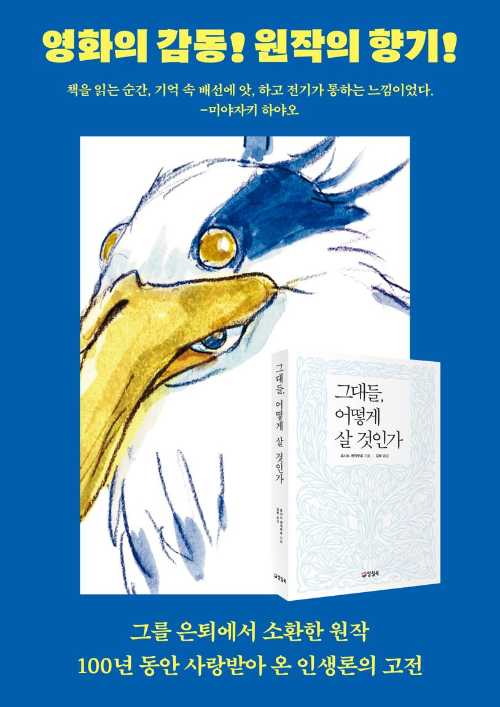

# 그대들, 어떻게 살 것인가 (요시노 겐자부로)

최근 미야자키 하야오 감독님의 "그대들은 어떻게 살 것인가" 영화가 개봉된다는 소식을 들었다.  
제목이 너무 낯익어서 찾아봤더니 [미야자키 하야오 감독님이 이 책을 오마주해서](https://book.asahi.com/article/14953353) 영화를 만들었다고 한다.  

대학생일때 도서관에서 빌려서 읽었던 책인데, 당시에는 책 내용이 너무 가식적이라고 생각했었다.  
중2병이 늦게 와서 그랬는지 모르겠지만, 그땐 되게 시니컬했고 그만큼 이런 내용에 거부감이 있었다.  
그래서 책을 읽고나서는 "이런 책을 왜 사람들이 좋아하는지 모르겠다" 라는 생각을 했었다.    

그러다가 취업 준비, 이직 준비, 여러 주변의 변화 등이 있었는데, 이런 변화들이 있을때마다 이 책의 내용이 떠올랐다.  
그리고 나는 어떤 어른이 되고 싶은지, 어떤 사람이 되고 싶은지에 대한 생각을 하게 되었다.  
  
이 책을 보면 주인공인 코페르의 성장 과정이 담겨있는데, 이 성장 과정에서 코페르의 삼촌이 주인공이 고민에 빠질때마다 다양한 주제의 이야기들을 해주면서 올바른 성장을 도와준다.  
주인공 보다는 주인공에게 이런 이야기를 해주는 코페르의 삼촌이 되고 싶었다.

## 밑줄

> 나를 중심으로 사물을 생각하고 판단하려는 성질은 어른이 되어서도 남아 있단다.  
> 네가 어른이 되면 알겠지만 자기 중심의 사고에서 벗어난 사람은 이 넓은 세상에서도 아주 드물단다.  
> 더구나 이해득실이 맞물린 상황에서는 내 입장을 떠나 진실을 있는 그대로 판단하고 받아들이기가 무척 어려워.  
> 그런 상황에서 코페르니쿠스적인 사고를 할 수 있는 사람이라면 위대하다고 존경받아 마땅하지.  
> 하지만 현실에서는 많은 사람들이 자기 입장에만 빠져 눈에 보이는 진실을 외면하고 자기에게 유리한 것만 바라보려고 한단다.  
> 내 입장만 생각해서 사물을 판단한다면 세상의 참된 진실과는 끝내 마주할 수 없단다.
> p.25

> 뉴턴이 위대한 것은 중력과 인력의 성질이 똑같지 않을까, 하고 의심했기 때문만은 아니야.  
> 작은 것을 의심하는 데서 시작해 깊이 고민하고 노력하여 실제 그것을 확인했기 때문이기도 해.  
> 뉴턴은 겨우 3,4미터 높이에서 떨어진 사과를 보고 저 사과가 어디까지 높이 올라가도 지금처럼 떨어질까, 하며 궁금해하다가 결국 거대한 사상과 맞딱뜨리게 되었지.  
> 당연한 것을 생각하는 건 절대로 우습지 않아.  
> 알고 있다고 믿었던 어떤 것을 좀 더 깊이 파헤치고 생각하다 보면 절대로 알고 있었다는 말을 하지 못하게 되는 거란다.
> p.74 
