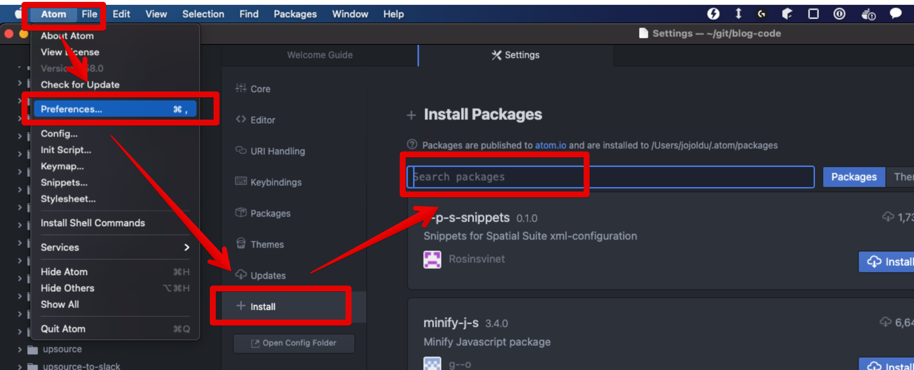
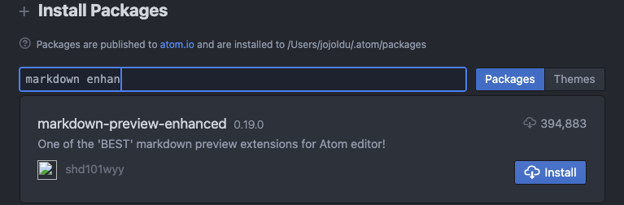
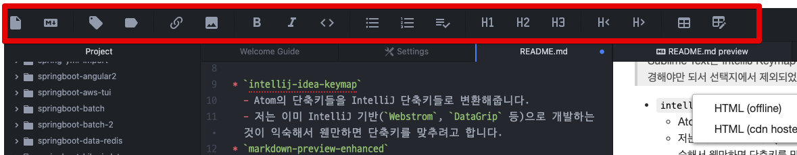
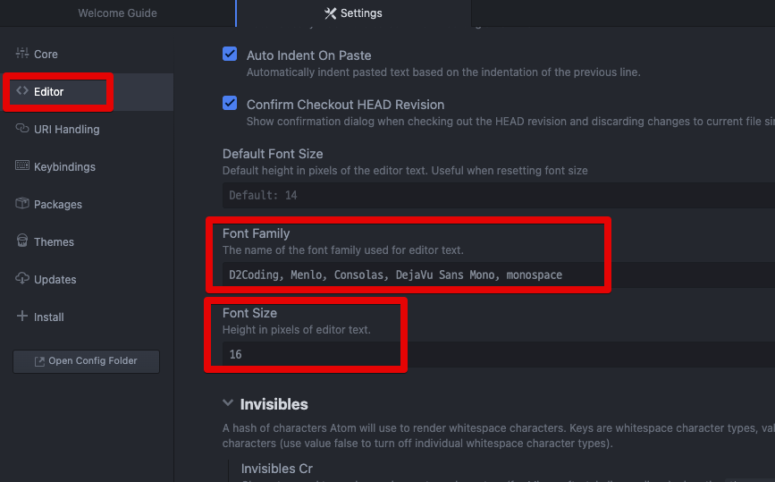

# Atom을 마크다운 에디터로 사용하기 (feat. Mac OS)

Visual Studio Code 를 업데이트하다보면 간혹 한글 입력이 누락되는 버그 현상이 발생할때가 있습니다.(마치 페이스북 에디터처럼)  

폰트 관련 설정을 리셋하고 재설정하면 문제가 없으나, 종종 한번 이럴때마다 꽤나 귀찮은 작업인지라 한번 다른 에디터를 마크다운 에디터로 전환해보려고 합니다.  

한달정도 사용해보고, 괜찮으면 정착하고 아니다싶으면 다시 VS Code를 사용할 것 같습니다.  

이번에 선택한 에디터는 [Atom](https://atom.io/)입니다.  

> Sublime Text는 IntelliJ Keymap 플러그인이 없어서, 단축키 하나하나를 다 변경해야만 되서 선택지에서 제외되었습니다.

## 플러그인

마크다운 에디터로 사용할 수 있도록 아래 플러그인들을 설치해봅니다.  

플러그인 설치는 다음과 같이 할 수 있습니다.

### 추천 플러그인

* `intellij-idea-keymap`
  - Atom의 단축키들을 IntelliJ 단축키들로 변환해줍니다.
  - 저는 이미 IntelliJ 기반(`Webstrom`, `DataGrip` 등)으로 개발하는 것이 익숙해서 웬만하면 단축키를 맞추려고 합니다.
* `markdown-preview-enhanced`
  - 마크다운 파일의 미리보기 플러그인입니다.
  - Auto Scrolling, PDF & HTML export, 이미지 헬퍼,  미리보기 단축키까지 다 지원을 합니다.
* `markdown-writer`
  - 마크다운에 글을 쓰기 위한 여러 편의 기능들을 지원합니다.
  - 특히 지킬 블로그와 같은 깃헙 블로깅에 최적화 되어있는데, 저 같은 경우에는 깃헙 블로그는 아니지만 동일하게 마크다운 기반으로 글을 쓰고 티스토리에 업로드를 하기 때문에 사용합니다.
* `tool-bar-markdown-writer`
  - 아래와 같이 Atom 내부에 마크다운 toolbar를 지원합니다.

* `platformio-ide-terminal`
  - Atom 에서 터미널을 사용할 수 있게 지원합니다.

## D2Coding font

플러그인 설치가 끝나면, 한글 폰트인 D2 Coding 폰트를 설치합니다.

* [D2Coding 폰트 설치](https://uxgjs.tistory.com/177)

패키지 인스톨과 마찬가지로 Settings -> Editor 로 이동해서 아래와 같이 D2Coding 폰트를 제일 앞에 추가합니다.

