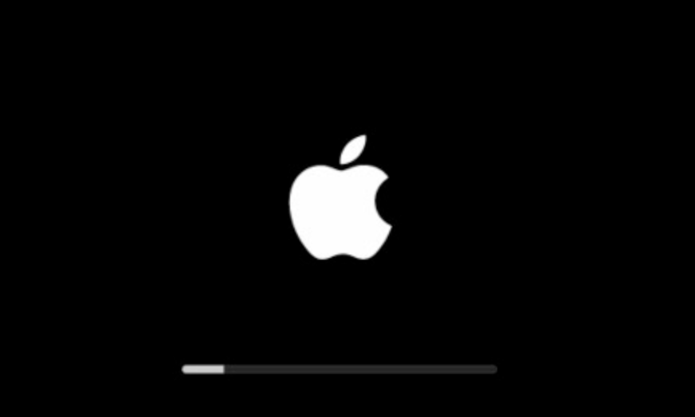

# Mac 빅서 설치 및 clean install

사내의 복지중 하나로 2년에 한번씩 맥북을 교체할 수 있다보니, 집에 있는 맥북을 딱히 업데이트할 필요가 없었는데요.  
  
빅서 업데이트를 했다가 깡통 되는 케이스가 많다고 하여, 한번 개인 맥북으로 진행해보았습니다.  
  

집에 남는 맥북이 있어 빅서 install을 진행했습니다.

## 디스크 지우기

컴퓨터 전원을 종료후 재시작하자마자 `command` + `R` 키를 **꾹** 눌러 줍니다.  
  
그리고 아래와 같이 애플

꾹 누르고 있으면 디스크를 관리 할 수 있는 화면이 부팅 됩니다.

디스크 유틸리티를 들어갑니다.

우선은 설치된 디스크를 지워줘야 합니다. 디스크 선택을 하시고...(아마 이름을 따로 바꾸지 않았으면, 디스크 이름은 Macintosh HD라고 되어 있을겁니다. 저는 중고 SSD를 이번에 새로 구매해서 이미 사용하던 분이 mac이라고 이름을 바꿔놓으셨습니다.) 화면창 상단에 지우기를 선택해줍니다.

그러면 이와같이 이름과 포맷을 정할 수 있습니다. 이름은 Macintosh HD로 하겠습니다. 이건 취향이니 원하는 이름으로 바꾸셔도 됩니다. 포맷은 보통 확장 저널링을 많이 하므로 저도 이와같이 하겠습니다.

## Mac OS 다시 설치하기

## 빅서 업데이트하기
