# Mac에서 개발 환경 (IntelliJ 기반) 꾸미기

현 회사에 오면서 처음으로 Mac을 경험하면서 윈도우보다는 훨씬 다양한 기능과 앱들을 찾아보고 경험했습니다.  
다양한 앱들 덕분에 IntelliJ IDEA에서 사용하는 여러 단축키들이 충돌나서 대채제 혹은 단축키 변경등을 하기도 했는데요.  
다양한 앱들을 모르는 분들도 계시고, IntelliJ 와 단축키가 충돌나서 단축키를 못쓰시는 분들에 대한 이야기도 듣게 되어 정리하게 되었습니다.  
  
**터미널과 도커** 등의 개발 환경은 이미 subicura 님께서 블로그에 정리해주셔서 저는 그것외에 주로 사용하는 세팅과 앱들을 소개 드리겠습니다.

* [본격 macOS에 개발 환경 구축하기](https://subicura.com/2017/11/22/mac-os-development-environment-setup.html)

## App

대부분의 Mac App들은 단축키를 적극 활용할 수 있도록 되어있으니, 단축키도 함께 소개드리겠습니다.  
  
혹시나 Mac의 특수기호가 윈도우/리눅스 배열과 달라서 어색하시다면 아래 단축키 표를 한번 보시면 좋습니다.

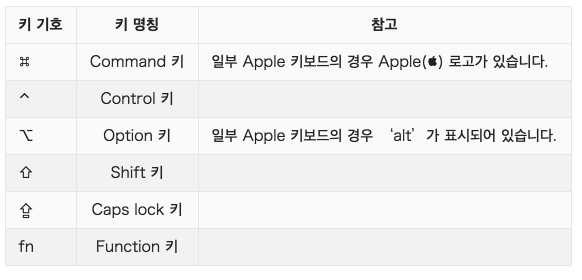

### Alfred (알프레드)

Mac의 기본 검색 App은 Spotlight 입니다. 
해당 앱에는 몇가지 문제가 있는데요.

* 파일 인덱싱 부하가 심합니다.
  * 키워드를 빠르게 보여주기 위한 작업이지만 너무 부하가 많이 발생합니다.
* 단축키가 여러 개발도구의 자동완성 (`Ctrl` + `space`)와 겹칩니다.
  * 이건 변경이 가능합니다.
* 검색외 기능이 미흡합니다.

그래서 저 같은 경우에는 [Spotlight 는 중지](https://hyunsoft.tistory.com/228)하고, [Alfred](https://www.alfredapp.com/)를 사용합니다.  
  
Alfred는 Spotlight와 마찬가지로 Mac의 전체 검색 기능을 지원하는 강력한 앱인데요.  
워크플로우를 이용하여 원하는 기능을 Alfred 내에서 수행할 수 있는 기능을 지원합니다.  
  
예를 들면 파일/App 검색 외에도 아래와 같이 계산기와 연동되어 특별히 계산기 앱을 실행하지 않고도 바로 계산이 가능합니다.

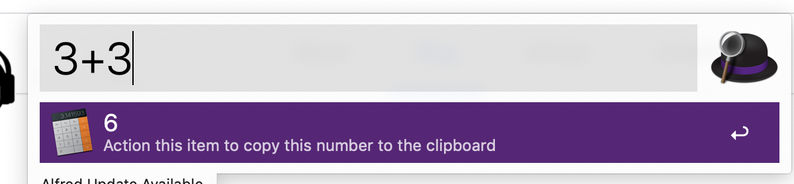

기본 단축키는 `Option` + `Space` 인데, 단축키 역시 변경이 가능합니다.

저 같은 경우 (`Ctrl` + `Shift` + `A`)로 두고, 여러 개발도구의 주요 단축키들과 겹치지 않도록 사용중입니다.

만약 **유료** 플랜을 구매하시게 되면 워크플로우를 비롯해 다양한 확장기능을 쓸 수 있습니다.  
IDE 프로젝트 검색, 파파고 연동 등을 손쉽게 Alfred 안에서 사용할 수 있습니다.

* [귀차니즘을 해결해주는 Alfred](https://sungjk.github.io/2020/12/13/alfred-tips.html)

### Monosnap (모노스냅)

(악마의) 캡쳐 App [Monosnap](http://macnews.tistory.com/1064) 입니다.  

맥의 기본 캡쳐 기능이 아무래도 부실한데요.  
저처럼 화면 캡쳐와 캡쳐된 화면을 편집을 자주 하시는 분들 (ex: 블로그등) 이라면 기본 캡쳐 기능으로는 한계를 느끼실겁니다.  
  
Monosnap 은 바로 이런 캡쳐와 편집에 대한 사용성이 굉장히 뛰어난 앱입니다.  

기본적인 단축키는 다음과 같습니다.

* **지정** 캡쳐: `Option` + `Command` + 5
* **전체** 캡쳐: `Option` + `Command` + 6

위에서 악마라고 한 최악의 단점은 바로 **메모리 점유율**입니다.  
맥을 사용할때면 부팅을 잘 안하게 되는데, 한 일주일정도 노트북을 부팅하지 않고 있으면 Monosnap이 **점유한 메모리가 5GB ~ 7GB**인 경우가 허다합니다.  

그래서 2~3일에 한번씩 부팅을 하거나, 중간중간 Monosnap 프로세스를 종료하고 재실행하는 등의 초기화 작업이 필요합니다.

> 사용성이라는게 참 무섭다고 느낀게 이런 단점이 있음에도, 너무 사용하기가 편해서 계속해서 다른 캡쳐앱으로 넘어가지 못하고 있습니다.

### Magnet

놀랍게도 맥은 **화면 분할 기능이 기본 기능이 아닙니다**.  
윈도우처럼 화면 분할을 하고 싶은데, 기본 기능이 아니기 때문에 별도의 App을 설치해야만 사용할 수 있습니다.  

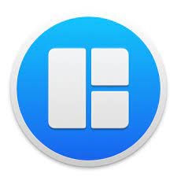

윈도우 보다 더욱 강력한 화면 분할 기능을 제공하는 App이 [Magnet](https://apps.apple.com/kr/app/magnet-%EB%A7%88%EA%B7%B8%EB%84%B7/id441258766?mt=12) 입니다.  
  
아쉽게도 **유료** App이지만, 한번 사용해보시면 확실히 좋다는 것을 느낄 수 있습니다.  

> 현재 가격은 9,900원인데, 가끔 이벤트로 1달러 구매가 가능할때가 있습니다.  
> 이때를 노리시는것도 좋습니다만, 굳이 1만원을 위해 불편함을 며칠 ~ 몇달간 유지할 필요는 없을것 같습니다.

단축키는 `Ctrl` + `Option` 을 조합해서 사용하기 때문에 다른 앱들의 단축키와 충돌날일이 거의 없습니다.

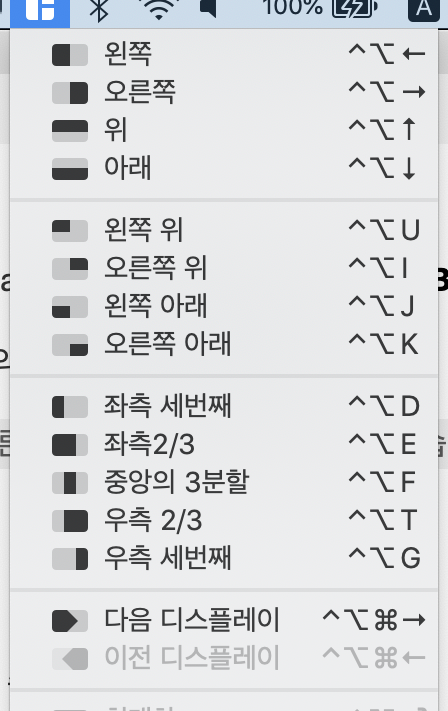

> 만약 무료로 화면 분할 기능을 쓰고 싶다면 [Spectacle](http://macnews.tistory.com/3198) 도 좋은 대안입니다.  
> 단, Magnet 에 비하면 확실히 기능과 사용성이 부족합니다.

### Scroll Reverser

윈도우를 사용하다 Mac 으로 넘어오면서 가장 크게 느낀 이질감이 스크롤 방향이 반대라는 것입니다.  
막상 사용해보면 이게 굉장히 자연스러운 제스처라는 것을 느낄 수 있습니다만, **마우스의 휠**을 사용할때면 오히려 더 어색합니다.  
  
즉, 화면 스크롤을 올린다고 가정하면

* 터치패드에서는 제스처를 **아래로** 내리는게 자연스럽고
* 마우스에서는 휠을 **위로** 하는게 자연스럽습니다.

입력 장치별로 스크롤 방향을 마음대로 바꿔줄 수 있는 상황이 필요한데, 이를 지원하는 App이 [Scroll Reverser](https://hoile.tistory.com/139) 입니다.

Scroll Reverser에서 아래와 같이 세팅을 해두시면 기본 터치패드 방향에서 **마우스만 반대 방향**으로 설정이 되어서 원하는 형태의 스크롤 방향을 가질 수 있습니다.

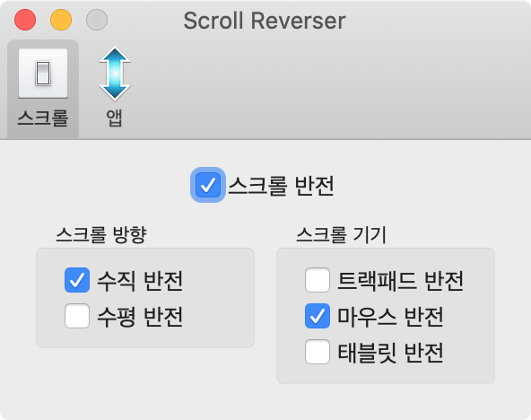

### Itsycal

Mac의 기본 캘린더를 사용해보신 분들은 느끼시겠지만 기본 캘린더 기능이 썩 마음에 들지 않습니다.  
그래서 좀 더 사용하기 편한 App을 찾다가 발견한 것이 바로 [Itsycal](https://truesale.tistory.com/272) 입니다.  
  
상단에서 바로 실행해볼 수도 있으며, 기존 Mac 캘린더와 연동되거나, 월별 이동등 사용성이 굉장히 단순하고 편리합니다.

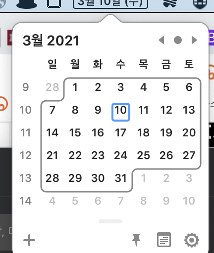

### karabiner-elements

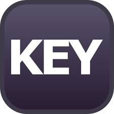

기본 키 매핑을 원하는 다른 키로 매핑해주고 싶다면 [Karabiner-elements](https://karabiner-elements.pqrs.org/) App을 통해 설정할 수 있습니다.

저 같은 경우에 Mac의 기본 한영키가 `Caps Lock`, `Command` + `Space` 인 것이 너무 싫어서 `Space`의 우측 `Command`를 사용할 수 있도록 설정해서 사용합니다.

* [우측 커맨드를 한영키로 사용하기](https://jojoldu.tistory.com/345)

## IntelliJ

처음 맥북을 받으면 IntelliJ 설치후 아래와 같은 세팅을 기본적으로 합니다.

### 터치바를 F1 ~ F12로 고정시키기

맥북 신형에서부터 터치바가 추가되었습니다.  

유튜브, 키노트등을 사용할때 유용하게 쓸 수 있었지만, IntelliJ나 기타 개발 환경에서는 F1 ~ F12 키를 사용하려면 `Fn` 키를 함께 눌러서 사용하는게 너무 불편합니다.  

그래서 개발 도구들에서는 터치바가 아니라 F1 ~ F12로 고정시키도록 합니다.

설정 방법은 [기존 포스팅](https://jojoldu.tistory.com/293)을 참고하시면 됩니다.

### 스크롤바

맥에서 IntelliJ를 사용할 때 당혹스러운 것이 스크롤바가 보이지 않는것이였습니다.

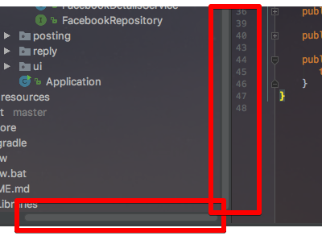

(이렇게 가로/세로로 나타나는 스크롤바)
  
이 옵션은 IntelliJ 설정의 문제가 아니라 **맥의 설정**이 문제였습니다.  
그래서 아래와 같이 설정을 변경해주셔야만 정상적으로 스크롤바가 노출됩니다.

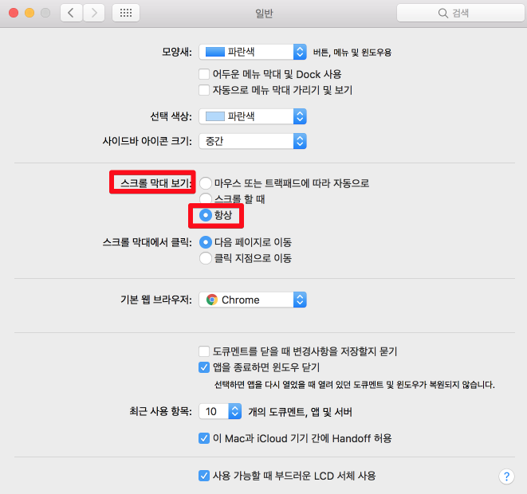

(`시스템 환경설정` -> `일반` -> `스크롤 막대보기` -> `항상` 체크)

### Smart Completion

IntelliJ의 기본 자동 완성 (Code Completion) 단축키는 `Ctrl` + `Space` 입니다.  
기본 자동완성 외에 **현재 컨텍스트에 맞는 자동완성들만 노출** 되게 Smart Completion (`Ctrl` + `Shift` + `Space`) 기능이 있습니다.

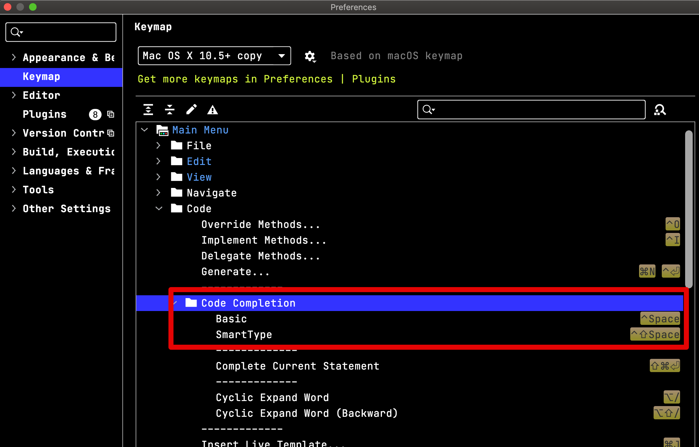

기본 자동 완성의 경우에 전혀 쓸만하지 않은 코드까지 보여주기 때문에 가독성만 떨어지는 경우가 있어 필요한 경우에는 기본 자동 완성 단축키를 제거하고, Smart Completion을 `Ctrl` + `Space` 로 매핑해서 사용하기도 합니다.

### cmd + shfit + A 단축키 이슈

IntelliJ 에서 자주 사용되는 단축키인 `Command` + `Shift` + `A` 를 Mac에서 누르게 되면 다음과 같이 `man 페이지 인덱스` 수행 터미널이 실행됩니다.

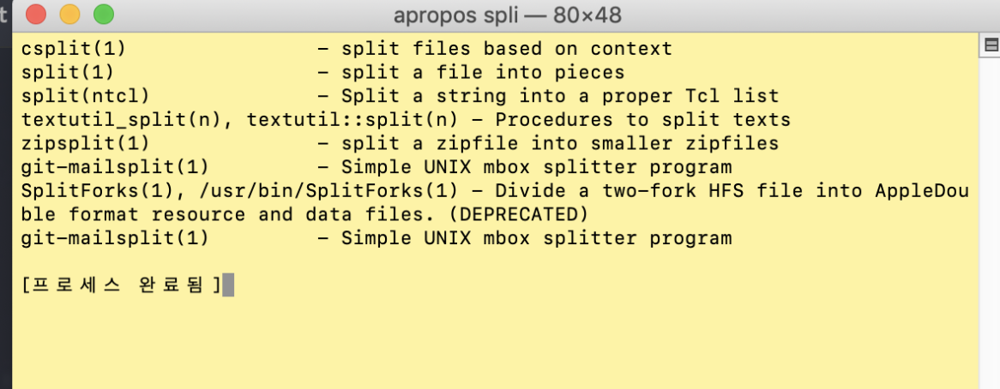

Mac의 버전이 업데이트되면서 단축키가 추가된 것인데요.  
이로 인해서 IntelliJ의 Action 검색 단축키를 사용할 수 없게 됩니다.  
  
해결방법은 맥의 기본 단축키 설정을 변경하는 것입니다.  
변경 방법은 [기존 포스팅](https://jojoldu.tistory.com/420)을 참고합니다.

### 키보드 속도

맥의 기본 키보드 반응속도가 굉장히 낮게 설정되어 있습니다.  
그래서 같은 키를 계속 누르고 있어도, 빠르게 입력되지 못합니다.  
그럴 경우엔 아래와 같이 키 반응 속도를 최대치로 높여둡니다.

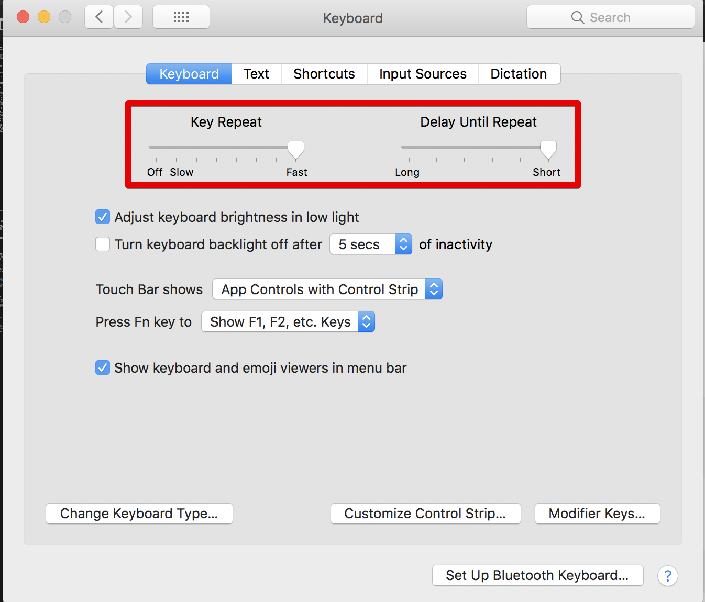

## 마무리

이 외에도 좋은 앱들이 있는데, 이는 기억나는대로 계속 추가하도록 하겠습니다.  

> Mac이 버전업되면서 충돌나는 단축키와 앱들이 있다면 마찬가지로 계속 반영하도록 하겠습니다.
