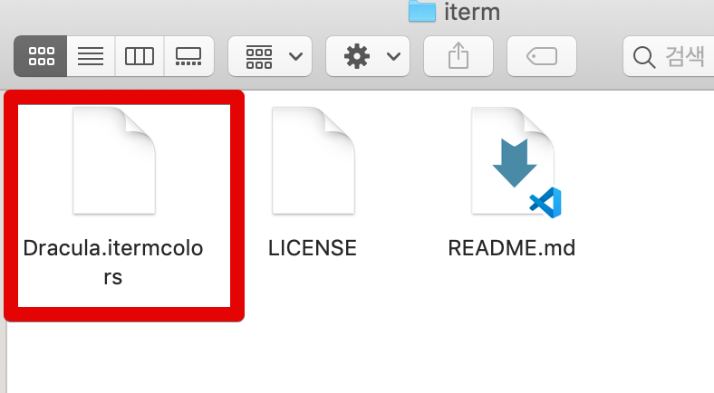
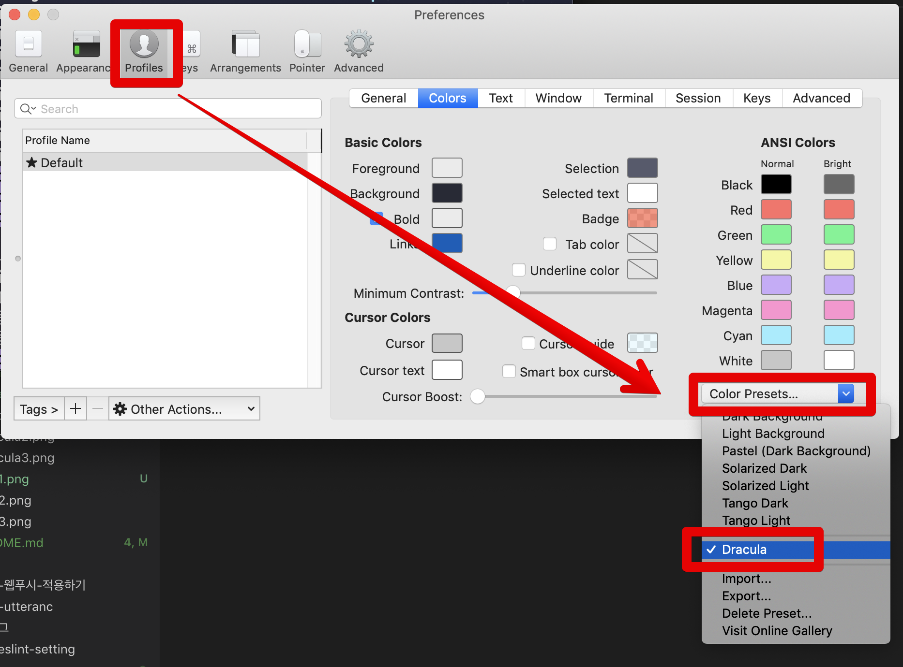
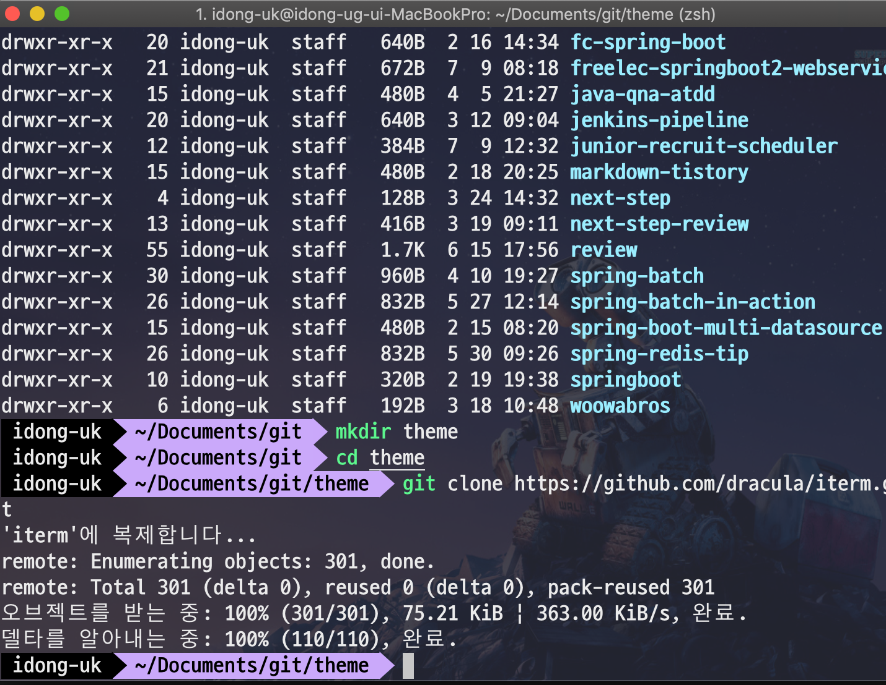

# iTerm2에 Dracular 테마 적용하기

**색이 연한 Solarized** 테마 대신에 Dracular 테마를 iTerm2에 적용하기로 결정해서 진행합니다.  
(눈에 잘 보이지가 않아서 가독성이 떨어졌습니다 ㅠ)  
  


빠르게 진행하겠습니다.

## 테마 클론

아무 곳이나 dracula 테마를 다운 받습니다.

```bash
git clone https://github.com/dracula/iterm.git
```

다운 받은 디렉토리를 열어 보시면 다음과 같은 Dracula.itermcolors 이 있습니다.  
이를 더블 클릭 합니다.  



더블 클릭 하면 자동으로 iterm2 테마에 추가됩니다.  
  
iterm2 설정창 (```command+,```)을 열어 Profiles 탭으로 이동하신 뒤, Color Presets -> Dracular를 차례로 선택합니다.



그리고 좀 더 Dracular 테마를 돋보이게 하기 위해 **Appearance**로 가서 아래와 같이 설정을 변경합니다.


위 설정을 다 하시면 아래와 같이 이쁘게 Dracula 테마가 설정 된 것을 확인할 수 있습니다.


