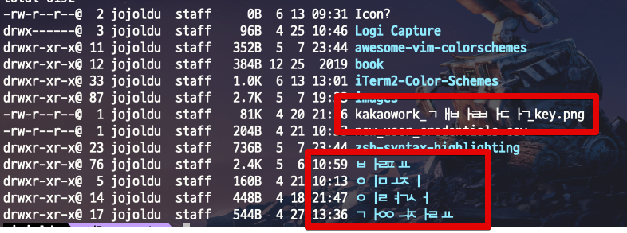
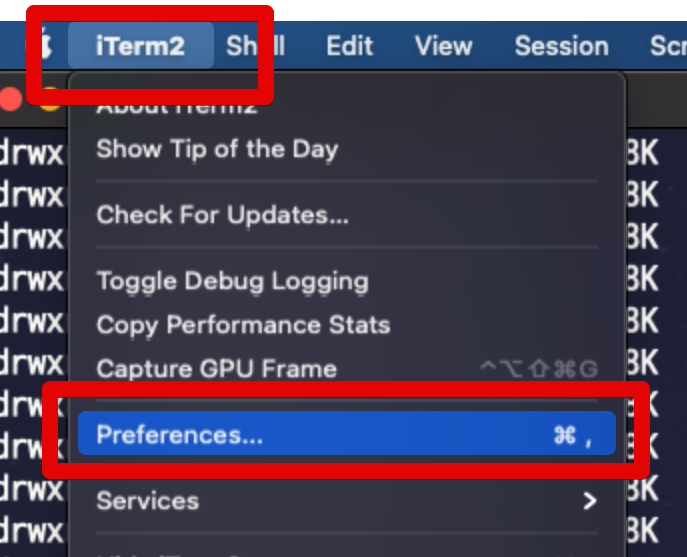
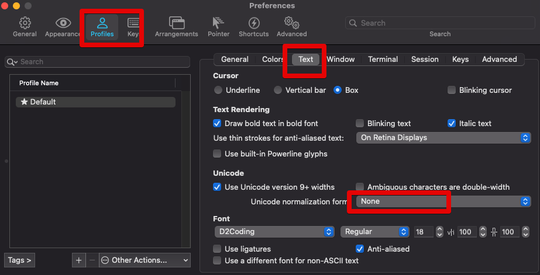
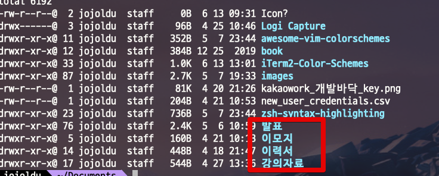

# iterm2 에 한글 자소 분리 문제

iterm2 의 `Preferences` (단축키: `command+,`)을 열어 `Profiles` 탭으로 이동합니다.

Preferences -> Profiles -> Text -> Unicode normalization form

여기서 `NFC`나 `HFS+` 
(둘중 한글 자소가 제대로 합쳐지는 것이면 됩니다.)

