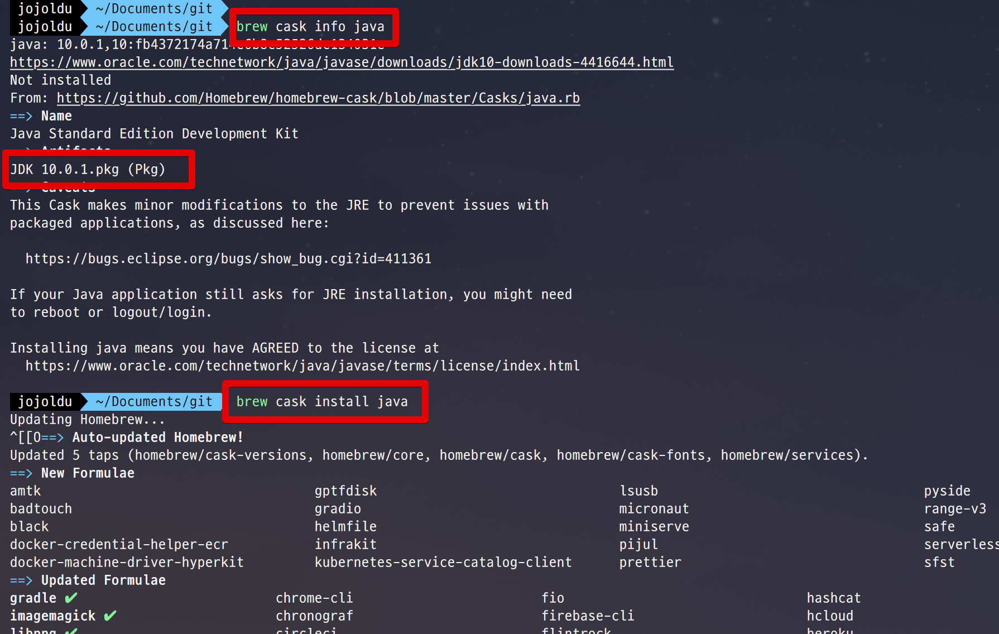
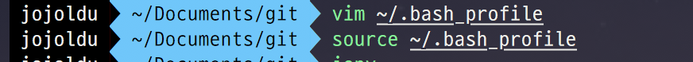
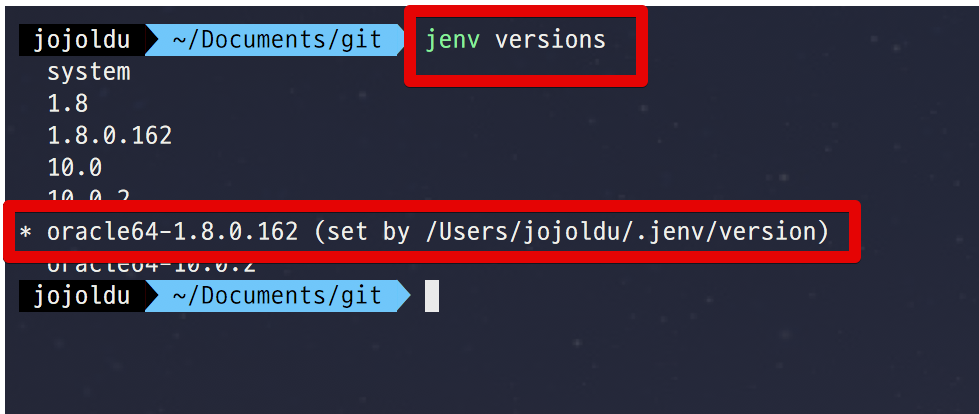
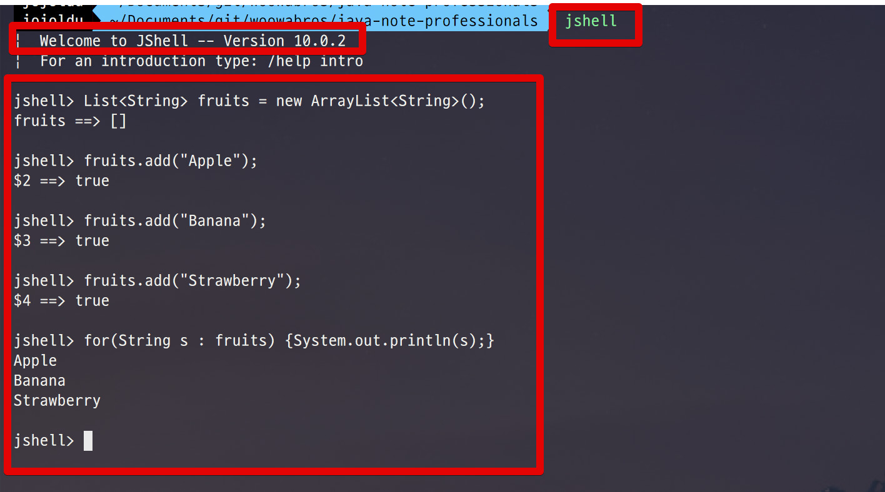

# Mac에 Java 최신버전 & Java 8 같이 운영하기

Java9부터 jshell이 등장했습니다.  
그러다보니 가끔 간단한 Java 코드 작성이 필요할때 굳이 IDE 실행 없이 마치 Bash를 작성하듯이 간단하게 코드를 작성할 수 있게 되었습니다.  
하지만 대부분의 프레임워크와 라이브러리가 Java8에 최적화되어있어 함부로 버전업하기가 쉽지 않은데요.  
그런 경우를 대비해 jenv가 있습니다.  
  
이번 시간에는 Mac 환경에서 기존에 사용하는 Java와 Java10을 함께 사용하는 방법을 공유드리겠습니다.

> 현재 제 PC에는 Java8이 설치되어있어 Java8과 Java10을 함께 사용하는 과정이 됩니다.

## 1. Homebrew Cask

일단 Homebrew를 최신으로 업데이트 합니다.

```bash
brew update && brew upgrade brew-cask && brew cleanup && brew cask cleanup
```

## 2. Install Java Latest

Homebrew 업데이트가 끝나셨으면 Java 최신 버전을 brew를 통해 설치합니다.  
아래 2개 명령어를 실행합니다.

```bash
brew cask info java
brew cask install java
```

> 현재(2018.08.13)는 자바 10이 최신이라 Java 10이 설치됩니다.



## 3. Install jenv

Java의 버전을 관리해주는 jenv 패키지를 설치하겠습니다.

> Node.js를 써보신 분들은 nvm이나 n 등을 떠올리시면 될 것 같습니다.

```bash
brew install jenv
```

설치가 되셨으면 ```~/.bash_profile```에 아래 코드를 추가하여 jenv를 초기화시킵니다.

```bash
if which jenv > /dev/null; then eval "$(jenv init -)"; fi
```


저장(```:wq```)하신뒤 ```source```를 실행합니다.

```bash
source ~/.bash_profile
```



자 그럼 이제 Java 8과 Java 10을 jenv 관리 항목에 추가하겠습니다.  
  

**Java8**

```bash
jenv add /Library/Java/JavaVirtualMachines/jdk1.8.0_162.jdk/Contents/Home/
```

**Java10**

```bash
jenv add /Library/Java/JavaVirtualMachines/jdk-10.0.2.jdk/Contents/Home/
```

> 각 버전의 **상세 버전은 조금씩 다를 수 있습니다**.  
설치된 버전을 사용하시면 됩니다.

## 4. 전역 & 로컬 버전 설정

jenv가 설치와 설정이 다되셨으면 한가지 추가 설정을 진행하겠습니다.  
로컬 환경 전체에서 사용할 Java 버전을 지정하겠습니다.  
이건 기존에 사용하시던 Java 버전을 사용합니다.  
예를 들어 제 PC에선 Java 8을 사용하니 Java8을 전역 설정으로 두겠습니다.

```bash
jenv global oracle64-1.8.0.162
```

설정이 되셨으면 잘 되었는지 한번 확인합니다.

```bash
jenv versions
```



이제 로컬의 모든 환경에선 Java8을 사용하도록 설정되었습니다.  
그리고 테스트 용도 혹은 공부용으로 Java10을 사용하실때는 **해당 디렉토리/프로젝트에서만 Java10을 사용할 수 있도록** 로컬 버전 설정을 합니다.  
  
본인이 테스트로 사용하실 프로젝트 혹은 디렉토리를 생성하고 해당 디렉토리로 이동합니다.  
해당 디렉토리에서 아래 명령어를 사용합니다.

```bash
jenv local oracle64-10.0.2
```

자 이렇게 설정하셨다면 이제 **해당 디렉토리에서만 Java 10을 사용**할 수 있습니다.  

## 5. jshell 사용

설정이 다 되셨으면 해당 디렉토리에서 jshell을 사용해봅니다.

```bash
jshell
```


