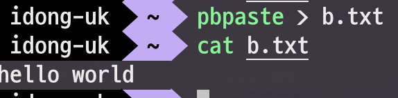

# Mac의 클립보드 명령어 - pbcopy & pbpaste

Mac에는 기본적으로 제공하는 여러 명령어들이 있는데요.  
이 중에서 ```pbcopy```와 ```pbpaste```는 터미널을 즐겨 사용하시는 분들께는 아주 유용한 명령어입니다.  
(사실 알만한 분들은 다 아시겠지지만..)  
  
> Linux에서는 [xclip](http://guileschool.com/2018/12/01/Use-the-pbcopy-and-pbpaste-of-Mac-on-Linux/) 패키지를 통해 사용가능합니다.

## 1. pbcopy

명령어의 결과를 그대로 **클립보드로 복사**합니다.  
아래 결과물들은 명령어를 수행후 ```command + v```로 붙여넣기 할 수 있습니다.

### 1-1

a.txt의 내용을 클립보드로 복사하기

```bash
cat a.txt | pbcopy
```

### 1-2

echo로 출력된 결과물 (```"echo test"```) 을 클립보드로 복사하기

```bash
echo "echo test" | pbcopy
```

## 2. pbpaste

클립보드에 복사된 내용을 붙여넣기 합니다.

### 2-1

클립보드에 있는 내용을 그대로 출력

```bash
pbpaste
```


### 2-2

클립보드에 있는 ```hello world``` 로 b.txt 파일 생성하기

```bash
pbpaste > b.txt
```

