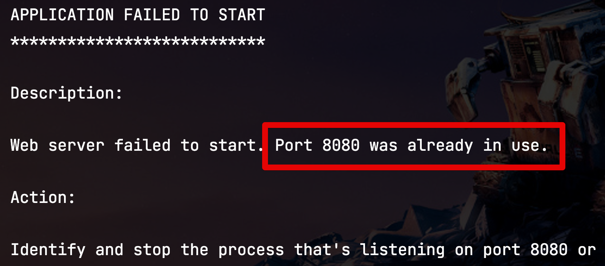

# Mac OS에서 특정 포트 Process 종료하기

간혹 IntelliJ를 사용하다가 JVM 프로세스를 종료하였음에도, **포트가 그대로 잡혀있는 경우**가 종종 있는데요.  
IntelliJ까지 종료하여도 해당 포트가 계속 잡혀 있어서 **프로젝트를 재실행이 안되는 경우**가 있습니다.  



```bash
***************************
APPLICATION FAILED TO START
***************************

Description:

Web server failed to start. Port 8080 was already in use.

Action:

Identify and stop the process that's listening on port 8080 or configure this application to listen on another port.
```
  
이는 한번 실행된 JVM이 IDE 실행여부와 관계 없이 계속 떠있는 경우인데요.  
종종 이런 경우가 있습니다.  
  
이걸 해결하는 가장 쉬운 방법은 실행중인 `java` 프로세스를 모두 종료하면 되는데요.  
딱 `8080` 포트만 종료하고 싶다면 아래와 같은 방법으로 종료하시면 됩니다.

## 해결책

해결책은 `lsof`를 통해서 포트번호 기반으로 프로세스를 찾아 `kill`을 하시면 됩니다.

> `lsof` 는 **list open files** 의 약자로 시스템에서 열린 (사용중인) 파일 (프로세스등 포함) 목록을 알려주는 명령어입니다.  

```bash
lsof -i :포트번호
```

* `-i`
  * 특정 포트를 사용하는 프로세스 정보 보기 옵션
  * 만약 **포트 범위를 지정**해서 보고 싶다면 `-`를 사용
    * ex) `lsof -i :8080-9090`

명령어를 사용하시면 다음과 같이 프로세스 정보를 볼 수 있습니다.


```bash
COMMAND   PID     USER   FD   TYPE             DEVICE SIZE/OFF NODE NAME
java    22086 idong-uk  122u  IPv6 0x910fa16c151c1f21      0t0  TCP *:http-alt (LISTEN)
```

이외에도 다양한 옵션으로 프로세스를 확인할 수 있습니다.  
다음은 주로 사용되는 `lsof` 옵션들입니다.  

* `-c`
  * java, httpd 등 특정 명령어가 실행한 오픈한 프로세스들이 출력
  * ex) `lsof -c httpd`
* `-t`
  * 다른 정보는 제외하고 `pid` 만 출력
* `-u`
  * 특정 사용자가 오픈한 프로세스들 출력

이렇게 찾아낸 프로세스 정보 중 원하는 프로세스의 `pid` 를 `kill` 하면 정상적으로 종료가 됩니다.

```bash
kill pid
```

한번에 쉽게 하려면 두 명령어를 합쳐서 진행할 수 있습니다.

```bash
kill $(lsof -t -i:8080)
```

그러면 기존에 떠있던 프로젝트가 정상적으로 종료되어 재실행이 문제 없음을 확인할 수 있습니다.