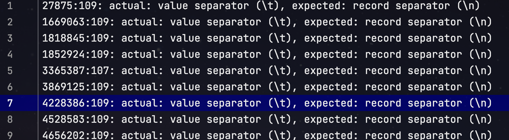
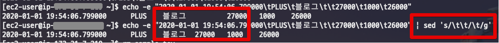
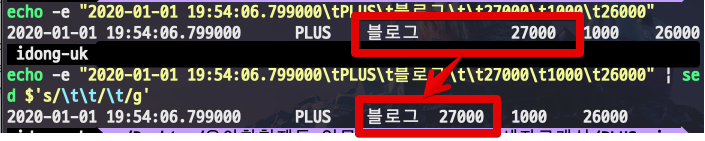
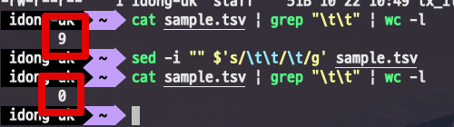

# Mac OS X에서 Multi Tab(\t\t) 정리하기

가끔 외부에서 전달 받은 tsv 파일에 중복으로 탭 (```\t```)이 포함될 때가 있습니다.  
  
이럴 경우 해당 tsv파일을 정상적으로 파싱할 수가 없어 (```\t```이 기준을 초과해서) 제대로 활용할 수가 없는데요.



(DB에 import시 발생하는 에러메세지)  
  
그래서 이럴 경우 일괄적으로 ```\t\t```를 ```\t```로 변경하도록 ```sed``` 명령어를 사용해보겠습니다.

## 1. sed 테스트

tsv 파일의 용량이 1GB이상일 경우도 많아서, **명령어를 먼저 테스트하고** 실제 파일에 적용해보겠습니다.  
  
아래 명령어 입력시 잘 노출되는 것을 먼저 확인합니다.

```bash
echo -e "2020-01-01 19:54:06.799000\tPLUS\t블로그\t\t27000\t1000\t26000"
```


자 그럼 해당 출력문에서 ```\t\t``` 영역 (```블로그\t\t27000```) 을 ```\t```로 교체하겠습니다.  
  
파이프라인으로 추가할 명령어는 다음과 같습니다.

```bash
sed $'s/\t\t/\t/g'
```

해당 명령어까지 포함해서 ```echo``` 내용을 처리하면 다음과 같이 됩니다.

```bash
echo -e "2020-01-01 19:54:06.799000\tPLUS\t블로그\t\t27000\t1000\t26000" | sed $'s/\t\t/\t/g'
```

여기서 기존 Linux와 달리 Mac에서는 정상적으로 탭을 ```\t```로 인식하려면 ```$```가 붙어야만 합니다.  
즉, Linux에서는 ```sed 's/\t\t/\t/g'```로 처리가 가능한 반면



Mac에서는 ```$```가 추가되어 ```sed $'s/\t\t/\t/g'```로 처리되어야만 합니다.



해당 명령어가 잘 되는것 확인하였으니, 실제 파일에 적용해보겠습니다.

## 2. 파일내 텍스트 변경

위 ```echo``` 교체때와 같이 ```sed``` 명령어를 적용한다면 다음과 같습니다.

**Linux**

```bash
sed -i 's/\t\t/\t/g' sample.tsv
```

**Mac OS X**

```bash
sed -i "" $'s/\t\t/\t/g' sample.tsv
```

Linux와 달리 ```$```외에 ```""```가 추가된 것을 확인할 수 있는데요.  
  
(1) ```""```

* 통상 리눅스에서 통용되는 ```sed```는 OSX 에서 "Invalid command code R" 라는 메세지를 뱉으며 실행되지 않습니다.
* 이는 리눅스에서는 ```-i``` 옵션 뒤에 백업을 위한 suffix 가 선택 옵션이지만, OSX 에서는 ```-i``` 옵션 뒤 suffix가 **필수**옵션입니다.
* 그래서 **빈값**으로 suffix를 채워야합니다.

그래서 미리 만들어둔 ```sample.csv```의 탭 문자열을 교체해보겠습니다.  
  
먼저 ```\t\t``` 문자열 개수를 확인후,

```bash
cat sample.tsv | grep "\t\t" | wc -l
```

명령어 ```sed```로 교체를 하면

```bash
sed -i "" $'s/\t\t/\t/g' sample.tsv
```

정상적으로 모든 멀티탭 (```\t\t```)이 교체된 것을 확인할 수 있습니다.



