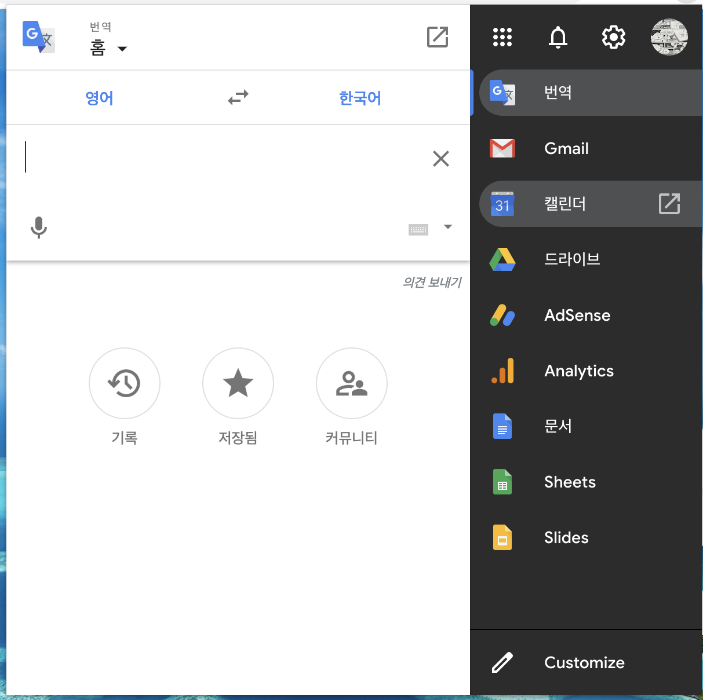
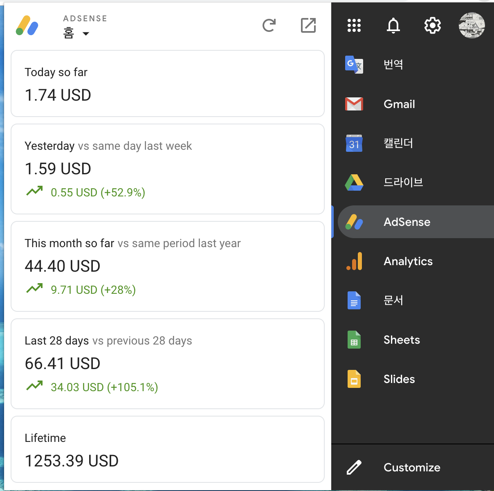
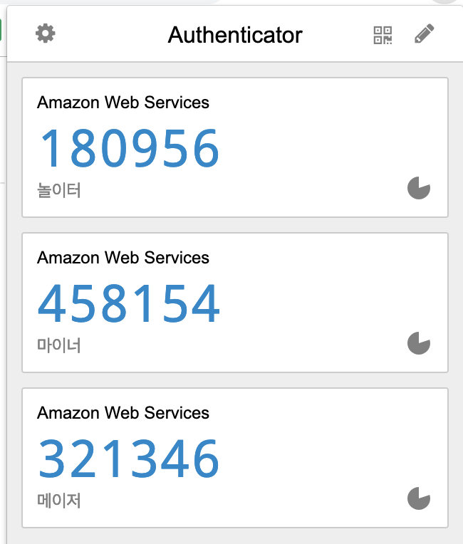
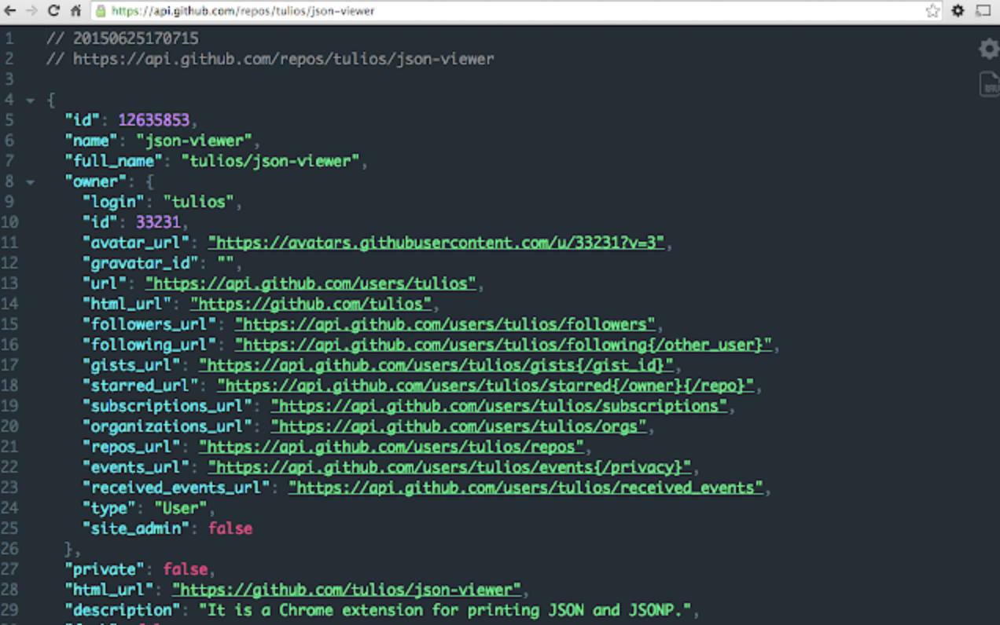
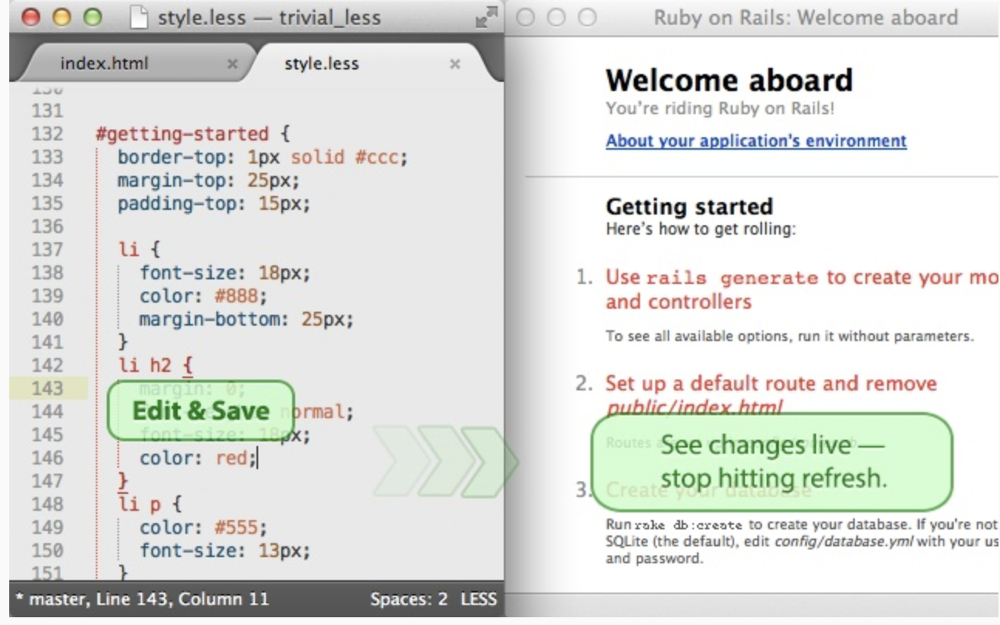
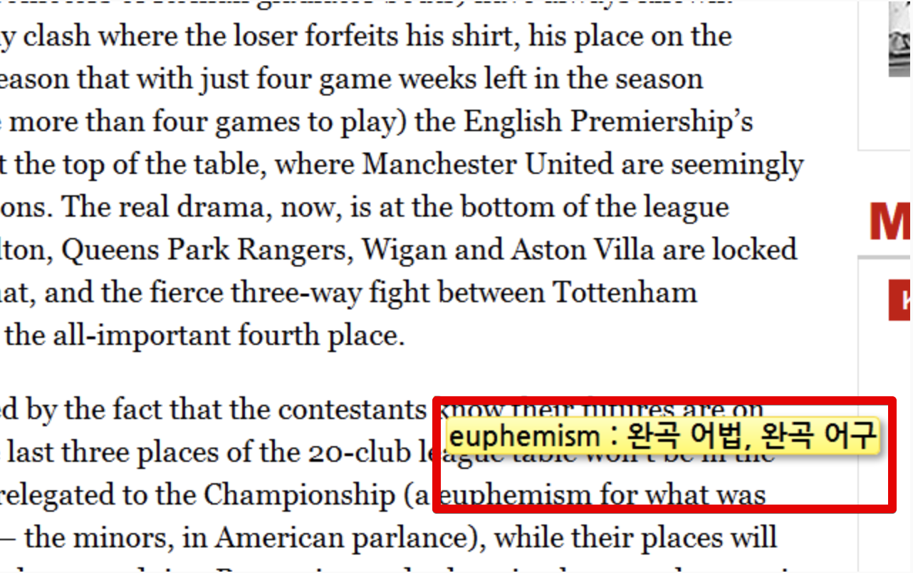
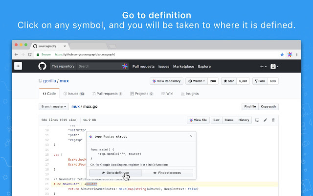
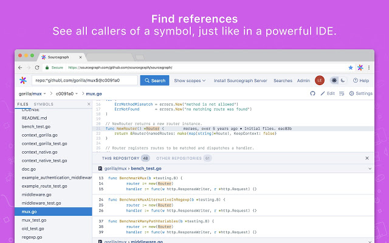
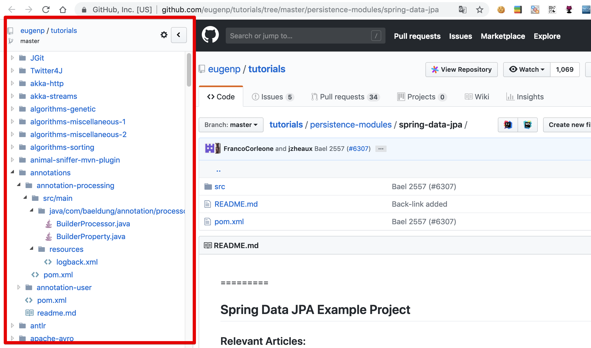

# 내가 추천하는 크롬 익스텐션 10선

주변에서 자주 듣는 질문중 하나가 크롬 익스텐션 추천입니다.  
제가 개인적으로 주변 개발자분들께 추천하는 플러그인들을 정리해보았습니다.

## 1. Black Menu

첫번째로 추철할 메뉴는 [Black Menu](https://chrome.google.com/webstore/detail/black-menu-for-google/eignhdfgaldabilaaegmdfbajngjmoke?hl=ko)입니다.  
기획/마케팅 직군분에서는 많이들 아실텐데요.
개발직군에선 그렇게 유명하지 않아서 첫번째로 추천드리게 되었습니다.

**Google의 모든 제품을 화면내에서 바로 사용**할 수 있습니다

저 같은 경우

* 구글 번역을 바로 사용할때
* GA를 보고 싶을때
* 구글 애드센스를 보고 싶을때

등등 **별도의 창을 열지않아도** 바로 실행해볼 수 있어 적극 사용중입니다.

사내 오피스가 구글 드라이브인 분들이라면 더더욱 많은 기능을 편하게 쓰실 수 있을 것 같습니다.

## 2. Edit this Cookie

두번째는 [Edit This Cookie](https://chrome.google.com/webstore/detail/editthiscookie/fngmhnnpilhplaeedifhccceomclgfbg) 입니다.

편하게 **쿠키 변조, 삭제, 등록**을 해주는 플러그인입니다.

크롬이나 파이어폭스에서 쿠키를 변조하는것은 많이 불편합니다.
이 부분을 아주 쉽게 해결해주기 때문에 웹 개발자라면 적극 사용하시길 추천합니다.

저 같은 경우 이전 회사에서 기획자분들께 테스트로 쿠키 변조/삭제가 필요할때 이 플러그인을 소개시켜드려 덕을 많이 봤습니다.

## 3. Authenticator

3번째는 [Authenticator](https://chrome.google.com/webstore/detail/authenticator/bhghoamapcdpbohphigoooaddinpkbai?hl=ko) 입니다.

**AWS MFA**를 사용하시는 분들의 필수 플러그인입니다.

AWS의 계정에 MFA를 적용하면 보안성이 높아지지만, 매번 OTP 번호를 발급받아야하는데요.
휴대폰 OTP로 하기엔 불편함이 많습니다.
크롬 내에서 바로 번호를 발급 받을 수 있어 편하게 MFA를 사용할 수 있습니다.

AWS를 사용하시는 분들의 필수 플러그인이라고 생각합니다.

## 4. JSON Viewer

4번째는 [JSON Viwer](https://chrome.google.com/webstore/detail/json-viewer/gbmdgpbipfallnflgajpaliibnhdgobh?hl=ko)입니다.

아래와 같이 브라우저 내에서 **JSON을 포맷팅**해서 보여주는 플러그인입니다.

테마도 여러개라 저 같은 경우 Daracula를 사용해서 IntelliJ와 유사한 느낌으로 쓰고 있습니다.
최근엔 IntelliJ의 [.http](https://jojoldu.tistory.com/266)를 사용하기 때문에 사용할 일이 거의 없지만 브라우저에서 JSON 데이터를 확인할 일이 있으신 분들은 설치해서 사용해보시길 추천합니다.

## 5. LiveReload

5번째는 [LiveReload](https://chrome.google.com/webstore/detail/livereload/jnihajbhpnppcggbcgedagnkighmdlei?hl=ko)입니다.  

프론트엔드 개발시 빠질수 없는 플러그인인데요.  
웹 프론트 개발시 수정사항을 자동으로 반영해주는 역할을 합니다.  
(실제로는 새로고침을 자동으로 해주는거나 마찬가지지만..)  

좋은 점은 Freemarker와 같은 서버 템플릿 엔진 역시 Devtools가 있으면 적용할 수 있습니다.
개인적으로 프론트엔드 개발시에 적극적으로 사용하는 플러그인이라 많은 분들이 사용해보셨으면 합니다.

Spring Boot + Devtools를 사용하시는 분들은 아래의 링크를 참고해서 적극 사용해보세요.

* [Spring Boot에서 적용방법](https://haviyj.tistory.com/11)
 
## 6. Tooltip Dictionary

6번째 플러그인은 [Tooltip Dictionary](https://chrome.google.com/webstore/detail/tooltip-dictionary-englis/hcidimjcobcnahiceedndikkenbibpop) 입니다.

크롬내에서 마우스가 있는 **포커스 영역의 단어를 번역**해줍니다. 

기술 문서를 볼때 전체 영역의 번역이 아닌 부분 번역으로 읽고싶을때 아주 유용한 플러그인입니다.
개발자분들은 영문 기술 문서를 볼일이 많기 때문에 정말 유용하게 쓰실 수 있습니다.

## 7. Sourcegraph

7번째 추천 플러그인은 [Sourcegraph](https://chrome.google.com/webstore/detail/sourcegraph/dgjhfomjieaadpoljlnidmbgkdffpack) 입니다.

Github에서 코드를 볼때 아주 유용하게 사용할 수 있는데요.

* 해당 코드(ex: 클래스등)가 선언된 곳으로 바로 이동하고 싶을때
* 해당 코드(ex: 클래스등)를 사용하는 곳으로 바로 이동하고 싶을때

바로 이동하는 기능을 지원합니다.

젯브레인의 코드리뷰 전용 Upsource 만큼 파워풀한 기능을 지원하진 않지만, 위 플러그인으로 최대한 유사하게 사용해볼 수 있으니 Github 사용자들은 꼭 설치하시길 바랍니다.

> 꼭 Github 사용자가 아니더라도 Github의 오픈소스 코드들을 분석할때도 유용하니 참고하세요.

## 8. Octotree

8번째는 [Octotree](https://chrome.google.com/webstore/detail/octotree/bkhaagjahfmjljalopjnoealnfndnagc?hl=en-US) 입니다.  
  
IDE의 프로젝트 탭처럼 Github 프로젝트를 볼때 전체 구조를 좌측 사이바에 노출시켜줍니다.

전체 구조를 확인할때나, 한번에 특정 파일로 이동할때 굉장이 유용합니다.
7번 Sourcegraph와 함께 Github의 오픈소스 프로젝트를 분석할때 자주 사용하는 추천 플러그인 입니다.

## 9. JetBrains IDE Support

9번째는 [JetBrains IDE Support](https://chrome.google.com/webstore/detail/jetbrains-ide-support/hmhgeddbohgjknpmjagkdomcpobmllji)) 입니다.

젯브레인의 IDE (IntelliJ, WebStorm 등) 사용시 **웹 프론트엔드의 디버깅을 IDE내에서 가능하도록 지원**하는 플러그인입니다.

아래는 젯브레인의 시연 영상입니다.

<iframe width="560" height="315" src="https://www.youtube.com/embed/kJh9lGbTSGI" frameborder="0" allow="accelerometer; autoplay; encrypted-media; gyroscope; picture-in-picture" allowfullscreen></iframe>

젯브레인의 IDE (IntelliJ, WebStorm 등)를 사용하시는 분들께는 정말 큰 도움이 될 플러그인입니다.
저는 최근엔 웹 프론트엔드 작업을 할일이 없어 거의 사용하지 않지만, 이전에 JS 개발을 할때는 적극 사용한 플러그인입니다.

## 10. Momentum

마지막 추천 플러그인은 [모멘텀](https://chrome.google.com/webstore/detail/momentum/laookkfknpbbblfpciffpaejjkokdgca?hl=ko&utm_source)입니다.

매일 새로운 풍경 사진을 배경으로 제공해주는 플러그인입니다.

특별한 기능 보다는 일할때마다 리프레시 되는 느낌이 좋아 계속 사용중인 플러그인입니다.
산뜻한 느낌을 원하시는 분이시라면 한번 사용해보시길 추천합니다.

## 마무리

제가 추천하는 10개의 플러그인들을 소개드렸습니다.  
이외에도 좋은 플러그인들이 많은데요.
다음 기회에 추가로 된 플러그인들을 정리해서 소개드리겠습니다.

감사합니다.
