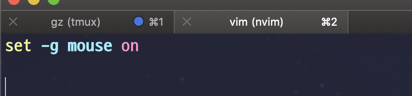
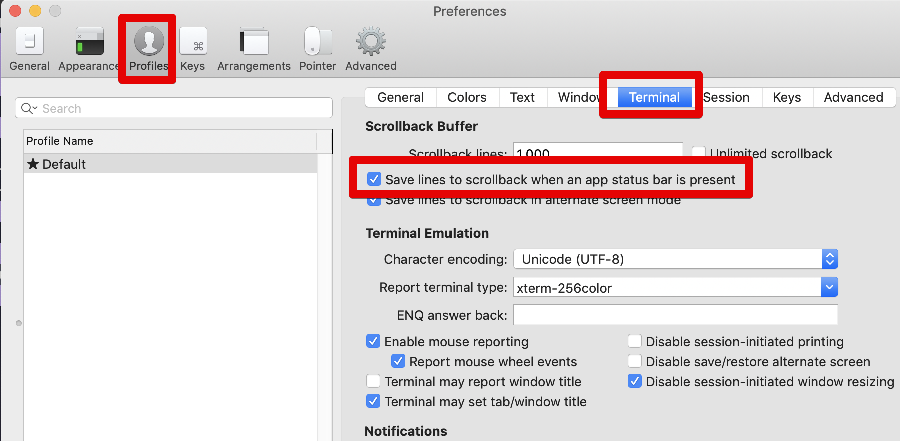

# Tmux 마우스 사용하기

본인의 맥북에서 외부 서버로 접근할때 Tmux를 자주 사용합니다.  
그러다보면 Tmux의 페이지 스크롤 모드로 전환했다가 편집 모드로 다시 전환했다 하는 등의 작업이 너무 불편하게 느껴집니다.  
  
그래서 Tmux에서도 마우스를 사용할 수 있게 터미널 환경을 변경해보겠습니다.  
  
먼저 현재 본인의 Tmux 버전을 확인합니다.  

```bash
tmux -V
```

그럼 버전이 노출되는데, 저는 2.8 버전을 사용중입니다.  
자신의 버전에 맞춰 아래 코드를 ```~/tmux.conf``` 에 붙여넣습니다.  
  
**2.1 이상 버전**  

```bash
set -g mouse on
```

**2.1 아래 버전**  

```bash
set -g mode-mouse on
```

config 파일을 열어서

```bash
vim ~/tmux.conf
```

코드를 등록합니다.



여기까지 하면 되어야겠지만, iTerm2에서는 한가지 작업을 추가로 해야합니다.  
  
Profiles -> Terminal -> Save lines to scrollback when an app status bar is present를 체크 하시면 됩니다.



이제 마우스로도 Tmux 페이지 스크롤을 사용할 수 있습니다.