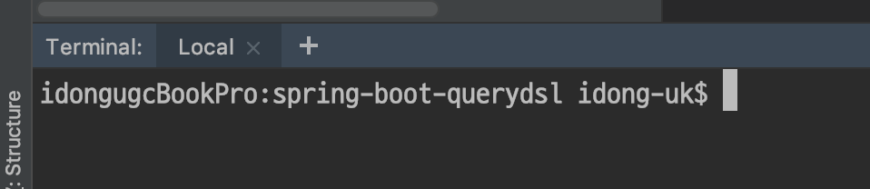
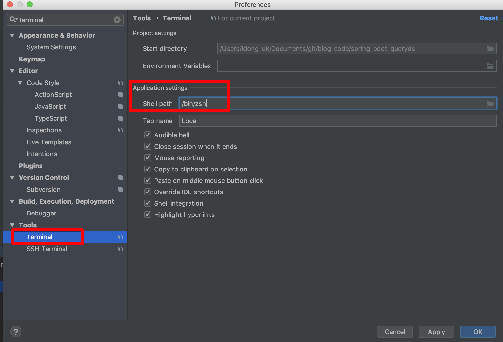
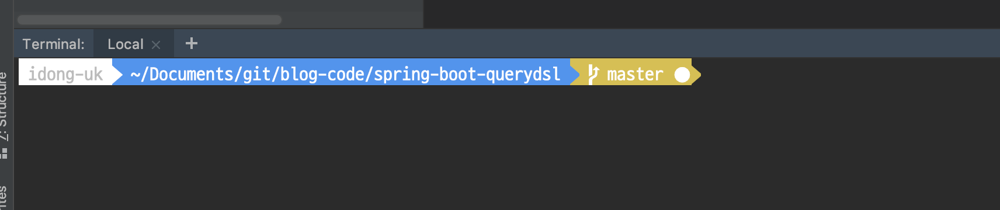
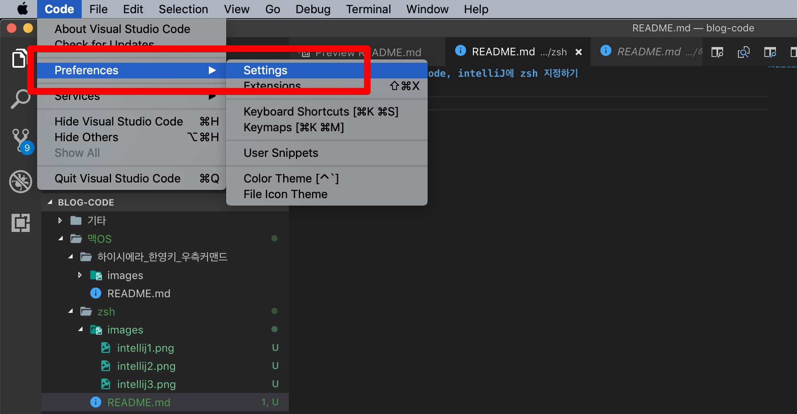
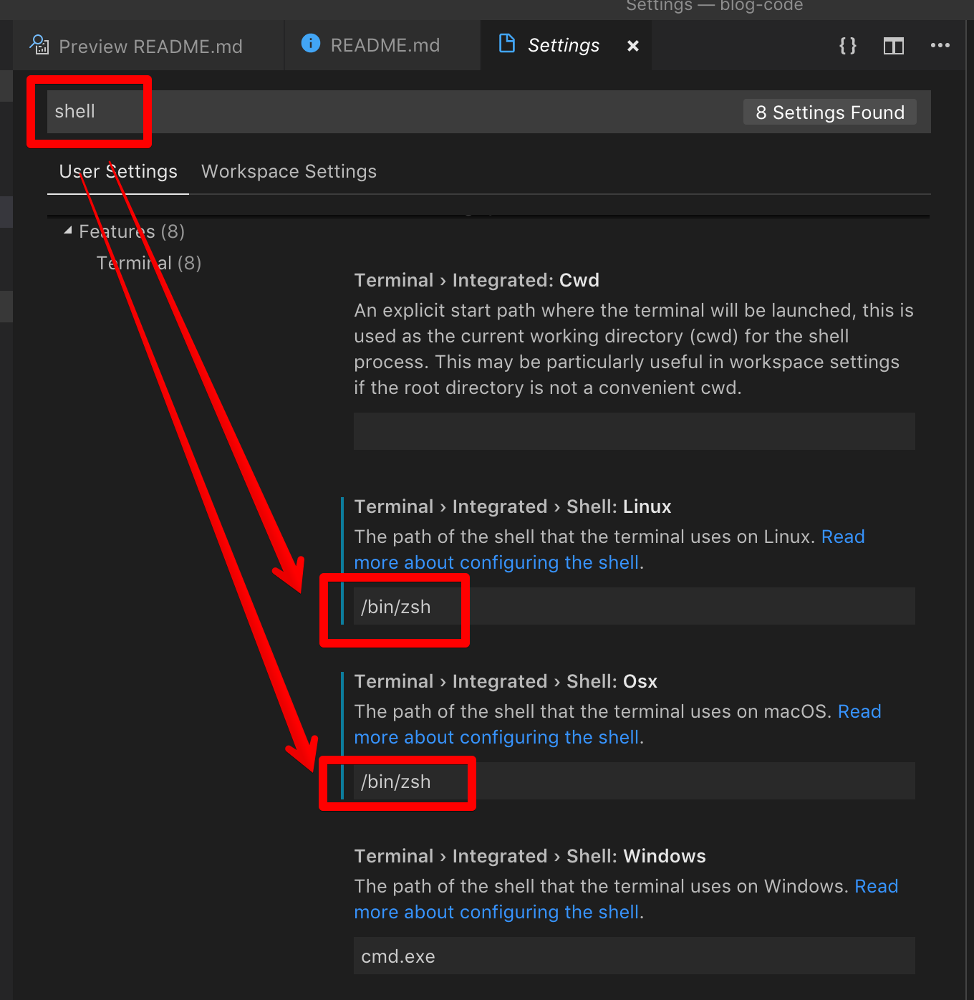
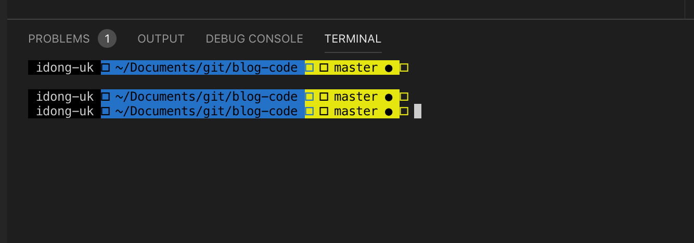

# 맥 환경에서 vscode, intelliJ에 zsh 지정하기

새로운 맥으로 교체하거나, 처음 사는 경우 [oh-my-zsh](http://heetop.blogspot.com/2017/10/oh-my-zsh_12.html)을 꼭 설치합니다.  
본인만의 아름다운 테마를 가진 터미널을 사용하기 위함인데요.  

기본적으로 Mac에서는 bash가 기본 쉘이라 IntelliJ나 VS Code와 같은 개발 툴에서는 bash를 기본 터미널로 사용합니다.  
아래처럼 말이죠.



이미 oh-my-zsh를 설치해서 본인만의 테마가 있으신 분들은 아래처럼 진행하시면 본인의 개발 툴 터미널이 zsh로 변경되니 참고해보세요 :)

## 1. IntelliJ

IntelliJ의 Preference (settings) 로 이동 한뒤, terminal을 검색합니다.  
그리고 Tools -> Terminal -> Application settings 항목에 아래와 같이 ```/bin/zsh```를 등록합니다.



등록하신뒤, IntelliJ를 재시작하시면 아래와 같이 zsh이 적용된 것을 확인할 수 있습니다.




## 2. VS Code

VS Code 역시 IntelliJ처럼 쉽게 적용할 수 있습니다.  
Preferences -> Settings로 이동합니다.



아래와 같이 ```shell```로 검색 한 뒤,
Shell:Linux와 Shell:Osx에 ```/bin/zsh```로 수정합니다.
(기본값은 ```/bin/bash```입니다)



그럼 아래와 같이 정상적으로 변경 된 것을 확인할 수 있습니다.

