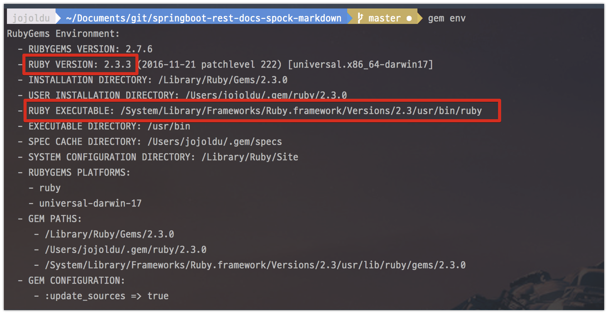
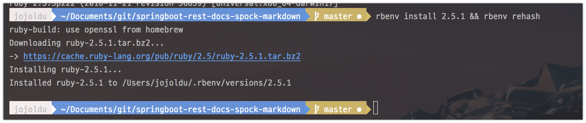
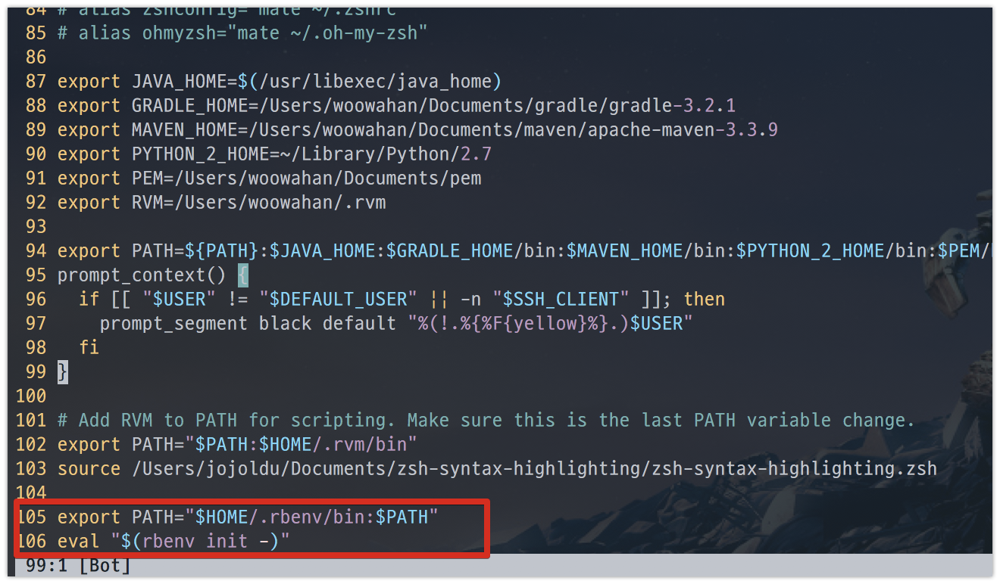

# Mac OS에서 Ruby Gem 권한 문제

맥에는 기본적으로 Ruby와 Ruby 패키지 관리 툴인 Gem이 설치되어있습니다.  
하지만 기본 설치 장소가 Root 사용자 권한이 필요한 곳입니다.  



(시스템 디렉토리에 설치된 Ruby와 Gem)  
  
이 상태에서 Gem을 통해 패키지를 받으면 **Permission Denied**가 발생합니다.

> ERROR:  While executing gem ... (Errno::EACCES)
Permission denied - /usr/local/lib/ruby/gems/2.0.0/gems/jekyll-1.0.3/CONTRIBUTING.md

그러다보니 기본 설치된 Gem 을 실행하기 위해서는 항상 ```sudo```로 실행해야만 하는데요.  
**설치된 패키지 역시 Root**사용자만 접근할 수 있기 때문에 문제가 더 커지기만 합니다.  
그래서 Ruby와 Gem의 권한을 **Root**가 아닌 **개인 사용자로 전환**하는 방법을 소개드립니다.

## 설치

먼저 Ruby 버전 관리 패키지를 설치합니다.  
대표적으로 2개가 있는데요

* rbenv
* rvm

여러 사이트에서 [rvm 보다는 rbenv를 추천](https://rorlab.gitbooks.io/railsguidebook/content/contents/rbenv.html)하기 때문에 rbenv를 설치합니다.

```bash
brew install rbenv
```

설치 가능한 루비 버전 목록을 확인합니다.

```bash
rbenv install -l
```

현재 최신 버전 (2018.04.22)이 2.5.1이므로 2.5.1을 설치합니다.

```bash
rbenv install 2.5.1 && rbenv rehash
```



설치가 완료 되셨으면, 이제 쉘을 실행시킬때 **기본 설치된 ruby가 아닌 rbenv로 설치된 루비를 실행**시키도록 변경해야 합니다.  
  
여기서 본인이 사용하는 쉘에 따라 다른 방식을 취해야합니다.  
  
**bash**

```bash
# 아래 명령어 실행하면 bash_profile에 자동 반영
echo 'eval "$(rbenv init -)"' >> ~/.bash_profile

# 반영
source ~/.bash_profile
```

**zsh**

```bash
# ~/.zshrc을 열고
vim ~/.zshrc

# 제일 하단에 다음과 같이 추가
export PATH="$HOME/.rbenv/bin:$PATH"
eval "$(rbenv init -)"

# 반영
source ~/.zshrc
```



자 이렇게 하신뒤 다시 Ruby 환경을 확인해보시면!


정상적으로 Ruby가 **개인 사용자 위치에 설치**된 것을 알 수 있습니다.  
(버전도 2.5.1로 변경되었네요!)  
  
시험 삼아 Gem 패키지 중 하나인 ```bundler```를 설치해보겠습니다.

```bash
gem install bundler
```


정상적으로 Gem 패키지가 설치된 것을 확인할 수 있습니다!
