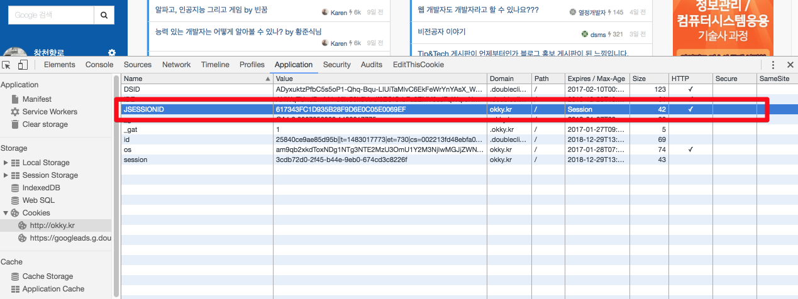

# 서블릿의 인스턴스화, 세션, 다중스레딩에 관련된 질문과 답변에 대한 번역
스택오버플로우에 올라온 서블릿과 관련된 [질문](http://stackoverflow.com/questions/3106452/how-do-servlets-work-instantiation-sessions-shared-variables-and-multithreadi)에 아주 좋은 답변이 달린 것을 보고 이건 많은 분들이 보시면 좋겠다는 생각에 첫 번역을 시작하게 되었습니다.  
영어를 너무 너무 못하지만 그래도 시작이 반이라고 생각되기에 일단! 시작하였습니다. (구글신을 믿습니다.)  
참고로 인스턴스화 라는 것은 **해당 클래스의 구현** 이라고 생각하시면 됩니다.  
```
Member m = new Member
// m은 Member 클래스의 인스턴스(객체가 아니에요)
// 이 생성 과정을 Member 클래스의 인스턴스화
```

혹시나 아래 번역이 부족하여 이해가 더 안되신다면 [구루비의 글](http://wiki.gurubee.net/pages/viewpage.action?pageId=26740202)을 읽어보시면 도움이 되실것 같습니다.


### 질문)
다수의 서블릿이 있는 웹서버가 있습니다. 해당 서블릿들 간에 전달되는 값들은 세션 변수와 인스턴스 변수에 할당해서 사용하고 있습니다.  
이 상황에서 만약 2명 혹은 그 이상의 사용자가 이 웹 서버에 request를 보내면 세션 변수는 어떻게 되는 건가요?  
모든 사용자가 동일한 세션변수를 사용하는 것인가요?  
아니면 각 사용자마다 세션변수가 다른가요?  
서로 다르다면 서버는 다른 사용자를 어떻게 구별할 수 있는건가요?  

한가지 더 비슷한 질문으로, 특정 서블릿에 접근하는 n명의 사용자가 있는 경우 이 서블릿은 첫번째 사용자가 처음 엑세스 했을때만 인스턴스화 되는건가요, 아니면 모든 사용자에게 개별적으로 인스턴스화 되는건가요?  
즉, 인스턴스 변수는 어떻게 되는건가요?  

### 답변)
#### ServletContext
서블릿 컨테이너(아파치 톰캣과 같은)가 시작되면, 해당 서블릿 컨테이너는 모든 웹 어플리케이션들을 배포하고 로드(load)합니다.  
웹 어플이케이션이 로드되면 서블릿 컨테이너는 ServletContext를 한번 생성하여, 서버의 메모리에 보관합니다.  
이후 web.xml을 파싱하여 ```<sevlet>```, ```<filter>```, ```<listener>``` 가 발견되면 (혹은 ```@WebServlet```, ```@WebFilter```, ```@WebListener``` 어노테이션들로 지정된 클래스들) 해당 클래스들을 **한번** 인스턴스 생성을 하고 서버의 메모리에 보관합니다.  
각각의 인스턴스화 된 필터는 본인의 ```init()```메소드가 즉시 실행(invoked)됩니다.  

서블릿 컨테이너가 종료되면 모든 웹 어플리케이션들을 언로드(unload)하고, 모든 초기화된 서블릿 및 필터의 ```destory()``` 메소드를 실행후 ```ServletContext```, ```Servlet```, ```Filter``` 및 ```Listener``` 인스턴스들은 전부 삭제됩니다.  

서블릿에 0보다 큰 ```<servlet><load-on-startup>``` 또는 ```@WebServlet(loadOnStartup)``` 값이 있을 경우 ```init()``` 메소드도 시작 중에 즉시 실행 됩니다.  
이러한 서블릿은 해당 값(1이면 첫번째, 2이면 두번째)에 지정된 순서대로 초기화 됩니다.  
1개 이상의 서블릿이 동일한 값을 가지고 있을 경우엔 web.xml 또는 ```@WebServlet``` 클래스로딩에 등장하는 순서대로 로드됩니다.  
만약 ```load-on-startup```값이 없을 경우엔 해당 서블릿에 **처음으로 HTTP request가 올때** ```init()```메소드가 실행됩니다.  

#### HttpServletRequest 및 HttpServletResponse
서블릿 컨테이너는 특정 포트 번호(8080포트는 일반적으로 개발단계에서 사용되고, 프로덕션(실서버)환경에서는 80포트)에서 HTTP request를 받는(listens) 웹 서버에 연결됩니다.  
클라이언트(웹 브라우저를 가진 사용자)가 HTTP request를 보낼 때, 서블릿 컨테이너는 새로운 HttpServletRequest와 HttpServletResponse 인스턴스를 생성하고 해당 인스턴스를 미리 정의된 필터 체인과 서블릿 인스턴스를 통과하도록 합니다.  

필터의 경우 ```doFilter()```메소드가 호출됩니다. ```chain.doFilter(request, response)```를 호출하면 request와 response가 다음 필터로 넘어가거나, 남아있는 필터가 없는 경우 서블릿에 도달합니다.

서블릿의 경우 ```service()```메소드가 호출됩니다. 기본적으로 이 메소드는 ```request.getMethod()``` 메소드를 기반으로 호출할 ```doXXX(): doGet, doPost등``` 메소드 중 하나를 결정합니다. 해당되는 메소드가 서블릿에 없으면 응답에 HTTP 405 에러가 리턴됩니다.  

request 객체는 header와 body 같은 HTTP request에 대한 모든 정보를 갖고 있습니다.  
response 객체는 예를 들어 header와 body(일반적으로 JSP 파일에서 생성된 HTML 내용)을 설정하는 것처럼 당신이 원하는 방식으로 HTTP 응답을 보낼 수 있는 기능을 제공합니다.  
HTTP 응답이 완료되면 request 객체와 response객체는 모두 재활용되어 재사용 할 수 있습니다.  

#### HttpSession
클라이언트(웹 브라우저의 사용자)가 처음으로 웹 어플리케이션을 방문하거나 ```request.getSession()```을 통해 HttpSession을 처음으로 가져 오면 서블릿 컨테이너는 새로운 HttpSession 객체를 생성하고 길고 unique한 ID를 생성 후, 서버의 메모리에 저장합니다. (```session.getId()```을 통해 가져올 수 있습니다.)  
또한 서블릿 컨테이너는 **JSESSIONID**란 이름을 key로, 생성한 session ID를 value로 하여 HTTP 응답의 Set-Cookie header에 cookie로 설정합니다.  

HTTP Cookie 스펙(웹 브라우저와 웹 서버가 준수해야 할)에 따라 클라이언트(웹 브라우저)는 cookie가 유효한 동안은 cookie header의 후속(subsequent) request에 이 cookie를 반환해야합니다. (즉, unique ID는 만료되지 않도록 **만료기간이 session**이어야 하며 도메인과 경로는 정확해야합니다).  
브라우저의 내장 HTTP 트래픽 모니터를 사용하면(Chrome / Firefox 23+ / IE9 +에서 F12 키를 누르고 넷 / 네트워크 탭을 선택) cookie가 유효한지 확인할 수 있습니다.  



([OKKY](http://okky.kr)를 예로 JSESSIONID의 value가 서버의 세션 ID입니다.)  

서블릿 컨테이너는 들어오는 모든 HTTP request의 cookie header에서 JSESSIONID라는 이름의 cookie가 있는지 확인하고 해당 값 (세션 ID)을 사용하여 서버의 메모리에서 연결된 HttpSession을 가져옵니다.  

HttpSession은 web.xml의 설정인 ```<session-timeout>```에 지정된 값 까지만 살아있습니다.  
time out의 기본값은 30분입니다. 따라서 클라이언트가 time out보다 오래 웹 어플리케이션을 방문하지 않으면 서블릿 컨테이너가 세션을 삭제합니다.  
모든 후속 request는 지정된 cookie가 있더라도 더 이상 동일한 세션에 액세스 할 수 없습니다. 서블릿 컨테이너는 새로운 세션을 생성 할 것입니다.

클라이언트 측에서는 **웹브라우저 인스턴스**가 실행되는 동안 session cookie가 활성화됩니다. 따라서 클라이언트가 웹 브라우저 인스턴스(모든 탭 / 창)를 닫으면 클라이언트 측에서 session이 삭제됩니다.  
새 브라우저에서 세션과 연관된 cookie는 존재하지 않으므로 더 이상 전송되지 않습니다. 이로 인해 완전히 새로운 HTTP Session이 생성되고 완전히 새로운 session cookie가 사용됩니다.

### 간단히 말해서
ServletContext는 **웹 애플리케이션이 살아있는 한** 계속 존재합니다. 모든 세션에서 모든 request간에 공유됩니다.  
HttpSession은 클라이언트가 동일한 브라우저 인스턴스로 웹 응용 프로그램과 상호 작용하고 세션이 서버 측에서 time out되지 않은 한 계속 유지됩니다. **같은 세션은 모든 request간에 공유**됩니다.
HttpServletRequest와 HttpServletResponse는 완전한 응답 (웹 페이지)이 도착할 때까지 서블릿이 클라이언트로부터 HTTP request을 받을 때부터 살아납니다. 다른 곳에서는 공유되지 않습니다.
모든 Servlet, Filter 및 Listener 인스턴스는 웹 응용 프로그램이 살아있는 한 계속 살고 있습니다. 모든 세션에서 모든 request간에 공유됩니다.
ServletContext, HttpServletRequest 및 HttpSession에 정의 된 모든 속성은 문제의 객체가 살아있는 동안 지속됩니다.  
객체 자체는 JSF, CDI, Spring 등과 같은 빈 관리 프레임 워크의 "범위"를 나타냅니다. 이러한 프레임워크는 범위가 지정된 bean을 가장 유사한 일치 범위의 속성으로 저장합니다.

#### Thread Safety
즉, 당신의 주요 관심사는 스레드 안전성이라고 할 수 있습니다. 서블릿과 필터는 모든 request에서 공유된다는 사실을 이제 알았습니다. 그것은 Java의 좋은 점입니다. 다중 스레드이며 다른 스레드 (읽기 : HTTP request)는 동일한 인스턴스를 사용할 수 있습니다. 그렇지 않으면 매 request마다 ```init()``` 및 ```destroy()```를 다시 작성하기에는 너무 비용이 많이 듭니다.  

또한 request이나 세션 범위 데이터를 서블릿이나 필터의 인스턴스 변수로 할당해서는 안됩니다. 다른 세션의 다른 모든 request간에 공유됩니다. 스레드로부터 안전하지 않습니다. 아래의 예는 이것을 설명합니다.  

```
public class ExampleServlet extends HttpServlet {

    private Object thisIsNOTThreadSafe; //쓰레드에 안전하지 않은 변수

    protected void doGet(HttpServletRequest request, HttpServletResponse response) throws ServletException, IOException {
        Object thisIsThreadSafe; // 쓰레드에 안전한 지역변수

        thisIsNOTThreadSafe = request.getParameter("foo"); // BAD!! 모든 request가 공유합니다.
        thisIsThreadSafe = request.getParameter("foo"); // OK, 이건 쓰레드에 안전합니다.
    }
}
```

### 답변에 달린 참고
[What is the difference between JSF, Servlet and JSP?](http://stackoverflow.com/questions/2095397/what-is-the-difference-between-jsf-servlet-and-jsp)
[Best option for Session management in Java](http://stackoverflow.com/questions/1700390/best-option-for-session-management-in-java)
[Difference between / and /* in servlet mapping url pattern](http://stackoverflow.com/questions/4140448/difference-between-and-in-servlet-mapping-url-pattern)
[doGet and doPost in Servlets](http://stackoverflow.com/questions/2349633/doget-and-dopost-in-servlets)
[Servlet seems to handle multiple concurrent browser requests synchronously](http://stackoverflow.com/questions/8011138/servlet-seems-to-handle-multiple-concurrent-requests-synchronously/)
[Why Servlets are not thread Safe?](http://stackoverflow.com/questions/9555842/why-servlets-are-not-thread-safe/)
