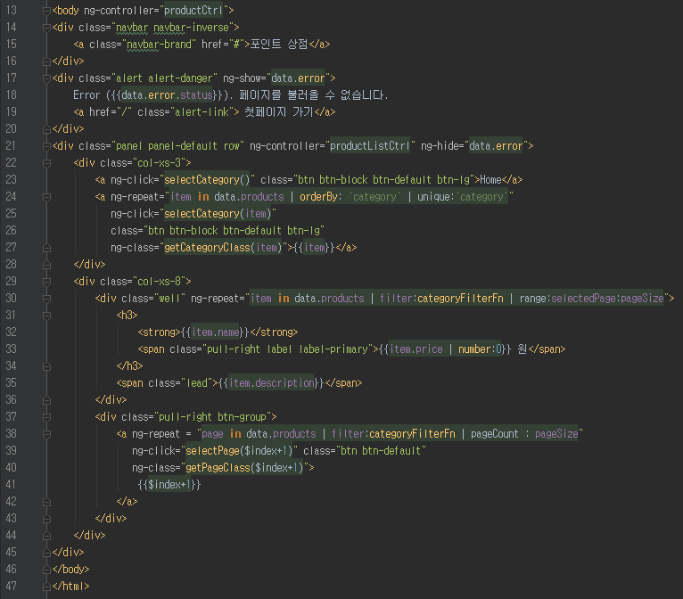
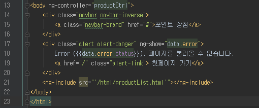
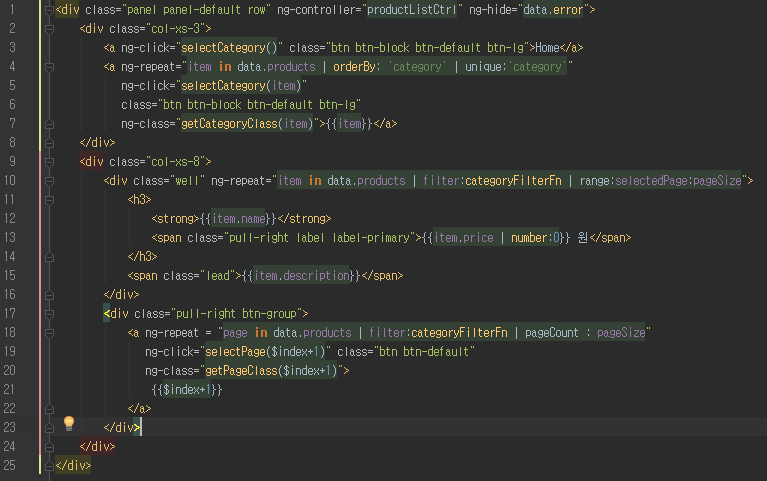

# 부분뷰 (ng-include)

HTML, JSP같이 VIEW 영역에 대한 코드는 서버사이드처럼 코드를 분리해서 작성하지 않고, 화면의 한 페이지당 하나의 파일로 코드를 작성하는 경우가 많다.  
이럴 경우 각 엘리먼트가 하는 일을 한눈에 알 수 없을 정도로 복잡해진다.  
다행히 AngularJS에서는 마크업 파일을 분리, 호출 할수 있는 디렉티브를 제공하는데 이것이 바로 `ng-include` 이다.  
  
아래 코드를 보자.

위 코드는 상품리스트를 나타내는 product.html 의 `<body>` 코드이다.  
  
현재는 그리 코드가 많지 않지만, 점차 기능을 붙임에 따라 코드가 늘어날 것이므로 `ng-include`를 사용하여 코드를 분리시키겠다.  

**product.html**

**productList.html**

메인 컨텐츠 부분만 별도로 분리하여 productList.html 을 만들고, 이를 product.html에서 호출하도록 하였다.  
  
조심해야할 점은 `ng-include`의 src속성은 홀따옴표인 `''`로 파일명을 wrapping 한 것이다.  
  
만약 `''`가 없을 경우 디렉티브가 스코프내에서 파일명을 찾게되므로 문자열로 지정할수있도록 `''`를 사용하자.  
  
굳이 이렇게 분리할 필요가 있나 라는 생각이 든다면 아래 부분뷰의 3가지 장점을 보고 다시 생각해보자.  

(1) 포스팅 상단에 얘기했던 것처럼 어플리케이션을 관리하기 쉬운 단위로 쪼갤 수가 있다.

* 이는 유지보수를 하는데 있어 내가 아닌 타인이 내 코드를 이해하기 쉽게 해준다.

(2) 어플리케이션에서 반복적으로 사용하는 HTML 요소를 생성할 수 있다.

* 이를테면 productList.html의 경우 product에서만 사용하는 것이 아니라, book, game 등 여러 html에서 호출하여 데이터만 다르게 끼워서 사용이 가능하다.

(3) 어플리케이션에서 특정기능을 사용하면서 다양한 기능을 보여주기 쉽다.  

* 현재 URL을 기준으로 자동으로 각기 다른 뷰를 보여줄수 있게 된다. 이에 대해서는 차후에 다시 포스팅 하겠다.

ng-include를 사용하여 좀더 편한 마크업작업을 하도록 하자.