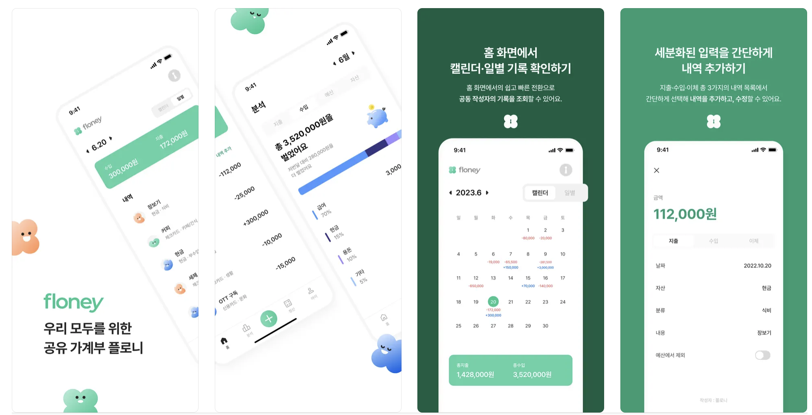

# 경쟁력 있는 신입 포트폴리오

> 팀원들의 이력서를 글 하단에 첨부해두었다.  
> 이 사이드 프로젝트를 진행한 멤버들에게 관심이 생긴다면 한번 커피챗을 요청해보자.

올해 대학생분들을 멘토링을 종종 했다.  
  
자주 받던 고민이 "어떻게 해야 취업 경쟁력이 생기느냐" 인데, 나는 그럴때마다 아래와 같이 조언을 드렸다.    
  
"뭐든 괜찮으니 본인에게 필요한 것을 하나 만들고 실제 출시까지 해보라.  
CLI, 패키지, 웹, 앱 상관없이 출시를 하고,  
100, 1000명의 고객을 만들고, 365/24시간 운영해보면  
로그 메세지는 어떻게 남겨야하고,  
에러 핸들링은 어떻게 해야하고,  
쿼리는 어떻게 작성해야하고,  
SQL 인잭션, XSS 공격 등을 왜 막아야하고,  
한정된 서버 자원을 어떻게 활용해야 하는지 등등을 배우게 된다.  
운영하면서 배운 내용을 블로그에 정리하면  
그게 포트폴리오고, 경쟁력이 될 것이다."  
  
과거에는 [LAMP (Linux, Apache, MySQL, PHP) 스택](https://aws.amazon.com/ko/what-is/lamp-stack/)이 너무 대중적이라서 누구나 자기만의 웹서비스를 만드는 것이 많았다.  
  
대학 졸업 작품 대부분이 스토어에 출시된 앱인 시즌도 있었다.  
  
실제로 나는 jQuery + PHP 로 본인의 학교 유틸리티 서비스를 만들어서 몇년간 운영하던 친구를 서류에서 바로 합격시킨 경우도 있다.  
  
localhost 을 벗어나야만 배우는 것들이 있다.  
예전에는 이게 너무 당연한 것이였다면,  
이제는 localhost 안에서 이쁘게 만드는 방법에 많이 집중되어있는것 같아서 오히려 지금 더 "내가 사용하고 싶은 서비스, 도구" 에 집중하는 것이 경쟁력이 된 것 같다.  
  
이런 피드백을 주고, 몇명이나 행동으로 옮겼을까? 라고 한다면 그리 많지는 않다.  
근데 그 중에서도 피드백 전부를 실행하고 결과를 낸 친구도 있다.  
  
백엔드였던 그 친구는 IOS 팀원을 모집해서 본인이 **Spring 기반의 백엔드와 클라우드를 담당해서 실제 앱까지 출시**했다.

- [Floney](https://apps.apple.com/us/app/%ED%94%8C%EB%A1%9C%EB%8B%88-floney/id6462989500)

> 담당하던 기획자 겸 디자이너분께서 [포트폴리오 소개 페이지](https://notefolio.net/miceaje9135/353331)를 만들어주셨다.  

그리고 실제로 서비스 출시 과정을 모두 블로그에 정리해주셨다.

- [Floney 개발 일지](https://sienna1022.tistory.com/category/Floney)

최근에 만나서 출시한 앱을 소개하면서,
"자꾸 서버가 죽어서 미치겠다. 최근에 이걸 해결하려고 A, B를 테스트해봤다."
"로그로 서버 용량이 계속 차는데 어떻게하면 좋을까요?" 
등등을 질문하고 고민에 빠지는 모습을 보여줬다.  
  
"아 저분은 이제 진짜 실무하는 분이구나" 라는 생각을 했다.  
현재는 모 기업에서의 정규직 채용을 전제로 인턴 생활을 하고 계신다.  
  
엄청 큰 회사는 아니지만,
이제 **회사에서의 실무 경험과 본인 사이드 프로젝트에서 쓰고 싶은 기술을 실제 사용자가 있는 환경에서 적용하면서 얻는 경험**까지 2배의 성장을 하실것이라 생각한다.  
  
서비스 경험에 대해 많은 회사들이 요구하는 것에 답답함을 많이 느낄수 있다.  
  
하지만 서비스 경험이라고 해서 **많은 사용자가 있는 거창한 서비스, 실무에서 사용하는 MSA, k8s에 각종 프레임워크가지 모두를 적용한 어떤 그런 환경에서의 경험을 요구하는 것이 아니다**.  
  
서비스 사용자를 만나면 알게 되는 여러 운영 경험들을 얻기 위해서
꼭 그런 기술들이 필요한것이 아니다.
과거의 선배들처럼 LAMP 스택이라도 괜찮으니 내가 사용하고 싶은 서비스를 한번 만들어보고 1년정도 운영해보면 좋다.  
  
개발자는 뭐가 됐든 무언가를 만들어내는 직업이다.
만들고 싶은 것이 있다면,
그걸 실제로 만들어보고 
내가 만든 것을 사람들에게 소개하자.
**고객들이 내가 만든 것을 좋아해주는 것을 경험하는 그때가 개발자로서 한단계 더 성장할 수 있는 순간**이 된다.

## 팀원 소개

만약, 위 사이드 프로젝트를 함께 했던 친구들 (디자인 / IOS / 백엔드) 과 이야기를 나눠보고 싶다면 아래 이력서를 참고해보자.

- [김성윤(BE)](https://www.rallit.com/hub/resumes/136304/%EA%B9%80%EC%84%B1%EC%9C%A4)
- [최세은(BE)](https://www.rallit.com/resumes/17169@dahyen_o/%EC%B5%9C%EC%84%B8%EC%9D%80?theme=MINT_SORBET)
- [남경민(ios)](https://www.rallit.com/resumes/39948@rudalswhdk12/%EB%82%A8%EA%B2%BD%EB%AF%BC?theme=STANDARD)
- [김소남(기획/uiux)](https://www.rallit.com/resumes/504267@sql2006/%EA%B9%80%EC%86%8C%EB%82%A8?theme=STANDARD)
- [제민지(기획/uiux)](https://notefolio.net/miceaje9135/353331)