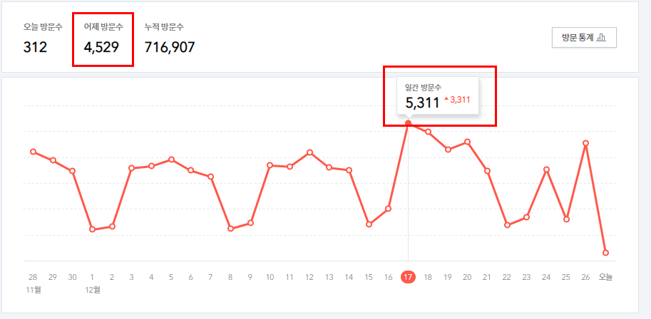
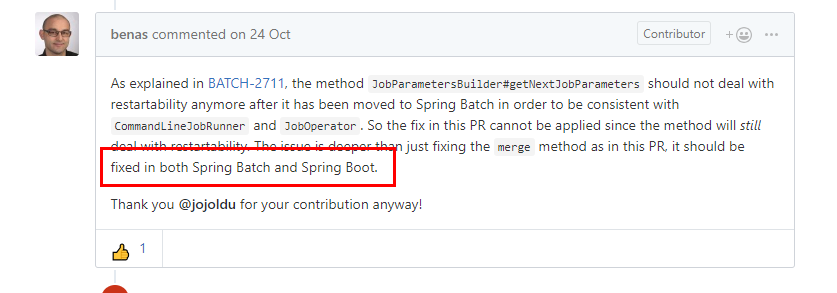

# 2018년 하반기 회고

(상반기엔 H2를 메인으로 썼으니, 하반기엔 [소라의날개로..)  
  
  
## 회사

하반기엔 큰 것 하나와 다음을 대비하는 작업들로 채운것 같다.  

### 8 ~ 10월 - 신 주문 시스템 TF 합류

하반기에 우리 실 (팀의 상위 조직) 최대 과제는 **주문 시스템 개편**이였다.  
  
우리팀의 도메인은 아니지만, 우리팀의 모든 서비스가 주문과 엮여있던 상태였다.  
그러다보니 주문 시스템이 얼마나 큰지, 모든 Flow에서 딱 중앙에 걸쳐있어 작은거 하나도 고치는게 얼마나 힘든지도 계속 보게 되었다.  
(공교롭게도 자리도 바로 옆이라서)  
  
근데 이 시스템을 **3개월만에 개편**해야하는 일정을 들었다.  
우리팀 일은 아니라서 애도를 표했다.  
  
"와.. 저기 진짜 풀야근이겠다 어떡하냐" 라는 생각과  
"우리팀에 요청 오면 많이 도와드려야겠다" 라는 생각도 덤으로 하고말이다.  
그팀으로 옮겨간 우리팀분과 같이 커피도 마시면서 위로도 해주고, 우리팀은 개편 다 끝나서 다행이다 라는 생각을 하고 있었다.  
  
그러다 갑자기 주문팀으로 옮긴 전 팀장님이 따로 나를 부르셨다.  

사실 그 팀의 상세한 도메인을 모르는 나로서는 어떤걸 도와드려야하나 난감하긴 했다.  
괜히 인원수만 채운게 아닌가 싶기도 하고, 

간단하게는 코드리뷰 참여 (도메인을 몰라서 코드상 오류나 컨벤션 위주로),

당시에 우리팀은 대부분의 서비스가 배치 작업이 수십개가 있었다.  
(결제/정산/포인트 등등이 다)  
수많은 Spring Batch Job들을 Jenkins로 관리했었는데, 이 방식이 2년간 해오면서 가장 효율적임을 느끼고 있었다.  
하지만 당시 주문 팀에는 배치 작업들을 Jenkins로 관리하고 있진 않아, 이를 도입했다.  

9월 추석연휴가 대박이였는데, 이날 고향인 대구에 내려가서 차례지내는 시간 외에는 모두 카페가서 작업을 진행했다.  
주문팀장님과는 1년 넘게 일했었지만, 확고하게? 완고하게? 작업 완료를 요청하신건 이때가 처음이였다.  
팀장님이 정말 진지한 표정을 지으시면서 얘기하셔서 **이거 못끝내면 진짜 큰일나나보다** 싶어서 **추석연휴에도 밤 12시까지** 작업했었다.  
친척분들은 뭐가 그렇게 일이 많냐고 하시는데 

뭐랄까 안개속을 걷는 기분이였다.  
도메인을 모른채로 레거시 데이터와 신규 모델 데이터를 검증하는 배치를 만드는건 그런 것이였다.  
구/신 테이블이 딱 1:1 관계면 얼마나 좋을까  
그런 아름다운 상황은 없고, 구 테이블이 1:N으로 이루어진 모델이 신에선 1로 이루어져서 어느 테이블의 어떤 필드가 신 테이블에 
아니 계산된 값을 써야할테도 있었고, 이 계산 로직이 아에 프로젝트에 없고 프로시져 스토어에 있기도 해서 수백개의 프로시져 스토어를 뒤져보기도 했다.  
그러다가 도저히 안되겠다 싶어서, 그 팀에서 정말 도메인을 꽉 잡고 계신분께 연락 드렸다.  
정말 죄송스럽게도 밤 12시까지 붙잡고 여쭤보고 테스트 코드를 작성했다.  

사실 나는 일과시간외에 회사에서 일하는건 좋아하지 않는다.  
그래서 보너스 휴가는 1도 받지 못했다 ㅠㅠㅠㅠ  
다음부터는 나와서 일해야겠다는 생각을 했다.  
  
여튼 이번 개편까지 벌써 **3번째 레거시 시스템 개편**에 참여하고 함께 완료를 경험했다.  
개인적으론 정말 뿌듯하다.  
레거시 시스템 개편을 할때 어떻게 계획을 잡고, 로직과 데이터를 검증하고, 모델링을 어떻게 해야할지 하나둘씩 채워가는 느낌이 든다.  
뭐 그렇다고 엄청 잘하게 되었다 이런건 아니고.  

### 11 ~ 12월 - 정산 / 포인트 운영

신주문 TF가 끝나고, 
## 블로그

블로그엔 아주 큰일이 있었다.  
사실 상반기에 있었던 일인데, 상반기 회고에서 잊고 작성을 안해서 하반기 회고에 작성한다.  
그 큰일이란..  
[Hibernate 뉴스레터 블로그](http://in.relation.to/2018/05/25/hibernate-community-newsletter-2018-10/)에 **내 블로그가 링크** 되었다.

(For our Korean reader, this article 이라고 되어있는 부분이다!!)  
  

그리고 티스토리가 통계 개편이 되면서 갑자기 방문자수가 급증했다.  

1 ~ 7월까지 72개의 글을 썼고, 8 ~ 12월까지 42개의 글을 썼다.  
즉, 올해는 총 114개의 글을 썼다.  

* 8월: 9
* 9월: 8
* 10월: 9
* 11월: 6
* 12월: 10
  
## 오픈소스

Spring에 PR을 2개를 보냈었다.

* Spring Rest Docs PR
* Spring Batch PR
  
보내긴 했는데...  
아쉽게도 **Spring Batch PR은 빠졌다**.  
버그는 확실한데, 이 버그가 단순히 Spring Batch만 수정해서 될 게 아니라, **Spring Boot도 같이 수정이 필요**하다는 것이다.

([Spring Batch PR](https://github.com/spring-projects/spring-batch/pull/625))  
  
내가 수정한건 보다 훨씬 더 큰 건이라고 하니 더 찾아보진 않고 포기했다.  
다른 하고 싶은것들도 많아서 더 매달릴순 없었다.  
얼른 해결해주길 바래본다.  

## 교육

* [DEVOPS로 활용하는 클라우드 플랫폼 WORKSHOP](https://www.fastcampus.co.kr/data_camp_cpb/)

## 발표

* [11월 JetBrains Day](https://info.jetbrains.com/jetbrains-day-seoul-2018.html)
* [12월 마소콘](https://www.imaso.co.kr/masocon2018/)