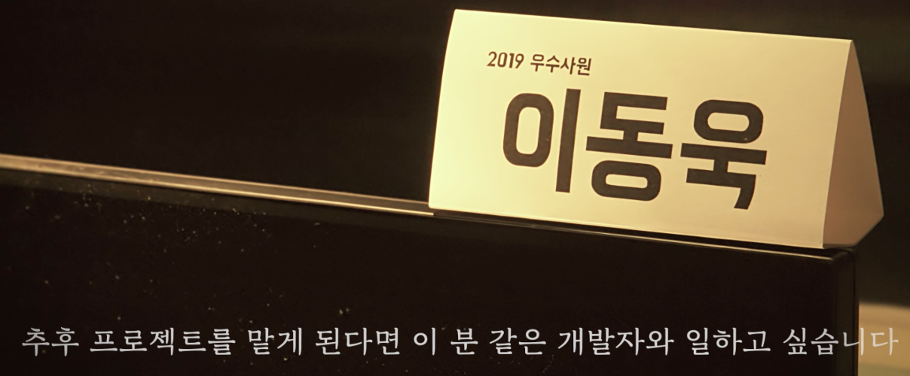
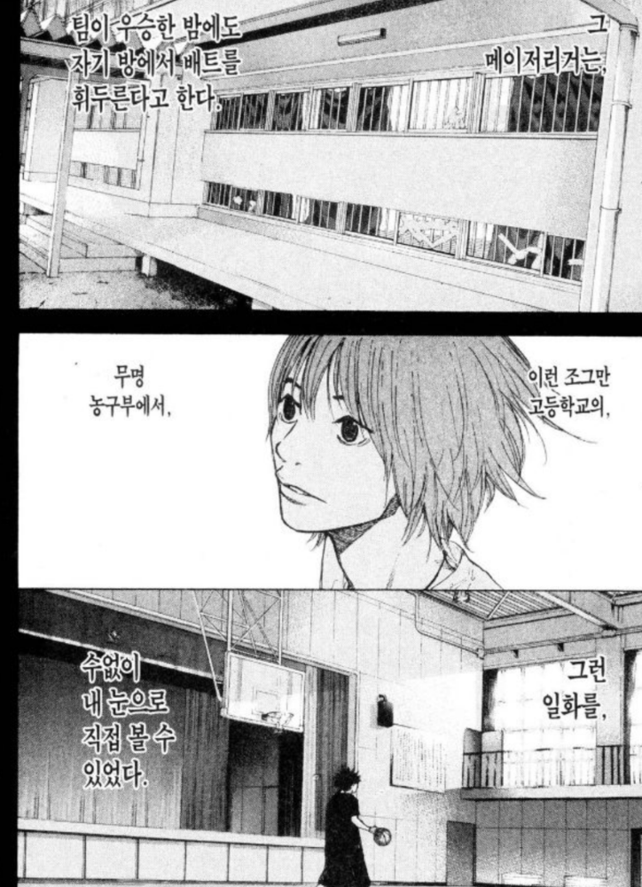
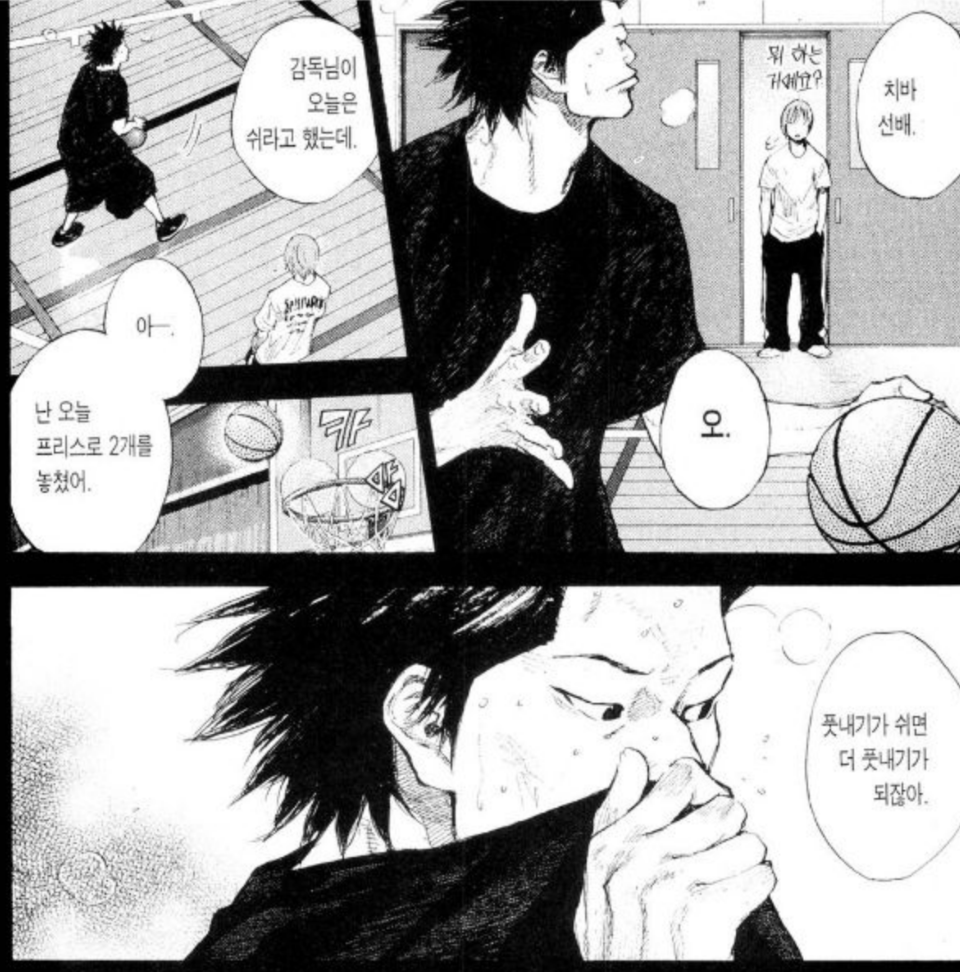
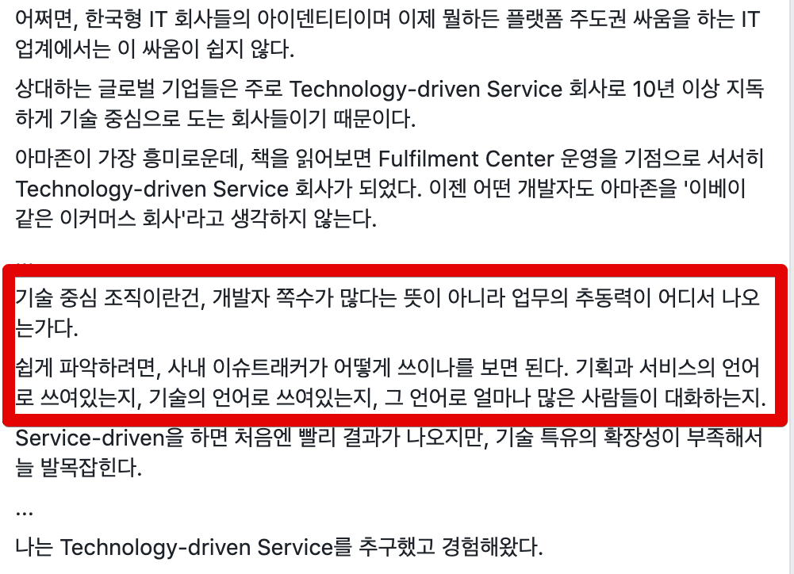
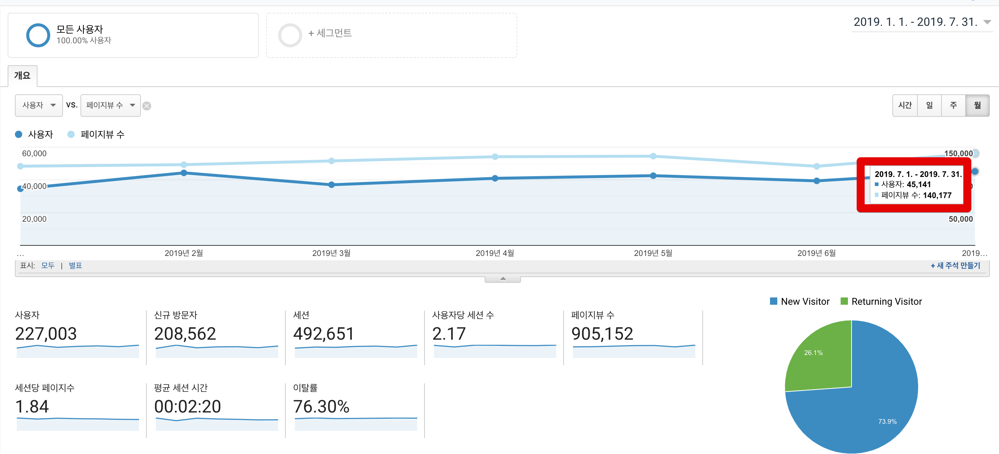
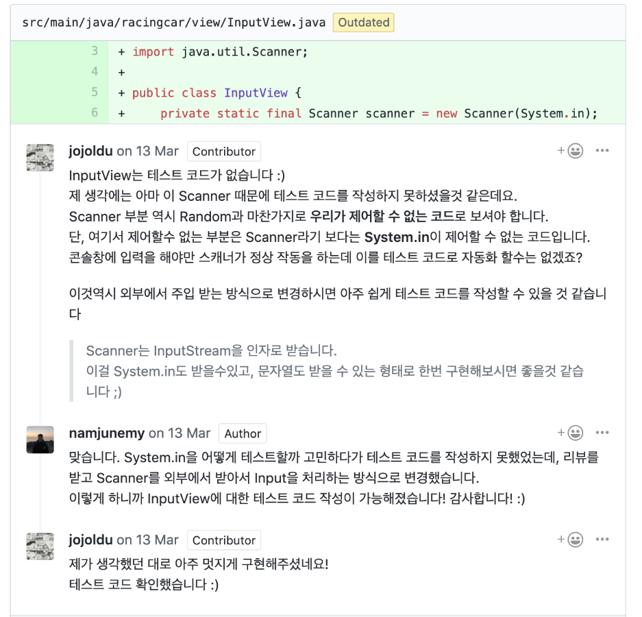

# 2019년 상반기 회고

(이번 회고 컨셉은 소라의날개 치바)  
  
8월이 되어서야 상반기 회고를 쓰게 되었다.  
그만큼 상반기에 겹치는 일이 많아 미루고 미루다 이제야 쓰게 되었다.

## 회사

지난 2년 6개월간 안바빴던적이 없었지만, 이렇게 **오래 바빴던 적은 처음이다**.  
  
단기간인 1~3개월 정도 바쁜건 자주 있었던 일이지만 거의 **5개월 내내** 주말에도 회사 일을 해야할 정도였다.  
  
이건 한개의 프로젝트가 길게 끌어서 그런건 아니다.  
**큰 프로젝트들이 한달 주기로 오픈**해야되다보니 계속 달릴수 밖에 없었다.  
  
빡센것도 빡센건데, **오래달렸다.**  
  
오죽하면 여자친구가 주말에 같이 있으면 "**혹시 회사 가야하는데 나 때문에 무리하는거 아니냐**" 라고 물어볼 정도로 주말에 회사나가서 일하는게 너무 당연시되던 시기였다.  
  
그래서 회사 이야기는 아마 프로젝트 얘기만으로 꽉 채울것 같다.

### 일정산 + 먼데이

상반기에 오픈했던 여러 프로젝트들 중 가장 큰 2개의 프로젝트가 **일정산 프로젝트**와 **먼데이 프로젝트**다.  

아마 대부분은 공감하실텐데 
### 업주 업소 프로젝트 개편 지원

주문 TF만큼 아예 고정멤버로 합류한건 아니다.  
(우리팀도 프로젝트 진행을 해야했으니)  
  

### 우수사원

상반기 사내 우수사원에 뽑혔다.  

(우수사원 소개 영상 중)  
  
1,000명이 넘는 인원 중에 5~6에게만 주는데, 내가 받게 된 것이다.  
이 상이 회사의 결정이 아닌, **같이 일한 주변 분들의 추천**으로 받는거라 정말 값진 상이다.  
  
너무 감사하고 기뻤지만 이 상을 받고 페이스북이나 블로그 등에 따로 기재하지 않았다.  
그리고 한달 넘게 지난 지금에야 기록 중이다.  
  
부끄럽다거나 민망하다거나 그런 류의 감정때문은 아니였다.  
그냥 감정의 기복없이 **평소와 다를바 없는 하루를 보내고 싶었다**.  
  
성향이 그런건 아닌데, 

상을 받든, 벌을 받든, 비가 오든, 눈이 오든 매일 커밋하고 글을 쓴다.

### 팀 분리

7월 1일을 기준으로 내가 속한/함께 일한 개발팀/기획팀들이 찢어지고 합쳐졌다.  
  
직군별 팀이 아닌 **서비스별로** 직군이 모여있도록 된 것이다.  

  
기존에 포인트 시스템과 정산 시스템 2개의 시스템 담당자로 되어있어서 어디로 갈지 알 수 없었다.  
그리고 조직 개편 이후로 신설된 **정산 시스템 팀**에 합류하게 되었다.  
  
[[ad]]

예전에 라인에 인수된 바풀의 CTO이신 [김영재](https://www.facebook.com/youngjaekim81)님의 포스팅을

([출처: 김영재님 포스팅](https://www.facebook.com/youngjaekim81/posts/10155404859622794))

정산이란 도메인이 그렇게 기술적인 도메인이 아니여서 그렇다고 생각할 수 있다.  
  
그렇지만 다시 생각해도 내가 어디를 가더라도 이정도로 **기술적인 이해도가 있는 기획자**들과 일할 수 있을까?  

그렇다고해서 계속 더 기술적인 용어로 대화를 하겠다는건 아니다.  
이를테면 여행가이드

**극단적인 서비스 용어도, 기술적인 용어도 아닌 중간 지점**을 찾으려고 노력중이다.  

## 블로그

6개월간 총 32개의 글을 썼다.  

* 1월: 11
* 2월: 7
* 3월: **2**
* 4월: **4**
* 5월: **4**
* 6월: 6

강조표시를 했지만, 3~5월은 **1주일에 1개의 글 쓰기도 힘들었다**.  
  
앞에서도 언급했지만, 기존에 글 쓰던 시간인 평일 오전 / 주말 시간대 모두를 회사 일을 하는데 써야했기 때문이다.  
  
특히나 3월~4월까지는 일정이 너무 빠듯해서 여자친구를 잠깐 만나는 것도 힘들었다.  
  
그러다보니 심적으로 힘들었다.  

수치는 우상향이다.  
7월을 기준으로

* MAU: **4.5만**
  * 1월 (3.4만)과 비교해서 **1.1만 증가**
* PV: **14만**
  * 1월 (12만)과 비교해서 **2만 증가**
* 평균 세션시간: 2분 20초
  * 1월 (2분 37초) 와 비교해서 **17초 감소**

을 달성했다.  
  
이대로 쭉 간다면 **MAU 10만, PV 50만** 까지 달성할 수 있지 않을까? 라는 기대감이 생겼다.  

## 오픈소스

* [spring-batch PR](https://github.com/spring-projects/spring-batch/pull/713)

[[ad]]

## 외부활동

상반기엔 새로운 외부 활동 몇가지를 참여했다.

### 클린코드 리뷰어 참여

자바지기 박재성님이 진행하시는 [클린 코드 교육](https://edu.nextstep.camp/c/8fWRxNWU/) 4기의 리뷰어로 참여했다.  

사실 처음 생각할때는 하루에 30분 ~ 1시간 정도 투자하면 되겠지 싶었는데, 해보니 그게 아니였다.  
하루에 2시간 이상을 리뷰어 활동에 쏟아야만 했다.  
  
단순히 컨벤션만 잡는게 아니라 
(컨벤션만 잡는거면 소나큐브로 자동화하면 될일이니)  

### WTD 2019 발표

* [꿈꾸는 태태태님이 작성해주신 세미나 참석 후기](https://taetaetae.github.io/2019/03/24/write-the-docs-seoul-2019-review/)

### 마소 396호 기고

### 책쓰기

작년 10월에 출판사와 계약을 맺었다.  
연락은 8월에 주셨는데, 고민에 고민을 더하다 10월에야 사인을 하게 되었다.  

9월이면 아마도 책이 출고될것 같다.

## 건강

[[ad]]

## 하반기 목표

### 팀

### 멘토링

### 출간

## 마무리

