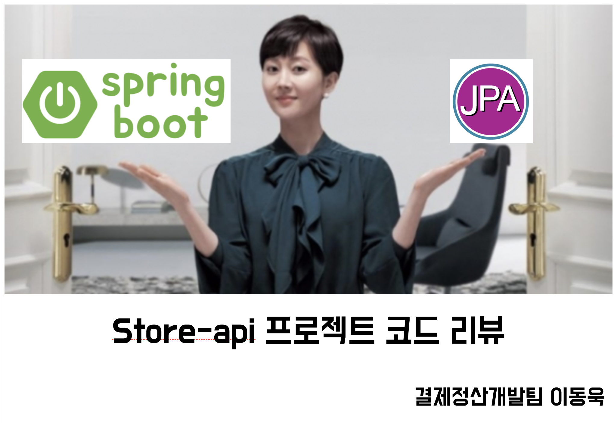
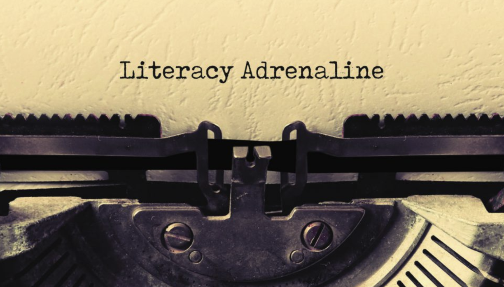
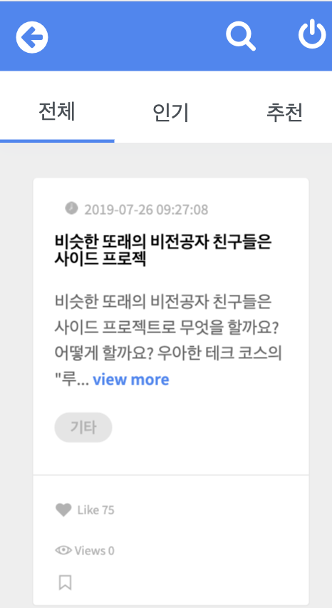

# 2019년 상반기 회고

(이번 회고 컨셉은 소라의 날개 치바)  
  
8월이 되어서야 상반기 회고를 쓰게 되었다.  
그만큼 상반기에 겹치는 일이 많아 미루고 미루다 이제야 쓰게 되었다.

## 1. 회사

지난 2년 6개월간 안바빴던적이 없었지만, 이렇게 **오래 바빴던 적은 처음이다**.  
  
단기간인 1~2개월 정도 바쁜건 자주 있었다.  
하지만 이번엔 **4개월 내내** (2월 ~ 5월) 회사일에 대부분의 시간을 투자해야만했다.  
  
이건 한개의 프로젝트가 길게 끌어서 그런건 아니다.  
**큰 프로젝트들이 한달 주기로 오픈**해야되다보니 계속 달릴수 밖에 없었다.  
  
빡센것도 빡센건데, **오래달렸다.**  
  
오죽하면 여자친구가 주말에 같이 있으면 "**혹시 회사 가야하는데 나 때문에 무리하는거 아니냐**" 라고 물어볼 정도로 주말에 회사일을 하는게 너무 당연시되던 시기였다.  
  
그래서 회사 이야기는 아마 프로젝트 얘기만으로 꽉 채울것 같다.

### 1-1. 일정산 + 먼데이

상반기에 오픈했던 여러 프로젝트들 중 가장 큰 2개의 프로젝트가 **일정산 프로젝트**와 **먼데이 프로젝트**다.  
(이 외에도 많았다.)  
  
조금 간단히 프로젝트를 소개하자면,

* 업계 최초로 주/월이 아닌 **일 단위로 정산**을 해주는 일정산 프로젝트
* 광고 도메인이 완전히 개편되어야 하는 먼데이 프로젝트
  
먼데이 프로젝트는 우리팀이 메인은 아니다.  
다만 개편된 광고 도메인에 맞추기 위해 **정산 비지니스가 크게 변경되어**야만 했다.  
광고금 정산 이란 비지니스가 그동안 정산 시스템에서 진행하고 있진 않았기 때문이다.  
  
상세하게 도메인과 시스템 변경 내용을 얘기할 순 없다.  
단지 광고와 관련해서 매출/채권/미수금/정산/가상재화차감 등등 전에 없던 도메인들이 너무 많이 필요했다.  
  
기존 도메인에 녹이기는 힘들었다.  
이름만 비슷하지 **시작점부터 끝점까지 비슷한게 거의 없어서 합치면 더 망할것 같았다.**  
  
일정산은 정산금 만드는 배치 로직을 다 고쳤어야 했다.  
검증 로직도 빡빡하게 추가되어야만 했다.  
결국 매일매일 정산금이 나가기 때문에 한번 삐끗하면 큰일이다.  
  
API나 어드민, SAP 관련해서도 변경 내용이 많아 **이거 진짜 일정 내에 오픈할 수 있나**?라는 생각을 계속 하면서 작업을 진행했다.  
  
그래도 끝나고 나서 기사도 나고, 회사나 업주님들께 모두 보탬이 되었다는 생각에 큰 위안이 되었다.

진행하면서 아쉬웠던 점이 많았지만 별도로 회고를 못했다.  
  
배민장부, 스마트오더, 1인분 등 줄줄이 작업 할 것들이 대기중이라 개발하느라 정신 없었기 때문이다.  
  
이번주 수요일이 팀 워크샵이라 이때 좀 제대로 상반기 회고를 해봐야겠다.

### 1-2. 업주/업소 프로젝트 개편 지원

먼데이 프로젝트에서 광고 시스템만큼 크게 개편된 도메인이 업주/업소 시스템이였다.  

프로젝트가 시작 되기 전에 실장님과 팀장님, 그리고 업주/업소 시스템의 팀장님과 잠깐 이야기를 나누었다.  
  
업주/업소 시스템이 개편하면서 기존 프로시저 로직들을 모두 JPA 기반으로 개선해야하는 목표를 이야기 해주셨다.  
  
그래서 내가 **도움을 주면 좋겠다**는 이야기도 해주셨다.  
(데자뷰같은..?)  
  
주문 TF처럼 아예 고정멤버로 합류한건 아니다.  
(우리팀도 프로젝트 진행을 해야했으니)  
  
단지 옆에서 힌트를 드리고, 샘플 코드를 작성해서 보여드리고, 설계 회의 참석하는 등등의 간접적으로 도움을 드렸다.  
  
좀 더 도움을 드리고자 진행중이시던 프로젝트 코드를 분석했다.  
워낙 프로젝트가 커서 전체 코드를 다 파악하진 못했다.  
다만 내가 파악한 선에서 내용들을 정리했다. 

* JPA 성능상 이슈가 될만한 요소들
* 스프링 부트에서 권장 하는 방식
* 좋은 프로젝트 구조에 대한 이야기

그리고 이를 해당 팀에 공유를 했다.

2주간의 직접적인 참여가 끝나고 난 뒤로는 상시 질문을 받는 형태로 도움을 드리게 되었다.  
  
너무 얕게 도와드렸던것 같아 죄송스러운 마음이 들기도 했다.  
  
개인적으로는 그동안 해왔던 도메인이 아니다 보니 이런 도메인도 맡아서 해보면 재밌겠다 싶은 생각이 들었다.  
  
프로젝트가 잘 오픈되고, 해당 팀에서 사주는 **소고기**를 맛있게 얻어 먹었다.

### 1-3. 우수사원

상반기 사내 우수사원에 뽑혔다.  

(우수사원 소개 영상 중)  
  
1,000명이 넘는 인원 중에 5~6에게만 주는데, 받게 된 것이다.  
회사의 결정이 아닌, **같이 일한 주변 분들의 추천**으로 받는거라 정말 값진 상이다.  
(선물도 **스타일러**와 **건조기**여서 더 좋았다.)  
  
너무 감사하고 기뻤지만 이 상을 받고 페이스북이나 블로그 등에 따로 기재하지 않았다.  
별도로 파티를 하거나 회식을 하지도 않았다.  
(당일 오후에 회사에서 빙수를 시켜먹긴 했다.)  
  
한달 넘게 지난 지금에야 기록 중이다.  
  
부끄럽다거나 민망하다거나 그런 류의 감정때문은 아니였다.  
그냥 감정의 기복없이 **평소와 다를바 없는 하루를 보내고 싶었기 때문이다**.  
  
성향이 그런건 아닌데 만화책을 보다가 그런 사람이 되고 싶다는 생각을 하게 되었다.  
  
**우승한 날에도 자기방에서 배트를 휘두르는 사람**  
  
그런 사람이 되고 싶었다.
  

(소라의 날개 중)  
  
상을 받든, 벌을 받든 일회일비 하지 않고 매일 커밋하고 글을 쓰는 사람이 되고 싶다.  
  
누가 봤을땐 재미없는 생활일 수 있겠지만, 이런 재미없는 습관이 결국 나를 더 높은 곳으로 데려다 줄거라 믿는다.

### 1-4. 팀 분리

7월 1일을 기준으로 내가 속한 개발팀과 함께 일한 기획팀들이 찢어지고 합쳐졌다.  
  
직군별 팀이 아닌 **도메인별로** 직군이 모이도록 된 것이다.  
  
나는 포인트 시스템과 정산 시스템 2개의 시스템 담당자로 되어있어서 어디로 갈지 궁금했었는데, 결국 **정산 시스템 팀**에 합류 하게 되었다.
  
조직개편이 되면서 내 역할에도 조금 변경이 생겼다.  
팀장님이 기획자이시다 보니 개발 파트의 주변 일들, 이를테면 IDC 인프라 관리/이력서 검토/면접/개발 회의 등등을 내가 하게 되었다.  
테크 리더라고 표현하기엔 좀 그렇고 여튼 어플리케이션 개발은 조금 뒤로해야만 하는 상황이다.  

그렇다고 개발을 완전히 손 놓은건 아니다.  
비동기 API와 같이 성능 개선이 필요한 작업들이나 예전에 내가 작업한 내용에 대한 후속조치는 직접 진행하기도 한다.  
다만 **다른 분들이 개발에 집중할 수 있게** 기타 작업들 위주로 하고 있고, 최근엔 리눅스 쉘 스크립트 작업 비중이 높다.  

[[ad]]

역할에 대해서는 불안감이 조금 있는 상태이다.  
너무 실무를 오래 손놓게 되는건 아닐까하는 걱정때문이다.  
다만, 이번에 받은 역할이 쉽게 경험할 수 있는 것은 아니기 때문에 **그간 경험해보지 못한 새로운 경험을 배운다**는 생각으로 재밌게 적응하는 중이다.  
  
개인적인 변화 외에 추가로 같은 팀이 된 기획자분들 이야기를 조금 하고 싶다.  
라인에 인수된 바풀의 CTO이신 [김영재](https://www.facebook.com/youngjaekim81)님의 포스팅을 본 적이 있다.  
나는 정산 기획자분들과 일하면서 이 글에서 이야기하는 것을 작게나마 경험할 수 있었다고 생각한다.

([출처: 김영재님 포스팅](https://www.facebook.com/youngjaekim81/posts/10155404859622794))

이분들은 비개발직군이지만 **개발에 대한 이해도가 높다**.  
그러니깐 어떤 주제에 대해 이야기할때 이분들과 함께라면 **기본적인 공감대가 형성된 채로 대화를 시작할 수 있다**.  
  
정산이란 도메인이 완전히 기술적인 도메인이 아니라서 기술적 난이도가 낮아서 그런게 아니냐고 반문할 수 있다.  
그렇지만 다시 생각해도 어디를 가더라도 이정도로 **기술적인 이해도가 있는 기획자분들**과 함께 일할 수 있을지 생각하면 확신할 수 없다.  
  
> 다만, 이런 이야기가 개발자의 면죄부처럼 쓰라는 의미는 아니다.  
> 대화를 할때 기술용어를 남발해도 된다는 이야기가 아니라, **어느 일이 더 중요한가**에 대해 서로 공감대 형성이 된다는 의미이다.
> 기술적인 용어를 남발하는건 개인적으로 **여행가이드가 현지어로 잘난체 하는것만큼** 잘못된 일이라고 생각한다.
 
Service Driven 해야하는 팀이지만, 그래도 그 안에서 Tech를 지향해 볼 수 있을것 같다.  
그래서 **이 팀이라면 좋은 경험치를 쌓을 수 있지 않을까** 기대하고 있다.

## 2. 블로그

블로그는 계속 성장중이다.

 
7월을 기준으로

* MAU: **4.5만**
  * 1월 (3.4만)과 비교해서 **1.1만 증가**
* PV: **14만**
  * 1월 (12만)과 비교해서 **2만 증가**
* 평균 세션시간: 2분 20초
  * 1월 (2분 37초) 와 비교해서 **17초 감소**

을 달성했다.  
  
MAU 5만이면 웬만한 소규모 서비스 수준이라고 들었다.  
올해 안에 5만은 쉽게 달성할 것 같고 6만을 목표로 해도 될것 같다.  
  
PV가 조금 아쉽지만, 올해 12월에는 20만을 달성하고 싶다.  
  
상반기엔 **좋은 퀄리티의 글을 많이 쓰지 못했는데도** 계속 상승중인걸 보면 가능하지 않을까 싶다.  
  
이대로 쭉 간다면 **MAU 10만, PV 50만** 까지 달성할 수 있지 않을까? 라는 기대감이 생겼다.  
  
6개월간 총 32개의 글을 썼다.  

* 1월: 11
* 2월: 7
* 3월: **2**
* 4월: **4**
* 5월: **4**
* 6월: 6

강조표시를 했지만, 3~5월은 **1주일에 1개의 글 쓰기도 힘들었다**.  
  
앞에서도 언급했지만, 기존에 글 쓰던 시간인 **평일 오전 / 주말 시간대 모두를 회사 일을 하는데** 써야했기 때문이다.  
  
특히나 3월~4월까지는 일정이 너무 빠듯해서 여자친구를 잠깐 만나는 것도 힘들었다.  
  
그러다보니 심적으로 힘들었다.  
  
나는 회사에서 해결한 문제를 **내껄로 만드는 별도의 시간이 필요**하다.  

> 참고: [마음껏 틀릴 수 있는 시간](https://jojoldu.tistory.com/435)  

이걸 못하니 계속 정체되고 있다는 생각이 가득했다.  

## 3. 오픈소스

오픈 소스 참여는 Spring Batch 쪽 PR을 하나 보냈다.  
(아직 Merge는 안됐다.)  

* [spring-batch PR](https://github.com/spring-projects/spring-batch/pull/713)

이외에도 기존에 필요한 라이브러리가 있었는데, 마음에 드는게 없어서 하나 만들어서 공유할 계획이 있었다.  
시간이 안되서 못했지만, 하반기에는 해당 라이브러리 공유와 추가 스프링 관련 PR을 진행할 예정이다.

## 4. 외부활동

상반기엔 그동안 안해오던 새로운 외부 활동 몇가지를 참여했다.

### 4-1. 클린코드 리뷰어 참여

자바지기 박재성님이 진행하시는 [클린 코드 교육](https://edu.nextstep.camp/c/8fWRxNWU/) 4기의 리뷰어로 참여했다.  

사실 처음 생각할때는 하루에 30분 ~ 1시간 정도 투자하면 되겠지 싶었는데, 해보니 그게 아니였다.  
하루에 2시간 이상을 리뷰어 활동에 쏟아야만 했다.  
  
단순히 **컨벤션만 잡는게 아니기 때문**이다.  
(컨벤션만 잡는거면 소나큐브로 자동화하면 된다.)  
  
* 이 분들이 왜 이렇게 작성하셨을까?  
* 이 기능이 요구 사항에 있던 기능인가?
* 이 분들이 참고할 블로그 글은 없을까?

위와 같은 이유로 정말 많은 시간이 소요되었다.

자주 질문하시는 부분들에 대해서는 아예 블로그로 정리해서 링크채로 공유드리기도 했다.

* [일급 컬렉션](https://jojoldu.tistory.com/412)

마지막 날엔 다같이 모여 회식을 했다.  
리뷰를 받았던 몇분이 내 리뷰가 제일 힘들었다고 얘기해주셨다.  

### 4-2. WTD 2019 발표

WTD 2019 (Write The Docs) 에 연사로 참여했다.  

* [꿈꾸는 태태태님이 작성해주신 세미나 참석 후기](https://taetaetae.github.io/2019/03/24/write-the-docs-seoul-2019-review/)

### 4-3. 마소 396호 기고

마소 396호에 "개발자 이직 포트폴리오" 란 주제로 기고 했다.

### 4-4. 책쓰기

작년 10월에 출판사와 계약을 맺었다.  
연락은 8월에 주셨는데, 고민에 고민을 더하다 10월에야 사인을 하게 되었다.  

9월이면 아마도 책이 출고될것 같다.

추가로 [소프트스킬](https://coupa.ng/bh5Ws7) 에 10페이지 정도 컬럼을 작성했다.  

## 5. 건강

작년 11월부터 시작한 PT를 여전히 진행 중이다.  
살이 계속 빠져서 80 kg 이하가 되니 선생님이 탄수화물 이제 드ㅅ
[[ad]]

언급했듯이 2~5월까지 회사 일로 바빴는데 어떻게 PT를 했냐면.. 돈으로 해결했다.  
  
타다를 이용해서 타다가 도착하기 직전까지 회사에서 일을 하고, 10분만에 헬스장에 도착해서 운동 한뒤, 다시 예약한 타다를 타고 회사로 복귀해 이어서 일을 진행했다.  
  
한번 타는데 대략 6천원이였으니 왕복 12,000원 택시비가 계속 지출됐다.  

## 6. 하반기 목표

### 6-1. 팀

### 6-2. 멘토링

### 6-3. 출간

### 6-4. 파일럿 프로젝트

신규로 준비중인 서비스가 있다.  

## 7. 마무리

