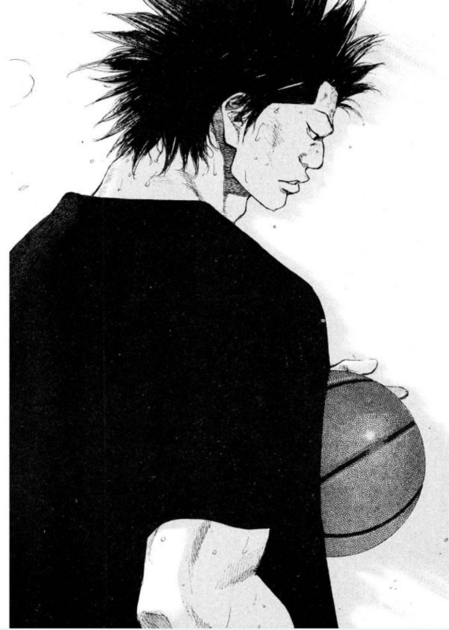

# 2019년 상반기 회고

(소라의 날개에서 명장면을 떠올릴때면 항상 생각나는 치바)

## 회사

### 일정산 + 먼데이

### 우수사원

### 팀 분리

## 블로그

6개월간 총 32개의 글을 썼다.  

* 1월: 11
* 2월: 7
* 3월: **2**
* 4월: **4**
* 5월: **4**
* 6월: 6

## 오픈소스

## 발표

## 기타 외부활동

### 책쓰기

9월이면 아마도 책이 출고될것 같다.

## 건강

## 하반기 목표

## 마무리

