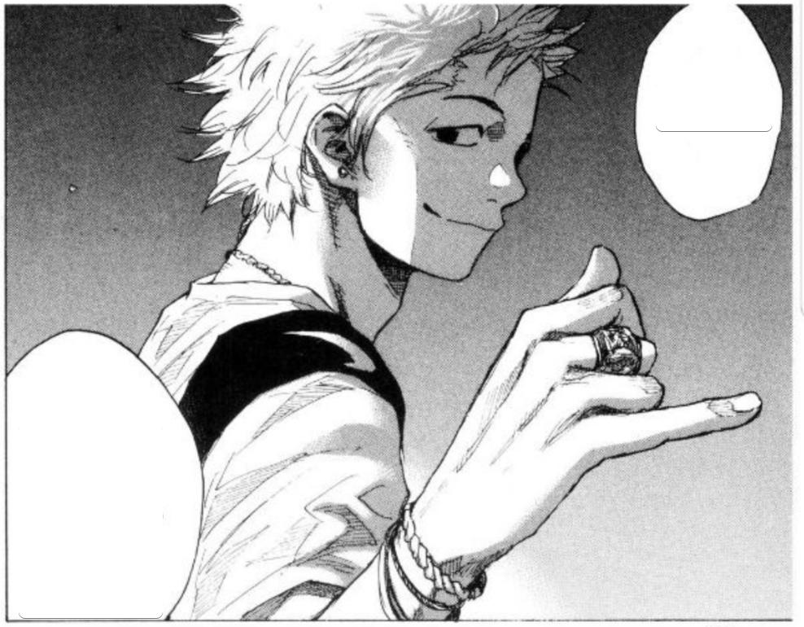
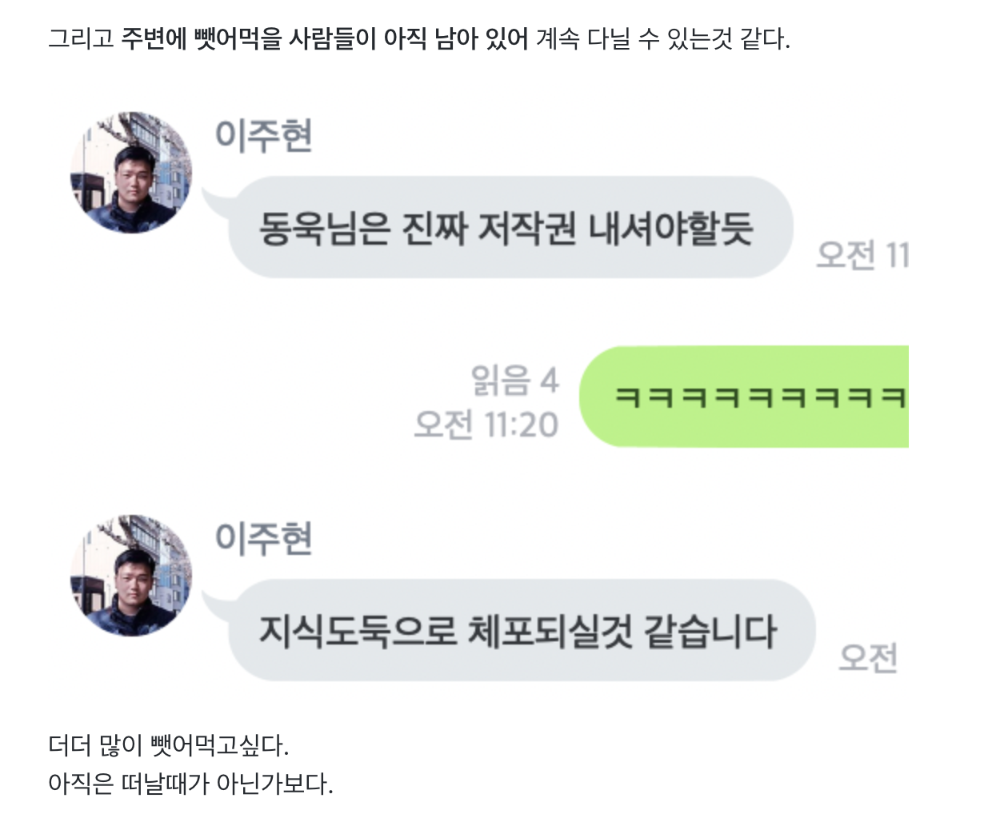
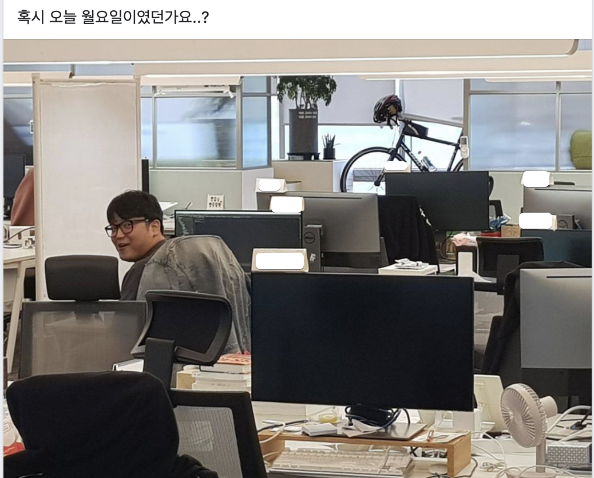
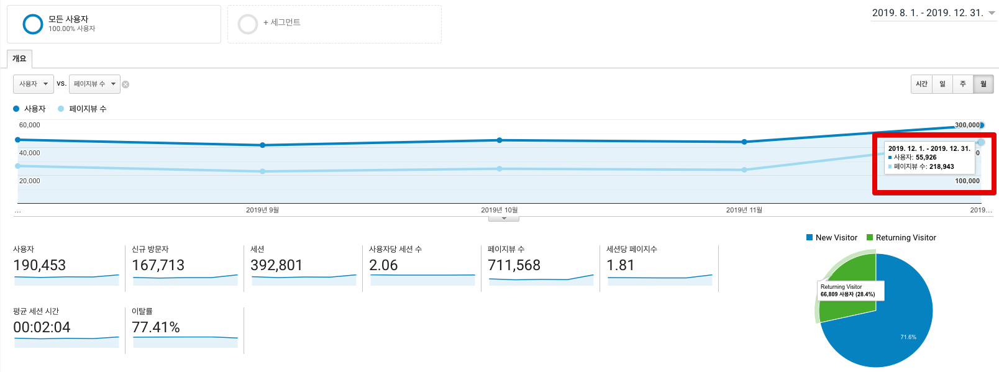
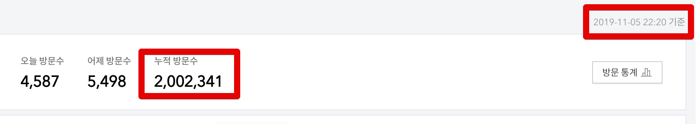
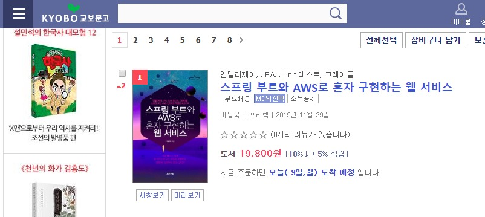
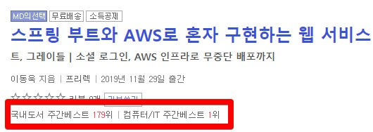
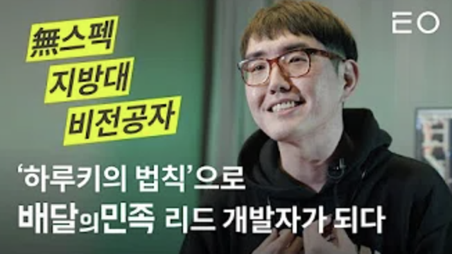
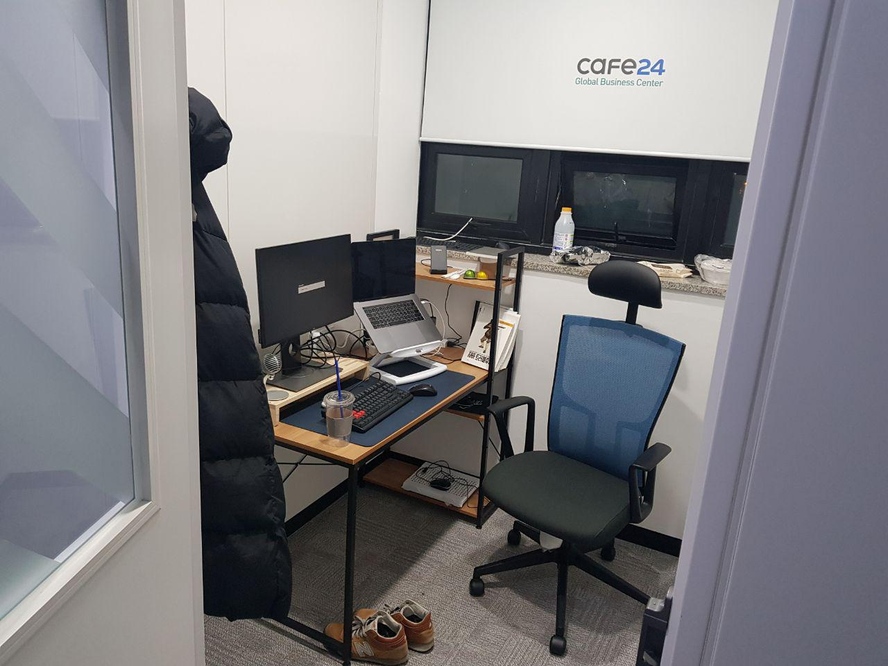

# 2019 하반기 회고

(소라의 날개 33권 130p)  
  

## 1. 회사

하반기 회고는 진행했던 프로젝트 보다는 프로젝트 외적인 일들을 좀 이야기 하고 싶다.

### 1-1. 팀 분리와 역활변경

[상반기 회고](https://jojoldu.tistory.com/436) 에도 작성했지만, 7월 1일자로 팀이 분리되어 팀 내 역할이 변경 되었다.  

정산이라는 도메인은 결제와 더불어 **IDC 환경**에서 사용되야한다.  
다른 팀처럼 AWS를 쓸 수 있는게 아니다보니, 불편한게 한 두개가 아니다.  

실제로 7월, 11월에 한번씩 DB 서버의 디스크 장애가 발생 했었고, 이를 복구 하기 위해 안쓰던 WAS 장비를 DB 환경으로 설정해서 풀 백업받고 HA 투입하는 작업이 있었다.  
  
2번이나 하고 나니 이젠 이런 작업들이 조금 익숙해져서 이후 12월에 신규 DB 장비 3대를 발주해서 HA 투입을 진행했다.  
  
이후에 취약점 인터뷰도 보고, 기존에 쉘로 되어있던 자동화 작업들을 앤서블로 하나씩 개선도 진행했다.  
(전체 서버에 사용자 계정 추가하고 패스워드 만료시 변경하는 등)  
  

> 그래서 올 하반기 내 블로그 내용들이 Spring 보다는 인프라쪽 주제가 더 많을 수 밖에 없었다.

### 1-2. 페이스 메이커의 퇴사

이게 이번 하반기 회고의 최고 핵심이다.  
3년간 함께 개발을 했던 [호돌맨](https://hodolman.com/26)님이 **퇴사**를 하였다.  
  
상반기 회고에도 언급했던 그 분이다.

하반기엔 이 분 퇴사에 맞춰 많은 일정들이 정해졌다.

(밤새 DB 복구하고 퇴근하던 날)  
  

(주말 개인 프로젝트하러 회사 왔다가 찰칵)  
  
야구 선수 중에 [오타니 쇼헤이](https://namu.wiki/w/%EC%98%A4%ED%83%80%EB%8B%88%20%EC%87%BC%ED%97%A4%EC%9D%B4) 라는 선수가 있는데 (**만다라트 계획표**로 유명한 그 선수) 투수와 타자 모두 에이스 역할을 해서 별명이 **이도류** 라고 한다.  
  
팀에서 함께 했던 호돌맨의 인상이 딱 이 선수 같은 느낌이였다.  
백엔드 애플리케이션도 잘하는데, **인프라도 너무 잘하는 것이였다**.  
  
당시에 50~60대에 달하는 결제/정산 온프레미스 인프라를 모두 호돌맨님이 관리중이였다.  
DB 튜닝/장애대응/백업 및 복구/MHA/파티셔닝, IDC 인프라 튜닝/장애 대응, 보안 취약점 감사 대응 등을 **혼자 다 했다**.  
매년 수조원의 거래, 월 4천만건의 결제가 발생하는 그 시스템을 말이다.  
  
데이터가 적고, 트레픽이 적을때야 Hello World 수준으로도 해결이 가능한데 이정도 규모에서 이렇게 안정적으로 DB와 인프라 모두를 관리하는 **애플리케이션 개발자**도 있구나 싶었다.  
  
그래서 한번은 술자리에서 도대체 호돌맨님은 어떻게 인프라도 잘하시냐고 여쭤봤었다.  
답변이 놀라웠던게, **전 회사에서는 백엔드 개발자가 개발/인프라 둘다 하는게 당연했다**고 답변을 하시더라.  
둘을 따로 분리해서 바라보는게 더 신기했다는 말도 덧붙였다.  
자기가 인프라 잘한다는 이야기 듣게 될 줄 꿈에도 몰랐다는 말로 마무리했다.

> 그래서 실제로 이 회사 출신 개발자분이 사내에 한분 더 계시는데 (호돌맨의 전직장 사수), 그 분 역시 인프라와 보안에 대해 정말 깊게 알고 계시더라.
> 집에 몇백만원짜리 서버 (PC아니라 실제 물리 서버)를 두고 직접 렉 꽂아보고 관리하면서 논다고 들었다.
> 이 회사 분들을 다 알진 못하지만, 어떤 회사인지 정말 궁금했다.

뭔가 그간 갖고 있었던 백엔드 애플리케이션 개발자의 모델이 완전히 깨지게 된 계기가 되었다.  
그래서 진짜 빨대 꽂아서 엄청 빨아먹어야겠다고 생각했었고, 실행에 옮겼다.  
이분이 설명해줬던 내용들이나, 사용했던 명령어들은 다 에버노트에 기록했다.  
사용했던 인프라 설정들이나 운영 작업들은 깡통 EC2에 직접 다 설치하고 테스트 해보면서 남기고 있었다.  
  
근데 퇴사한다니.  
이미 8월부터 주말에 커피마시면 자주 했던 얘기라 어느정도 마음의 준비는 하고 있었지만 그래도 충격은 충격이였다.
  
3년간 개발에 대해 같이 이야기를 나누던 분이 떠나니 어찌해야하나 싶었다.

나와 **비슷한 연차, 비슷한 나이에 뛰어난 사람이 바로 옆에** 있다는건 그 어느 것보다 강력한 **자극제**이다.  
내가 굳이 마음먹지 않아도, 더 잘하고 싶은 생각을 매일 매일 하게 된다.  
  
이런 큰 자극제가 사라진다는게 내년 최고의 고민이다.  
  
내가 이것 때문에 고민할때 주변에서 여러 조언을 해주셨는데, 그 중 하나가 **혼자서 공부하면 되지 않냐**라는 말이 제일 많았다.  
그렇지만 이 말은 나에게 크게 도움이 되지 않았다.  
  
강남 8학군으로 이사 왜 가겠나.  
어차피 아무 학교나 가서 혼자 공부하면 되는데.  
  
주변에 좋은 자극제들이 얼마나 많이 있냐가 그 사람의 발전에 얼마나 도움이 되는지 잘 안다.  
전 회사도 그랬고, 현 회사에서도 그런 경험을 많이 해봤다.  
  
그래서 새 자극제를 만들거나, 자가 발전하거나 뭐 어떻게든 수를 만들어내야하는 과제가 생겼다.

> 후일담이지만, 호돌맨님 퇴사하실때 회사 **SRE 팀에서도 팀 이동 제안**을 했었다. (서비스 개발팀에서도 당연 제시했고)
> 리얼 이도류....

## 2. 블로그

7월은 이미 상반기에 언급했으니 8월 ~ 12월까지의 지표만 뽑아보았다.  

12월 기준으로

* MAU: **55,000**
  * 7월 (45,000)과 비교해서 **10,000** 증가
* PV: **219,000**
  * 7월 (140,000)과 비교해서 **79,000** 증가
* 평균 세션시간: 2분 4초
  * 7월 (2분 20초) 와 비교해서 16초 감소

아래에서 자세히 이야기하겠지만, **태용님 영상 덕분에** 12월 지표가 말도 안되게 높게 나왔다.  
  
그래서 이걸 기준으로 뽑으면 안되겠지만, 이때 방문 해주신 분들이 계속 **재방문**을 해주신다고 생각이 되어 수치로 남기게 되었다.  
  
왜냐면 **일일 PV가 평균 1천명 이상 증가**했기 때문이다.  

일일 PV가 상반기에는 평균 5000정도였다면, 하반기에는 **6000이상** 나오고 있다.  
  
영상이 나온지 3주가 지난 시점이라 더이상 유튜브의 효과는 없다시피한데, 그럼에도 이 수치가 계속 유지되면 고정된 수치로 봐도 되지 않을까?  
  
실제 방문자수의 **77%가 구글 검색**을 통해 방문 하고 있다.  
(Direct 수치가 10%인건 좀 놀랍다.)  

페이스북 등을 통한 **거의 어뷰징에 가까운 블로그 글 홍보를 하지 않는다**는 점은 칭찬해주고 싶다.  
  
나쁘다는게 아니라, 결국 **특정 SNS 그룹에 홍보 하지 않으면 방문자 수를 유지할 수 없기 때문**이다.  
  
자생할 수 있는 기술 블로그이고 싶다.  
그래서 최대한 **구글 검색 방문수에 집중**하고 싶다.  
  
일단 내년 상반기에도 계속해서 수치를 지켜봐야 할것 같다.

### 2-1. 43개의 글

하반기 (7~12월까지)엔 총 43개의 글을 발행했다.

> 상반기 회고엔 6월까지 발행만 측정했길래 여기서 7월 포함

* 7월: 7
* 8월: 11
* 9월: 7
* 10월: 5
* 11월: 6
* 12월: 7

하반기엔 **Java / Spring 주제의 글이 많이 적었다**.  
아무래도 팀내 역할 변경 때문이라서 점점 공부해야할 기술들이 인프라/DB쪽이 더 많을 수 밖에 없었다.  
  
미뤄둔 [MariaDB 운영 시리즈](https://jojoldu.tistory.com/469)들이 마무리가 안되고 있어 내년엔 빨리 마무리 짓고 올려야겠다.  
  
그리고 사이드로 Jenkins에서 [Teamcity](https://jojoldu.tistory.com/448)로 이전하기 위한 작업을 진행중이다.  
  
팀에서 사용 중인 **미들웨어들은 쉽게 변경해선 안된다**고 생각한다.  
그래서 사전에 개인 프로젝트와 블로그로 계속해서 따로 해보고 **실제로 이전하는게 더 이득이라는 확신**이 있을때 팀에 이야기해 볼 예정이다.  
  
> 해보고 별로면 강요할 생각 전혀 없다.
> 회사와 팀은 나를 위해 존재하는게 아니다.

### 2-2. 200만 달성

2019년 11월 5일, 블로그 총 PV가 200만을 돌파했다.

GA 기준으로는 그 전에 돌파를 했는데, 그래도 블로그 공식 지표도 200만을 넘기는게 중요할것 같아서 11월 5일을 기준으로 하게 되었다.  
  
2019년 3월에 100만 돌파  
2019년 11월에 200만 돌파  
  
4월 ~ 11월 동안 월 PV가 12~14만정도라서 얼추 8개월이면 100만씩 증가했다.  

내년 1월 지표를 봐야겠지만, 월 PV가 16만정도만 되어도 6개월에 100만씩 증가가 가능하다.  
그럼 1년에 약 200만씩 증가하는데, 총 PV가 1천만이 되면 정말 기분이 이상할것 같다.  
그땐 뭔가 블로그에서 이벤트라도 해볼까 싶다.  
  
작성된 글의 수는 계속해서 늘어나고 있지만 (한달에 6~8개정도?) 방문자 수가 그에 비례해 늘진 않는다.  
Java/Spring 이라는 한정된 주제와 기본 문법에 가까운 기초적인 내용들은 없기 때문이지 않을까 싶다.  
  
그래도 어뷰징에 가까운 포스팅은 하고 싶지 않으니 계속 이 기조를 유지 하고 싶다.  
## 3. 오픈소스

## 4. 외부 활동

올해 하반기는 평소보다 많은 외부 활동이 있었다.  
내년엔 좀 자제해야지 싶다.  

### 출간

2019.11 프리렉과 함께한 스프링 부트와 AWS 책이 출간되었다.  
자세한 출간 회고는 이미 블로그에 썼으니 출간회고 ~ 2019 하반기 회고 사이에 있었던 일만 쓰면 될 것 같다.

#### 2019년 12월 9일 교보문고 1위 달성!

**하루 천하**였지만 ㅠ  
그래도 2019년 12월 9일, 딱 하루 **교보문고 1위**를 달성했다.

> 지금은 뒤에서 왔다갔다 한다.
> 엑셀,파이썬,정보처리기사는 너무나 강력하다.

### 태용 인터뷰

태용님이 운영하시는 유튜브 채널에 [인터뷰](https://www.youtube.com/watch?v=V9AGvwPmnZU)를 진행 했다.

(하루키의 법칙은 민망했지만 ㅠ)  
  

태용님 영상은 예전부터 너무 재밌게 봤어서

10분의 짧은 영상이지만 사실은 **5시간 촬영**해서 나온 결과물이다.  
(오후 6시 ~ 11시까지 촬영했음)  
  
그래서 
> 2019.12.30일 기준으로 영상 조회수가 29만이 되었다.

### 발표

## 5. 기타

### 작업실

개인적으로 사용할 작업실을 구했다.  

**월 38만원**이며 6개월 선납할 경우엔 10% 할인해준다고해서 아마도 다음 결제시에는 6개월 선납할 것 같다.  
  
거리도 집에서 **도보로 7분 거리**에 있어서 이동하기에 참 편하다.  
  
구하고 나서 제일 많이 받았던 질문이 "왜 구했어요? 카페에서 하면 되지 않아요?" 였다.  
  
한명 한명 다 답변하기가 귀찮아서 여기에 정리한다.  
  
일단 내가 **회사 외에** 개발하는 시간은 다음과 같다.

* 월요일 오전
  * 회사가 월요일 오후 출근 정책이라서
* 평일 퇴근 후
* 주말 데이트 전 / 후
  
> **평일 출근 전 시간**은 그냥 회사에서 한다.
> 카페 갔다가 다시 회사로 가기엔 시간이 아깝다.

"아니 저 시간도 회사에서 하면 되지 않아요?" 라고 할 수도 있는데,  
평일에 업무 시간외에 회사에서 **개인적인 공부와 작업을 처리하는건 참 어려운 일이다**.  
  
지나가다 누가 말을 걸수도 있는 거고,  
어떤 내용에 대한 질문에 답변을 해야될 수 도 있다.  
그럴때마다 계속 대응을 해야 되니 평일 저녁은 바로 퇴근하고 카페에서 하는게 더 좋다.  
뻔히 자리에 남아있는데, "**이제 퇴근 시간이니 저한테 말걸지 말아주세요**" 라고 할 수는 없으니 말이다.  
(물론 장애 대응하는건 예외다.)  
  
그렇다고 카페에서 매일 하자니 **회사에서 작업할때에 비해** 단점이 너무 심했다.  
대표적으로 다음과 같은데,

|             | 회사                                                                   | 카페                                                          |
|-------------|------------------------------------------------------------------------|---------------------------------------------------------------|
| 개발 환경   | Sidiz의자  넓은 책상  듀얼모니터 (Dell)  Realforce 키보드  Logitech 마우스 | 불편하고 높이가 맞지 않는 책상과 의자  단일 모니터 맥북의 키감 |
| 장소와 이동 | 고정된 장소  언제 어느때 가도 항상 자리가 존재   슬리퍼/가방걸이/옷걸이                          | 소음 매번 빈 자리 찾으러 다녀야 함   자리 부재시 분실 위험                                |

> 난 디지털 노마드 못할수도 있겠다는 생각을 했다.

의자나 책상의 높이, 모니터 높이, 키보드의 키감, 듀얼모니터 등등이 개발/공부할때 얼마나 영향을 끼치는지 알기 때문에 나에겐 되게 중요한 요소였다.  
  
더군다나 매일 자리를 구하는 것도 고역이였다.  
  
회사와 자취방이 모두 잠실이다보니 잠실 내의 카페를 가게되는데, **사람이 너무 많다**.  
특히나 콘센트와 와이파이가 빵빵한 스타벅스는 퇴근 시간엔 이미 꽉차있고, 그 외 카페는 매번 돌아다니면서 자리를 찾아다녀야해서 고역이였다.  
  
**가장 생산성이 좋은 환경에서 언제나 개발할 수 있는 것**  
이게 필요했다.  
그래서 작업실 역시 **회사의 개발환경과 동일하게** 세팅해서 사용하고 있다.  
(Sidiz 의자, Dell 모니터, Realforce 키보드, Logitech 마우스)  
  
> 집에 이런 환경을 세팅하기는 어렵다.  
> 회사 근처에서 1~2평 넓은 곳으로 이사가는건 몇천만원이 더 필요하기도 하고, 언제든 출근지가 변경될 수도 있으니 집은 최소한으로 유지하고 싶었다.  
  
"에이 그렇다고 38만원이나 쓴다고?" 할 수도 있지만, **생산성이, 시간이 5% 혹은 10%만 좋아져도 38만원은 전혀 아깝지 않다**.  
  
시간이 지나면서 학습 속도나 집중력, 체력이 신입때 보다 못하다는 생각을 계속 한다.  
그러니 **현질해서 부족한 부분을 채울 수 밖에** 없다.  
  
체력이 계속 떨어지니 PT를 받으며 체력을 키우고,  
집중력이 떨어지니 최적의 환경을 세팅해서 생산성을 보정하고,  
학습 속도가 떨어지니 시간을 돈으로 사서 더 많은 시간을 투자하는 등등.  
  
계속해서 떨어지는 부분을 채우면서 갈 수 밖에 없다.

> 비슷한 일로 무조건 회사까지 Door To Door 30분 이내로 이사한다.
> 월세 혹은 전세 보증금이 아무리 차이나도, 방 크기가 아무리 작아도 출근 거리가 가장 우선시 된다.

오바하는 것처럼 보일 수는 있겠지만, 나는 정말 **오래 오래 일하고 싶고 잘하고 싶다**.  
그러니 계속 이렇게 투자할 계획이다.

> 참고로 NBA 톱스타 르브론 제임스는 자신의 몸 관리를 위해 **매년 17억**을 쓴다고 한다.
> [참고 영상](https://www.youtube.com/watch?v=8cNRIjjZhl4)
> 내가 르브론 제임스만큼 연봉을 받진 않지만, 그래도 그냥 이야기 하고 싶었다.

## 6. 교육

## 7. 내년 상반기 목표

## 8. 마무리

군대에 있을때 
