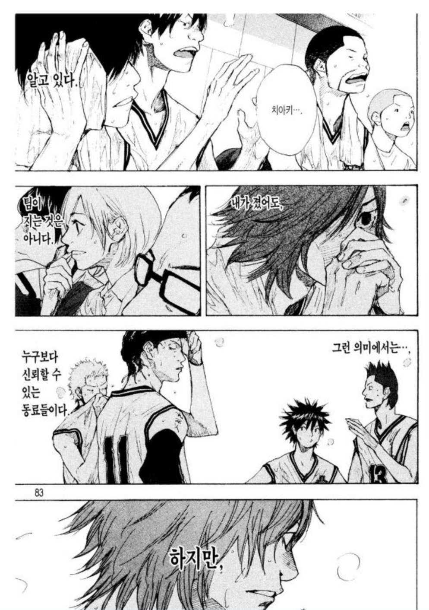
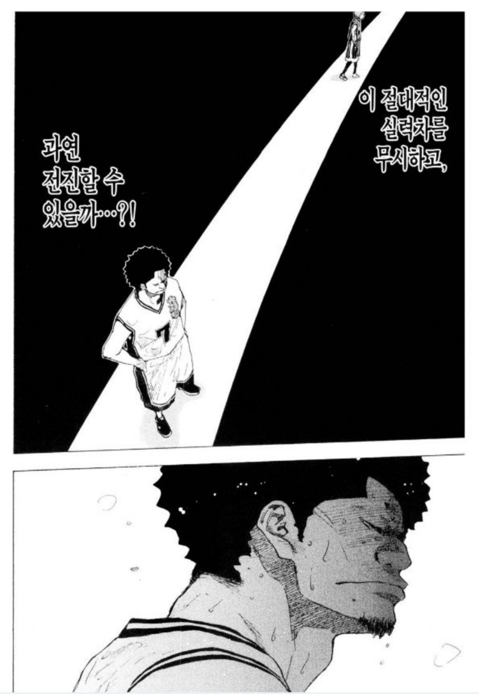
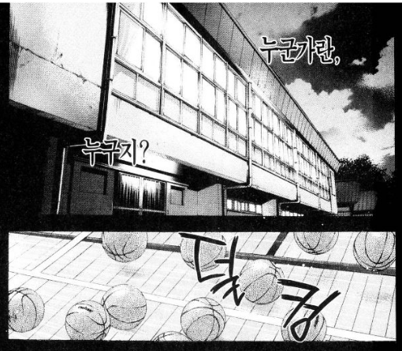

# 팀 게임속 나

수많은 명장면/명대사를 갖고 있는 슬램덩크에서 **팀 게임에 대한 명대사**를 꼽자면 단연 변덕규의 "난 팀의 주역이 아니라도 좋다" 가 있다.  

꼭 내가 에이스가 될 필요가 없고, **궃은 일을 도맡아 하는 역할**에 충실하는 것도 그 팀에 아주 도움이 되는 방법이다.  
  
당연하지만, **모두가 에이스 역할을 하려고 한다면 그것도 문제다**.  

> 일례로 NBA (미국프로농구) 덴버 너기츠라는 팀에서 2명의 에이스(카멜로 앤서니, 앨런 아이버슨 - 둘다 전시즌 득점왕 후보)를 둔적이 있는데, 이때 둘은 시너지 없이 서로의 평균 득점만 갉아 먹어 플레이오프 1회전 탈락을 경험했다.

다만 개인으로서 혹은 직업인으로서 **항상 에이스가 아닌 역할**에만 충실한게 도움이 될까?  
즉, 타인과의 격차를 넘을생각을 하지 않는 상황을 얘기한다.  
  
2019년 5월 현재, 연재 중인 소라의 날개에서는 이런 대사가 있다.  

> 개인적으로 이 장면으로 인해 소라의 날개가 슬램덩크의 아류작이 아님을 명확히 분리하는 시점이라고 생각한다.

(오른쪽에서 왼쪽으로 읽어야 해요)

마지막 말이 정말 중요하다고 생각한다.  
  
우리팀이 잘하는 것이 팀 게임에 있어서 가장 중요한 것은 맞다.  
스타플레이어 혼자서는 게임을 이기지 못하는 것도 맞다.  
사자가 이끄는 양무리가 양이 이끄는 사자무리를 이기는 것도 맞다.  
하지만 사자가 이끄는 양무리는 **사자가 이끄는 늑대 무리에게 진다**.  
  
우리 팀의 테크 리더가, 에이스가 사자이면 모든 게임에서 이기는 것이 아니라는거다.  
  
사자가 이끄는 늑대 무리 (높은 난이도의 프로젝트나 문제 상황)를 만날때를 대비해서 **최소한 늑대 정도는 되어 있어야 한다**.  
  
같은 포지션의 개발자와 비교해서 격차가 느껴진다면 따라잡아야만 한다.  
안될수도 있다.  
그렇다면 최소한 **격차를 줄이기라도 해야한다**.  
개발자로서 그 격차를 무시하고 성장하기는 정말 어렵다.  
  
**어려운 문제는 항상 특정 누군가만 해결하고 있다면 위험신호다**.  
여차하면 내가 해결할 수 있도록 항상 준비하고, 그와 나의 격차가 크지 않다는 점을 계속 보여줘야 한다.  
에이스가 아닌 사람도 웬만한 문제에 대해서는 해결할 수 있어야 한다.  
그래야 계속 성장할 수 있고, **팀이 유지될 수 있다**.  
  
언제 사자가 떠날지 모르기 때문에.  
사자가 떠나면 그 어렵던 문제들은 이제 누가 해결해야할까?  
또 사자가 올때까지 무작정 기다리는것 밖에 없을까?

본인이 해야한다.  
  
그래서 개인의 격차가 느껴진다면 따라잡으려고 애써보자.  
그리고 언제, 어느팀에 있던간에 이 팀을 떠났을때를 준비하자.  
그게 와닿지 않는다면 **우리 팀에서 가장 잘하는 사람이 떠났을때**를 준비하자.  
  
우리팀이 쪼개지거나, 팀 에이스의 도움을 더이상 받지 못하는 날이 올때를 생각하면 무섭다.  
근데 그런 날이 결국 온다.  

그런 감정때문에 개인으로서 계속 연습할 수 밖에 없다.  

