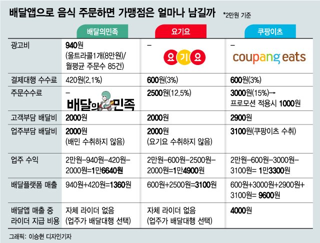
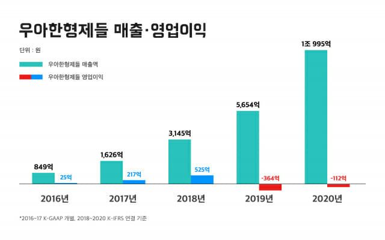
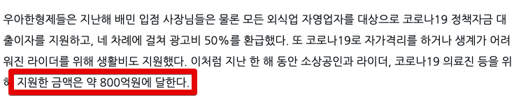
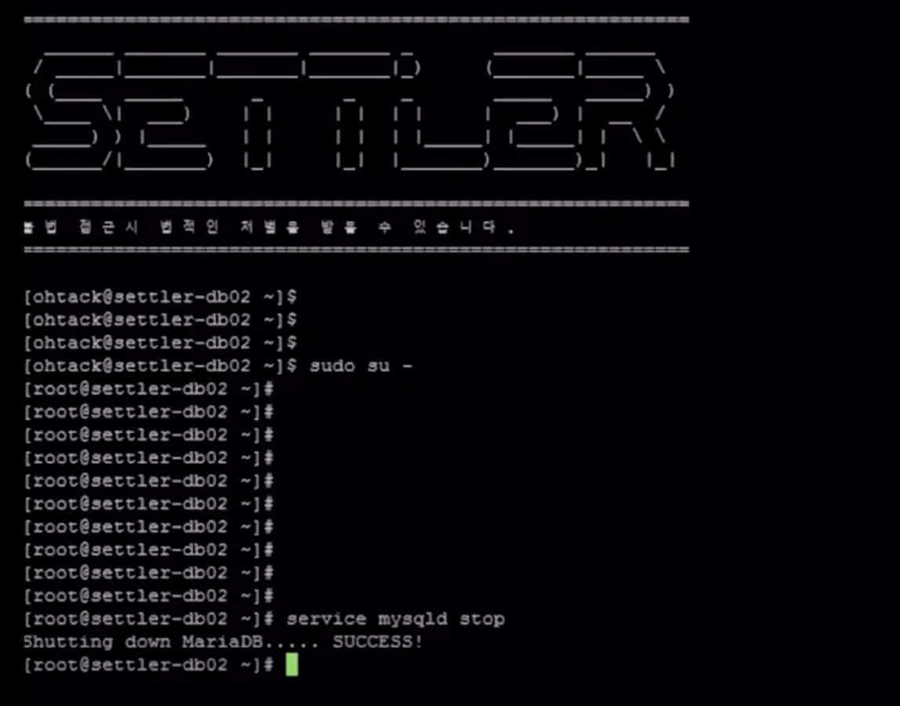
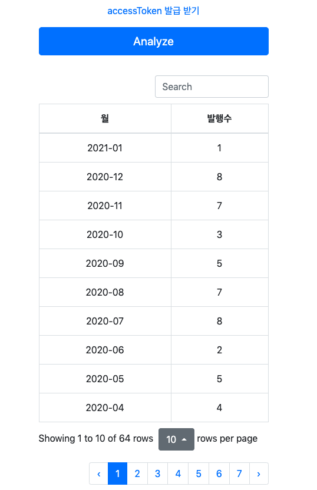
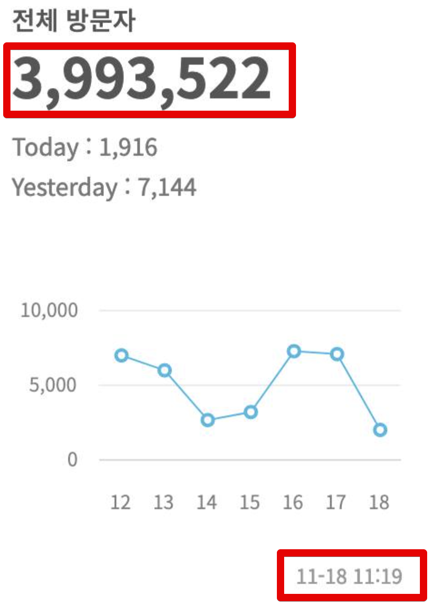
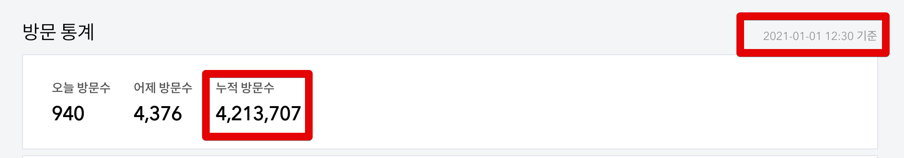
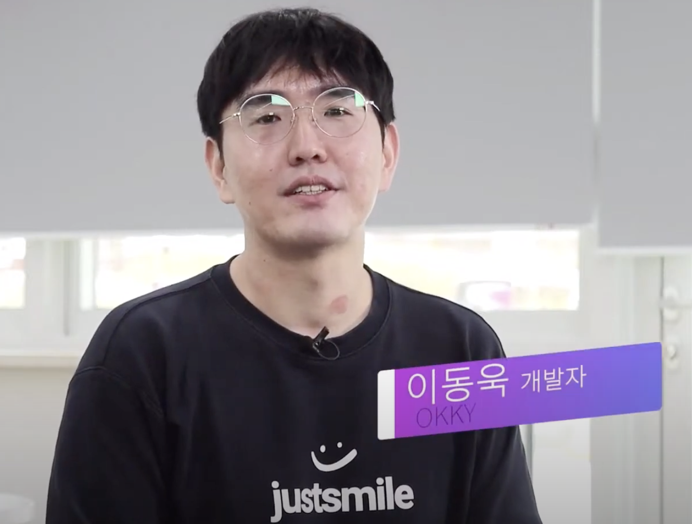
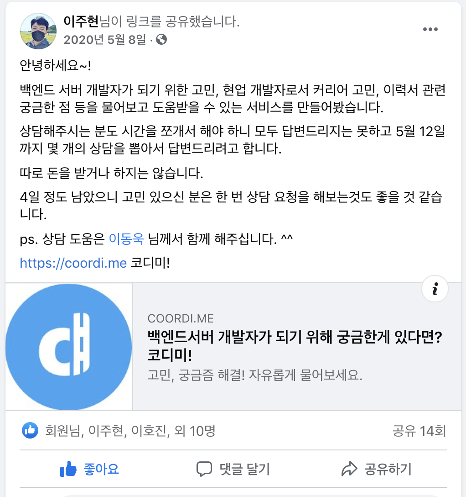

# 2020 회고

(소라의 날개 34권 중)  
  
2020년은 상반기/하반기가 아닌 1년 전체 회고를 작성하게 되었다.    
  
7월초에 상반기를 정리해야지 하다가, 회사 프로젝트가 너무 바쁘게 지나가 10월이 되다가 마무리도 하다보니 어느새 2021년 5월이 되었다.  
  
너무 늦어서 쓸까말까 하다가, 2020년에 무엇을 했는지 어디에도 안남는것이 싫었고, 매년 쓰던걸 이런 이유로 안쓰면 올해 회고도 안쓸것 같아서 늦었지만 쓰게 되었다.  
  
## 1. 회사

올 한해는 기술적으로도 다사다난했지만, 서비스적으로도 꽤나 다사다난했던 한해였다.  
그래서 단순히 개발자가 아닌 **제품 개발자** 로서 많은 고민을 할 수 있었다.

### 1-1. 신규 시스템 오픈

매입 (acquire) 시스템을 오픈했다.  
신규 시스템을 오픈하게 된 이유는 크게 2가지였다.  

1. 주문-정산 사이의 회색 지대만 담당할 시스템 필요성
2. 정산시스템의 망분리 환경

사건(?)의 발단은 점점 다양한 형태의 업주님들의 매출정보가 필요하다보니 주문시스템과 정산시스템이 실제 집중해야할 일 보다 **데이터 뽑아주는 일**이 계속 발생했던 것이다.  
  
* 주문시스템은 고객분들의 주문이 원할하게 하는 것에 집중을 해야하고
* 정산시스템은 업주님들께 빠르고 정확하게 정산을 해줘야하는 것에 집중을 해야하는데

그 외 **나머지 일들에 자꾸 업무 리소스가 사용**되는 것이였다.  
  
다양한 형태의 매출 정보, 회계감사용 데이터 제공, 신규 오픈되는 여러 업주향 서비스들에 제공될 API등 시스템 본연의 일 보다는 외부 지원에만 리소스가 다 사용되는 것이다.  
  
그러다보니 주문시스템은 주문시스템 나름대로 매번 신규 데이터 연동 포맷 고민과 외부 지원, 정산시스템은 수기 데이터추출, 어드민 기능 추가 등의 일들이 계속 있었다.    
  
그래서 이렇게 주문건당 필요한 요청에 대해서만 집중할 수 있는 별개의 시스템이 필요하다고 판단했다.  
  
물론 이에 대한 **해결책이 꼭 신규 시스템을 만드는 것인가**? 하는 생각도 있었다.  
  
그렇지만 "그냥 정산시스템이 계속 진행하면 되지않나?" 라고 하기엔 몇가지 허들이 있었다.

* 정산시스템은 일단 주문 원천 데이터를 사용하지 않고 이미 **가공된 데이터를 저장**하고 관리중이고
* 정산에 포함되지 않는 데이터는 연동 받지 않았고
  *  앱 내 결제가 아닌 만나서결제인 경우 업주님들이 직접 돈을 수령해가신다.
* 가장 큰 이유는 정산시스템은 **망분리 환경**이였다.

이 망분리 환경이 정말 큰 이슈인데,  
망분리 환경의 데이터는 **접근하는 모든 행위가 관리대상에 포함**된다.  
그래서 타 팀이 정산 시스템의 어드민이라도 접근하려면 수많은 권한요청과 프로세스를 거쳐야하고, **망분리용 접근 노트북**을 사용해야만 한다.  
  
경험해본 사람들은 알겠지만, 망분리 환경은 정말 개발자들의 생산성을 저하시킨다.  
몇몇 데이터가 주문 데이터와 다를바 없음에도 정산시스템이 그 데이터를 제공해야하는 순간 그 수많은 프로세스를 거쳐야되는 것이다.  
  
그래서 **망분리 환경에서 벗어나서** 다뤄야만 된다는 판단에 신규 시스템을 구축하게 되었다.  
  
기존의 정산시스템을 운영하고 전사 프로젝트들도 진행해야되서, 가장 편한 스택으로 빠르게 오픈하고 검수 과정을 거쳤다.  
대략 3개월간 빠르게 API/어드민/배치 등을 모두 구현해서 오픈한 이후, 3개월간 데이터 검수를 계속 진행했다.  
  
한번 데이터가 꼬이면 매일 수백만건씩 발생하는 주문데이터 사이에서 그 1건을 찾는게 너무 어렵기 때문에 개발 시간 보다 검수시간에 더 많은 리소스를 투입될 수 밖에 없었다.  
  
기회가 되면 이 시스템 오픈과정도 이전 [포인트 시스템 오픈](https://woowabros.github.io/experience/2018/10/12/new_point_story_1.html)처럼 소개해보면 좋겠다 싶었는데, 이건 기회가 되면 별도로 정리해볼 계획이다.  

> 물론 이렇게 오픈한 신규 시스템은 **정산시스템이 AWS로 이관되면서** 살짝 애매해졌는데 그래도 망분리인건 변함이 없다. 

### 1-2. 오픈 서비스 오픈과 롤백

4월에 전사가 달려든 대형 프로젝트가 오픈하고, 한달이 안되어서 롤백이 되었다.  
  
왜 그런 큰 프로젝트를 A/B 테스트를 거치지 않았냐부터 시작해서 별별 말들을 주변에서 많이 들었는데, **단순히 UI/기능의 변경이 아닌** 고객/업주/라이더 분들에게 금전적인 영향을 주게 되고 A/B 테스트하기에는 **실제 업주님들이 받는 돈에 영향을 주기 때문에** 그냥 A/B 테스트로 되는게 아니다.  
  
> 컨텐츠 노출하는 쪽이라면 이미 A/B 테스트 하고 있다.  
> 근데, 이건 컨텐츠 노출의 문제가 아니라 정산과정까지 모든게 다 변화가 필요한 것이라서 A/B가 쉽지 않다.
  
할말은 많은데(어찌됐든 퍼블릭한 공간이니깐), 그렇게 큰 프로젝트가 오픈되고 롤백 되는 과정을 경험하면서 서비스 기업의 어려움을 많이 느끼게 되었다.  
  
특히나 O2O 서비스는 기존의 많은 이해관계가 묶여있다보니 순수 Online에 비해서는 모든 것에서 어려움이 있다는 것을 깨달았다.  
  
> 지금부터의 이야기는 **회사가 아닌 내 개인의 입장에서 쓴다**.  
  
우리 서비스의 고객은 총 3분이다.

* 주문을 해주시는 회원분들
* 음식을 파시는 업주분들
* 음식을 배달하시는 라이더분들

여기서 3분을 **모두 만족하는건 사실상 불가능하다**.  
그래서 서비스마다 이 3 유형의 고객 중 누구를 만족시킬지 결정이 필요하다.  
그럼 **상대적으로** 반대편 고객분들에겐 덜 만족될 수 있다.  
  
배민에서는 최대한 이 균형을 맞출려고 노력하는데, 이 3분을 다 만족할 수 있는 비지니스 모델이라는게 있을까?

* 고객분들은 **더 할인된 가격**에 음식을 드시고 싶고,
* 업주님들은 **더 많은 이윤**을 남겨서 음식을 팔고 싶으시고,
* 라이더분들은 **더 높은 시간당 인건비**를 얻고 싶으시다.

그래서 오로지 주문 고객분들을 위해 모든걸 한다는 것은 **업주님들과 라이더분들에 드리는 혜택에서 가져올 수 밖에 없다**.  
  
왜 그러냐면, 거의 대부분의 주문은 배달의 민족에서 발생하는데 (배민 라이더스는 전체 주문의 5%도 안된다.) 아래 표를 보면 알겠지만, **주문 건당 발생하는 수수료가 없다**.  

(참고: [머니투데이 기사](https://news.mt.co.kr/mtview.php?no=2020081915381945802))  

발생한 수수료가 있어야 이를 줄여서 무언갈 할텐데, **애초에 주문건당 수수료가 없는데** 뭘 나누고 할게 있나 싶다.  
(사실상 월 8만원의 광고수수쇼가 메인이다.)  
  
90%이상의 주문이 발생하는 배달의 민족에서 주문 건당 발생하는 수수료가 없으니 쿠폰/포인트 등의 이벤트를 적극적으로 하기가 쉽지는 않다고 생각했다.
  
> 소상공인을 위한 **우대수수료**를 가장 먼저 적용한 것도 우리 회사인데 (위 표를 보면 알겠지만 3%가 안된다), 진짜 많은 부분에서 업주님들을 위한 서비스를 만드는 것에 비해 가끔 네이버 카페와 댓글을 볼때마다 안타깝다.

어찌됐든 이 과정에서 여러가지 사업에 관한 많은 고민을 해볼 수 있었다.  
(내가 결정권자도 아니지만)

1) 어떤 비지니스 모델을 해야 서로의 수익이 서로에게 의존한 관계에 있을때 최대치가 나올 수 있을까? 
2) 과연 롤백이 맞았을까 아니면 여론을 무시하고서라도 진행을 하는게 맞았을까?
3) 현재의 비지니스 모델을 계속 유지해서 우리 회사는 더 커질 수 있을까? 

내가 CEO는 아니지만, 단순히 제품을 잘 만드는 것 이외에 비지니스 모델에 대해서 더 크게 고민해 볼 수 있었던 시간이였다.  

### 1-3. 코로나 지원

2020년 2분기부터는 코로나 지원으로 인해 많은 리소스가 투입되었다.  

결국 그래서 우리회사는 작년 한해 코로나 특수를 받은 서비스임에도 적자였다.

([ZDNet Korea 기사](https://zdnet.co.kr/view/?no=20210330111252))

저런 코로나 지원이 없었다면, **112억 적자가 아닌 700억 흑자**였을 것이다.  
  
이런 혜택은 참 많았다.  
작년 한해는 포장 주문일 경우 **회사가 대신 결제 수수료를 지불했다**.  
즉, **포장주문은 하면 할수록 결제수수료를 우리가 대신 내는 모델**인데, 주문 수수료가 없다보니 사실상 주문이 발생하면 손실이 발생할 수 밖에 없다.  
  

3월/4월/8월/12월 합산 대략 수백억원의 광고비 지원을 했다.  
(정확한 수치는 공개해도 될지 몰라서 일단 3/4월 뉴스로 공개된 것만 올렸다.)  
  
광고비 지원이라는게 원래 있던 기능이 아니다보니, 광고료 받은 것을 별도로 연동 받아 별도 주기로 정산하는 기능을 만드는데 시간을 제법 보내게 되었다.  
  
별거 아닌것처럼 보이지만, 기존에 잘 돌던 시스템에 녹이는게 여러 조건들이 `false`가 되어서 결국은 광고비 정산이라는 구조를 별도로 만들어서 진행하게 되었다.  
(광고비 지원에 대해서 계좌가 없을경우, 채권이 있을 경우 등등 별도 프로세스가 너무 많이 달랐다.)  

한 두번만 하고 지원이 끝나겠거니 했는데, 1년내내 정기적으로 지원하게 되었다.   
단발성으로 끝날줄 알고 좀 수동 운영할걸 감안하고 빠르게 만들었다보니 좀 더 고민하고 만들걸 싶었다.  
하지만 어차피 시간 관계상 그럴수 없었어서 그 당시 최선의 선택이였다고 생각한다.   

> 뭐 어차피 서비스라는 것에 있어서 이렇게 감성 젖는 이야기는 **찌질하다는 이야기를 하도 들어서** 요새는 이런 이야기 잘 하지 않는다.    
> 결국은 서비스 품질이 제일 중요하지 않냐는 이야기로 결론이 나기 때문이다.  
> 다만, 업주님들을 위한 여러 지원 혜택도 하지 않고 주문 수수료도 빵빵 하게 받으면서 욕 먹었으면 억울하지도 않았을텐데 하는 아쉬움은 있다.  
> 서비스 품질이 좋으면 업주님들과 라이더분들께는 혜택을 줄이는게 맞나?? 라는 생각은 아직 있는데, 참 사업은 어렵다.

물론 이 글을 보고 "인생 최대 업적이 배민 입사" 라던가 "회사랑 본인을 일치화시키네" 같은 이야기를 할 수 있는데, 나는 이미 퇴사한 사람이라서 애사심이 엄청 높은 사람이 아니다.  

### 1-4. 정산시스템 전반적인 성능 튜닝

2020년 상반기부터 어드민과 배치에서 요청당 몇분씩 걸리는 쿼리가 하나둘씩 발생하기 시작했다.  
이미 주요 **테이블당 적재된 row가 10억건**이 슬슬 넘기 시작한 상태였기 때문에 당연한 일이였다.  
  
이 과정에서 좀 대표적인 몇몇 케이스는 블로그에 정리하기도 하였다.

* [커버링 인덱스 시리즈](https://jojoldu.tistory.com/476)
* [JPA exists 쿼리 성능 개선](https://jojoldu.tistory.com/516)
* [업데이트 쿼리 서브쿼리 vs 조인](https://jojoldu.tistory.com/522)
* [페이징 성능 개선 시리즈](https://jojoldu.tistory.com/528)
* [Querydsl Group by 개선](https://jojoldu.tistory.com/477)

당연하게도 [RealMySQL](http://www.yes24.com/Product/Goods/6960931), [RealMariaDB](http://www.yes24.com/Product/Goods/12653486?OzSrank=1) 책도 도움이 많이 되었는데, [High Performance MySQL 3판](https://www.amazon.com/High-Performance-MySQL-Optimization-Replication/dp/1449314287)이 도움이 많이 되었다.  
  
국내에는 1판이 번역되어서 MySQL 버전이 너무 낮은데 3판은 5.5를 기준으로 해서 5.7 에도 적용될만한 내용이 많아서 좋았다.  
  
해외원서는 사내 복지중 하나인 **사파리북스 계정 지원**이 있어서 사파리북스로 편하게 볼 수 있었다.  
  
특히나 그동안 MySQL에 대해서 시스템 운영 외에 쿼리 튜닝에 대해서는 제대로 보지 못했는데, 이걸 해소하게 되어서 좋았다.  
이후에 **다른 Data Store를 배울때도 어떻게 배우면 될지** 학습방법을 익히게 된 느낌이랄까?  
PostgreSQL, MongoDB 등 다른 걸 배울때도 이번 방법처럼 써보자는 작은(?) 자신감을 얻게 되었다.

> 아래에서 좀 더 자세히 후술하겠지만 이때의 개선 사례를 [회사 기술 컨퍼런스에서 발표](https://www.youtube.com/watch?v=zMAX7g6rO_Y)를 하였다.

### 1-5. 정산시스템 AWS 100% 마이그레이션

드디어 드디어 꿈에도 그리던 정산 시스템을 AWS로 100% 마이그레이션 하였다.  
  

(정산 IDC DB의 Shutdown!!!)  
  
* [우아한형제들 AWS 올인(All-In) 클라우드 마이그레이션 - AWS 고객 사례](https://www.youtube.com/watch?v=I1JAnbb3-GE)

SRE팀/정보보안팀/DBA분들의 지원 덕분에 실제 작업기간은 3개월만에 진행할 수 있었다.  
  
작업은 팀에서 다같이 진행하고 싶었는데, **여러 비지니스 요청때문에** 결국 나를 제외한 나머지 개발자분들이 다 신규 서비스 준비를 하고, 나 혼자서 AWS 이관을 준비하게 되었다.  

그러다보니 branch 관리가 좀 문제였는데, AWS로 이관하면서 프로젝트 코드를 완전히 손 안댈 수는 없었다.  
여러 설정값들이나 인증, Secret Key 관리 등이 AWS 매니지드로 완전히 사용되어야 해서 feature는 feature 대로 나가면서 클라우드 전환 코드도 같이 나가야해서 브랜치 관리를 어떻게 해야하나 고민이 많았다.  

결과적으로는 맘에 들진 않지만 rebase + squash merge를 좀 적극적으로 쓰면서 QA는 클라우드 코드까지 포함한 형태로 진행하고, IDC 배포는 클라우드 코드는 제외한채로 나가도록 했다.     
  
브랜치 전략과 무관하게 어려웠던 점은 **문서 작업**이였다.  
망분리/핀테크 규제 대상인 서비스를 클라우드로 이전하기 위해서는 수많은 문서 작업들이 필요한데, 이에 대한 요청사항들을 정리하는데 시간을 꽤 보냈다.  
  
다행히 회사에는 정보보안팀이 워낙 빵빵하게 지원해주셔서 수월하게 작성할 수 있었다.  
  
그 외에도 마이그레이션 전략이나 신규 아키텍처 등에 대한 것도 설계하고 리뷰를 갖는 등의 시간은 어차피 기존에 많이 했던 일들이라 큰 문제는 없었다.

* 성능 테스트
  * 순간 요청양
  * 배치와 같은 대량의 데이터 요청
* 레플리케이션 테스트
* 페일오버 테스트
* 롤백 테스트
* 각종 타임아웃 테스트

오픈 시나리오는 꽤 간단했다.  
기존 도메인 외에 새 도메인을 만들고 신규 AWS 시스템들은 다 새 도메인에 붙였다.  

(1) 오픈 전까지는 AWS의 모든 서비스들은 신 도메인을 붙여서 전체 테스트를 수행했다.

(2) 오픈 당일에는 **구 도메인을 모두 AWS에 추가로** 붙였다. 

* 즉, AWS 시스템에 구/신 도메인이 모두 붙어있는 상태 

(3) 1~2달 정도 구/신 도메인을 모두 AWS에 붙이고 있다가, 연동되는 시스템들이 다 신 도메인 호출로 코드 교체하게 되면 구 도메인을 제거

사내 배포 플랫폼을 쓰더라도 내부적으로는 테라폼 + CodeDeploy로 구성되어 있어서 팀 분들을 위해 Code Deploy에 대한 로그 보는법이나 배포 과정에서 발생하는 기본적인 예외 케이스에 대해서는 위키로 정리했다.  
  
배포 담당팀이 있다하더라도 기본적인 내용은 본인이 해결할 수 있어야지 뭐만 안되면 그 팀을 찾아서 **해결해줄때까지 손가락 빨고 있는건 좋은 개발자가 아니라는 점**을 이야기했다.  

### 1-6. 기술 블로그와 채용 노션

[기술블로그](https://woowabros.github.io/experience/2020/02/05/springbatch-querydsl.html)와 [팀 채용 노션](https://woowahan.oopy.io/60a06399-3f95-4fec-a436-000ad6baff40)

### 1-7. 역대 최고 주문수 달성

2020년을 마무리하는 12월 31일, 배달의민족 (배민라이더스와 포장주문 제외한 순수 배달의 민족으로만)의 **앱 내 결제**가 하루 최대치인 **310만 건**을 돌파했다.  
(만나서 결제도 수십만건이다보니 배민라이더스, 포장주문 제외하고 배달의 민족으로만 350만건을 넘는다.)  

그럼에도 배달이라는 도메인에서 하루 주문수가 310만이 된다는 것은 백엔드 개발자로서 감회가 새롭다.  
  
하루 500만건을 연동하고 정산하는 날도 금방 오지 않을까? 하는 생각이 들었다.

## 2. 블로그

### 2-1. 68개의 글

상반기: 30개
하반기: 38개

* 1월: 2
* 2월: 8
* 3월: 9
* 4월: 4
* 5월: 5
* 6월: 2
* 7월: 8
* 8월: 7
* 9월: 5
* 10월: 3
* 11월: 7
* 12월: 8

> 여담인데, 월별 발행수
 
### 2-2. 400만 PV 달성

GA 기준으로는 그 전에 돌파를 했는데, 그래도 블로그 공식 지표도 400만을 넘기는게 중요할것 같아서 11월 20일을 기준으로 하게 되었다.  
  
2019년 3월에 100만 돌파
2019년 11월에 200만 돌파
2020년 11월에 400만 돌파

1년만에 200만 PV가 증가되었다.  
거의 6개월에 100만씩 증가하는 셈인데, 솔직히 깜짝 놀라긴했다.  

PV와 애드센스의 비율은 1만PV당 $9 정도 되는 듯 하다.  
(환율따지면 PV 1당 1원인 셈이다.)

즉, 년 200만 PV가 발생하는 IT 블로그는 1년에 약 200만원의 블로그 광고 수익이 발생한다는 것이다.  
12개월로 나누면 1개월에 16만원정도 되는 셈이다.  
  
한번 포스팅 써놓은 것들이 있으니 꾸준히 방문자가 유입될것같지만, 유튜브와 마찬가지로 구글 검색엔진 역시 **계속해서 신규 글을 발행하지 않으면 검색 노출이 뒤로 밀린다**.  
즉, 계속해서 글을 쓰지 않으면 현재의 조회수가 금방 사라진다는 것이다.  

꼭 광고 수익때문에 글을 쓰는건 아니기 때문에, 꾸준히 글 쓰는데 문제 될 것은 없다. 

> 블로그 400만 회고는 별도의 글로 정리할 예정이였는데, 지금 추세(2021.04.10 기준 470만) 를 보니 그냥 500만 회고를 지금부터 준비하는게 낫겠다는 생각이다.

## 3. 오픈소스

### Spring Batch Querydsl

[spring-batch-querydsl](https://github.com/jojoldu/spring-batch-querydsl)

## 4. 외부 활동

### Yes24 올해의 IT Top8 & 리디 주간 1등

[2020 Yes24 IT연말결산](http://www.yes24.com/campaign/01_book/yesPresent/yesPresent.aspx?EventNo=193729&CategoryNumber=001)

### 발표

#### 이노콘 - OKKY 커뮤니티 소개

[이노베이션 아카데미 컨퍼런스 (이하 이노콘)](https://youtu.be/Tp9w7TatzJQ?list=PLdaJq4f37m1p-0EEXIO7JDb3xXhlluWC4&t=25662)에서 OKKY 운영진으로 커뮤니티 소개를 하는 촬영을 가졌다.

> 이노콘 전체 세션도 재밌지만, 사내 프론트엔드 개발리더이신 김민태님이 참여한 ["선배 개발자들이 말하는 실제 취업 현장과 개발문화"](https://www.youtube.com/watch?v=Tp9w7TatzJQ&list=PLdaJq4f37m1p-0EEXIO7JDb3xXhlluWC4&index=1) 세션은 취준생이라면 꼭 보길 추천한다.  
> (06:01:30부터다)

(07:07:42부터 OKKY 커뮤니티 소개 시작이다.)

> 이 촬영이 끝나고 OKKY 10주년 행사 촬영이 있었는데, 그건 아직 영상이 안나와서 내년 상반기 회고때 자세히 쓸 예정이다.

#### JetBrains Productivity Day

[온/오프라인 인플루언서와 함께하는 IntelliJ IDEA와 생산성에 대한 이야기](https://www.youtube.com/watch?v=FCa4bTUowTY)

#### 우아콘

[수십억건에서 Querydsl 활용하기](https://www.youtube.com/watch?v=zMAX7g6rO_Y)

### 코디미

[코디미](https://www.coordime.com/)

## 5. 기타

### 5-1. 작업실

### 5-2. 몸과 지갑의 다이어트

Salt Swag 이라는 단어를 

### 5-3. 카페인 없이 살기

위에서 `Salt Swag` 을 하면서 또 뭐를 줄일까 보다가 내가 하루에 마시는 커피의 양이 어마하게 많다는 걸 깨닫게 됐다.  
아침/점심을 매번 벤티 사이즈로 마시고 있었던 것이다.  
  
돈을 떠나서 하루에 습관처럼 커피를 마시는 모습을 보고 "조금 위험한것 같은데?" 라는 생각을 했다.  
그러다 호돌맨님의 페이스북 글을 보고나서 진짜 끊어야겠다고 생각했다.

하루에 1200ml 씩 커피를 마시던 사람이 한방에 끊을 수는 없었다.  

그래서 2단계로 나눠서 진행했다.  

1) 콜드브루 -> 디카페인 커피로 변경
2) 디카페인에서 -> 물로 변경 

디카페인은 일반 커피숍에서 팔지도 않고, 내가 마시던 양이 워낙 많아서 비용이 너무 크다는 생각을 했다.  
그래서 스마트스토어에서 원액을 그대로 파는 곳을 발견해서 거기서 원액을 주문하고 작업실 출근마다 하루 먹을양을 채워서 갔다.

[네이버 스마트 스토어](https://smartstore.naver.com/amolente/products/4857968316)

## 6. 교육

## 7. 내년 1분기 목표

## 8. 마무리

목표를 두진 않는데, 판단의 기준은 갖고 있다.  
보통 선택지 A와 B 둘다 좋은 경우 **하나를 위해 나머지를 버려야 하는 고통**이 있는데, 이때 무엇을 버릴지에 대한 최소한의 기준이 있어야 한다고 생각한다.  
  
나한테는 그게 "어른이 되었을때 얼마나 다양한 이야기를 해줄 수 있는가" 가 판단 기준이다.  
