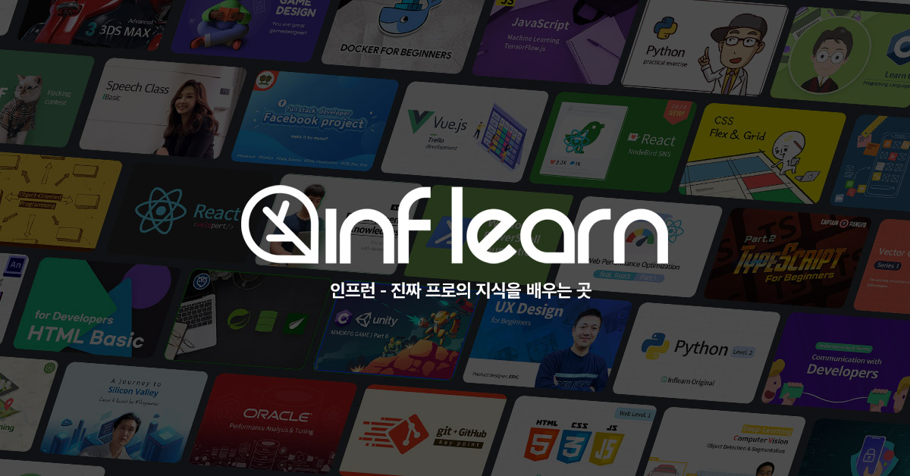

# 7시간 장애와 수영장

지난주 금요일에 7시간동안 서비스가 안되는 초대형 사고가 났다.  

* [[서비스 장애 발생 공지] 2021년 6월 4일 서비스 오류](https://www.inflearn.com/notices/226026)

원인은 이벤트로 인해서 높은 트래픽이였지만, 현 서비스의 인프라 스펙을 봤을때 그정도 트래픽은 무리없이 넘어갔어야 했다.  
  
하지만 결국 장애가 났었고, 이유는 서비스에서 사용중이던 여러 쿼리들과 코드들의 비효율 때문이였다.
* 슬로우쿼리
* 데드락을 유발할 수 있는 쿼리
* 최종 생성되는 쿼리를 예측할 수 없게 추상화된 SQL Builder 코드

이 쿼리를 개선하면, 또 다른 쿼리가 터지고, 그다음 쿼리가 또 터지고 연쇄폭발처럼 터져서 데드락 쿼리들 kill 하면서 인덱스 넣고 DB 업그레이드하고, 서버 늘리고 커넥션풀 늘리고 그랬다.  
  
어떻게 마무리 되긴했지만, 위기감이 정말 많이 들었다.  
  
바로 어제 (월요일) 전사 주간보고때 이런 얘기를 했었는데,

> "수영장에 물이 가득차 있을때는 누가 팬티를 입었는지 안입었는지 모른다.  
근데 물이 빠지면 그땐 누가 팬티를 입었는지 안입었는지 드러난다.  
현재 인프런은 서비스가 안정화 되어있는게 아니라, 일정 규모 이상의 트래픽이 발생하지 않아서 괜찮은것처럼 보였던것이다"

(글에서는 살짝 어둡게 보이지만 스마일 스마일 하면서 이야기했다.)  
  
서비스 안정화에 집중하면 되는데, 뭐가 고민인걸까 하는 생각도 들 수 있다.  
  
하지만, 스타트업에서의 서비스 안정화는 **최우선 과제가 아닐 수 있다**.  

* 신규 기능들과 신규 서비스
* 기존 기능의 확장 
* 모니터링을 비롯한 서비스 가시성 
* 장애가 날 수 있을 요소들을 정리하는 서비스 안정화 
* 코드리뷰등의 개발팀의 문화 
* 테스트코드를 비롯한 좋은 코드를 위한 여러 장치들의 도입
* 개발구성원들의 성장

등등 이 중에서 서비스 안정화가 가장 우선 된다고 단언하기는 어렵다.  
이미 일정 규모 이상의 성장을 이뤄낸 회사라면 모를까, 초기 스타트업은 서비스 확장이 더 중요할 수 있기 때문이다.  
  
예전에 범준님이 해주신 얘기인데,  
"기술 부채도 부채다.  
부채는 관리의 대상이지, 즉시 갚아야할 대상이 아니다"  
  
흔히 재테크/투자에서 대출을 통해 레버리지를 일으켜 더 큰 부를 얻는 것처럼,  
기술부채도 결국은 **서비스가 확장하기 위한 레버리지**로 사용하라는 의미로 말씀하셨던 것 같다.  
  
그래서 주말에 장애를 유발했던 코드와 쿼리들을 위키에 정리하면서 이런 저런 생각을 많이했다.  
해야할것들 중에 우선순위를 어떻게 정하고 진행할까.  
  
물론 당장은 이번에 장애났던것들을 회고하고 서비스 안정화 하는 것이 최우선이다.  
  
하지만 이번에 이렇게 안정화 작업을 한다고 해서 "이제는 서비스가 안정화되었습니다!" 라는건 없다.  
  
서비스 안정화도 한번 하고 끝나는게 아니라 계속해서 개선하고 관리해야되니 말이다.  
이 많은 부채들 중에 어디까지 트레이드오프를 해야할까.

