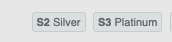

# 망했을때 어떻게 할 것인가

한참 리그오브레전드 (a.k.a LOL)에 빠진적이 있었다.  
그때 Top 신지드에 꽂혀서 주구장창 그것만 했다.  
잘 풀리는 판에서는 하드 캐리하는 내 모습에 골드까지는 그냥 갈 줄 알았다.  
근데 **수백판을 해도 실버를 못벗어 났다**.  
(~~다 정글탓이다....~~)  
  
그러다가 갑자기 다음 시즌부터 실버에서 플레티넘까지 티어가 급 상승하게 되었다.

이렇게 된 계기는 모 커뮤니티의 베스트 공략글 때문이였는데,  
그 글에서는 **망했을때 어떻게 1인분 할 것인가**를 아주 중요하게 다루고 있었다.  
  
모든 라인전에서 항상 이길 수는 없다.  
그럼 라인전을 지면 게임도 지는 건가? 라고 하면 그건 아니라는 것이다.  
**망한 판에서 어떻게 복구할 것인가**를 아주 상세하게 다룬 그 글을 보고 난 뒤부터 티어가 급 상승하게 되었다.  
  
0/7/0 으로 쫄딱 망한 판에서도 어떻게든 꾸역꾸역 방어템 두르면서 1인분을 하면서 결국 5판 질 것을 3판 지는 것으로 줄이다보니 어느새 승률이 좋아졌다.     
  

(더이상 내 계정의 기록은 찾을 수가 없어서 op.gg에서 다른 분의 기록을 캡쳐했다.)  
  
좋은 시니어 개발자가 되는 것도 비슷한 것 같다.  
  
이를 테면 커리어를 지나다보면 여러 회사를 거치게 되고, 망한 판에 본인이 들어갈 수 있다.  
  
* 개발 환경과 경험이 너무 별로이거나,
* 테스트 코드, 코드리뷰 등 개발 문화가 전무하거나,
* 프로젝트의 레거시가 심하거나,
* 팀 동료들의 실력이 너무 뒤쳐진다거나,

등등 만족스럽지 못한 환경은 언제든 만날 수 있다.  
  
**엉망인 환경을 만나는 것은 내가 어떻게 할 수 없다**.   
  
아무리 검토하고 검토해도 **확률을 줄일 수는 있지만 100% 피할 수는 없다**.  
하필 내가 합류한 팀이 별로일 수 있고,  
하필 내 팀장님이 별로 일 수 있고,  
하필 내가 맡은 도메인/프로젝트가 레거시만 가득한 것일 수도 있기 때문이다.  
  
중요한건 이 다음이다.  
엉망인 환경을 만나고 난 뒤에   
그래서 못해먹겠다가 될지,  
**그럼에도 불구하고 해야겠다**가 될지는 내가 정할 수 있다.  
  
그리고 이때 후자를 선택하는 것이 회사가 시니어 개발자에게 기대하는 것 같다.  
  
잘 풀리고 있는 판에서는 진짜 본인의 역량을 확인하기는 쉽지 않다.  
(당연히 잘 풀리는 판에서 캐리하는 것도 쉬운 것은 아니다.  
상대적으로 그렇다는 말이다.)  
  
누가 봐도 망한 판에서 어떻게 정상화 시키냐가 회사가 시니어 개발자에게 가장 기대하는 역량 중 하나라고 생각한다.  
  
특히, 스타트업으로 가겠다는 것은 99%는 레거시 해결해야한다는 것을 의미한다.  
  
상상치도 못한 코드/프로젝트/환경 등등을 만나게 된다.  

* 수백 ~ 수천라인의 한방 쿼리
* col_1, col_2, col_3.. 등 의미를 알 수 없는 테이블 컬럼들
* 주석과 따로 놀고 있는 코드들
* 장애가 나도 아무도 모르는 No 모니터링 / No 로깅
* 의미를 전혀 알 수 없는 애플리케이션 코드들
* 담당자들이 모두 퇴사해 아무도 모르는 히스토리

등등 별별 상황이 다있다.

> 현재의 인프런이 저렇다는 것은 아니다.  
> 4번째 직장에 오면서 겪은 일들과 주변 지인들의 하소연을 통해서 들은 워스트 사례들을 묶어놓은 것이다.

이때 너무 절망하기 보다는, "**드디어 내 역량을 뽐낼 기회가 왔다**" 라고 생각하면 좋을것 같다.  
그때가 진짜 **본격적으로 성장할 수 있는 기회**가 되는 것 같다.  
  
망한판이라면 오히려 못해도 본전이라고 생각해보는 것도 좋다.  
잘되고 있는 판은 잘해도 본전이다.  
**망한판을 복구 시키면 영웅이 된다**.  
어차피 해야하는 게임이라면,  
영웅을 노려보는 것도 좋지 않을까?  
  
(이렇게 글을 썼다고 해서 좋은 환경 보다는 별로인 환경이 무조건 더 좋다라는 것은 아니다.  
좋은 문화를 경험해봐야, 별로인 환경을 갔을때 이게 지금 문제가 있음을 알 수 있다.  
문제가 있는데 문제인지를 모르는게 가장 큰일이다.  
현재 상황이 문제인걸 알기 위해서라도 한번은 좋은 개발환경/개발문화/좋은 동료들이 있는 곳을 경험해봐야 한다고 생각한다)  
