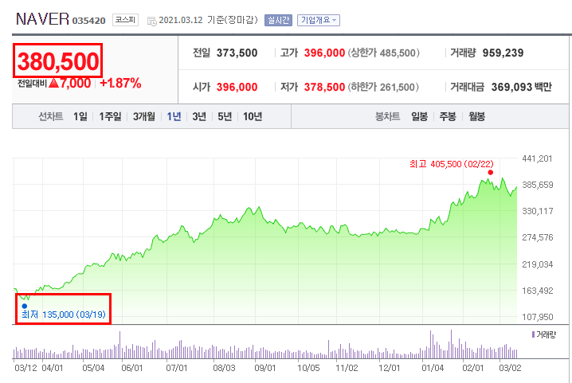

# 주식과 연봉

> 일단 난 주린이고, 연봉 결정권자도 아니라서 지극히 개인적인 생각이다.

최근 들어 주식을 하다보니 주식의 매수가격과 직장인의 연봉 책정이 비슷한 것 같다는 생각을 하게 됐다.  
  
2021.03.12 기준 네이버는 (액면분할해서) 주당 38만원이다.  

**1년전에 13만원**이였던걸 생각하면 38만원에 도저히 살 수 없을것 같은데도, 사는 사람들이 있다.  

이 사람들은 왜 사는 걸까?  
개인적인 생각으론 이건 네이버 주식의 가치가 그보다 훨씬 더 높다고 믿기 때문이다.  
다른 말로 하면 **미래에 38만원 보다 훨씬 더 높은 가격이 될 것이라는 믿음** 때문이다.  
  
만약 네이버의 주식 가격이 38만원에서 더이상 오르지 않는다고 하면 어떨까?  
그때는 **배당주**라고 불리는 **올 한해 성과에 대한 보상금**만 받을 수 있는 주식이 되기 때문에 더이상은 높은 가격에 매수될 일은 없을 것이다.  
즉, 38만원의 가격도 못지킨다는 것이다.  
  
이걸 보면서 직장인의 연봉도 마찬가지일수도 있겠다는 생각이 들었다.  
개인의 연봉은 수요/공급, 산업의 흐름이 가장 중요한데, 같은 업계 내에서도 비슷한 연차, 비슷한 경력에도 개개인의 연봉이 차이가 나는 이유는 미래에 대한 기대치가 다르기 때문이 아닐까 하는 것이다.  
  
즉, 신입 개발자의 연봉이 6천이라면 이 중 2~3천만원은 미래에 대한 기대치이며 실제 신입 개발자의 역량에 대한 것은 대략 3~4천 정도이지 않을까 한다.  
  
그래서 신입이 6천이니 나는 신입만큼 일하겠다고 하는건 이상하다는 생각을 했다.  
연봉에는 "미래에 이 사람이 이만큼 성장해서 이만큼 회사에 기여를 할 것이다" 라는 미래가치가 포함되어 있기 때문이다.  
현재의 퍼포먼스로만 판단하는게 아니라는 것이다.  
  
현재의 퍼포먼스로 판단한다면 신입한테 어떻게 6천을 줄 수 있을까?  
  
반대로 현재의 퍼포먼스가 높아도, **더이상 성장하거나 영향력 발산을 하지 않으려는 사람에게는 높은 연봉을 주지는 못하는 것 같다**.  
  
그래서 인센티브나 성과금이라는 제도가 있는것 같다.  
올해의 성과와 퍼포먼스는 인센티브/성과금으로 보상하고,
미래의 기대치에 대해서는 연봉으로 표현하는게 아닐까?

아 물론, 회사 전체에서 가장 좋은 평가를 받았음에도 연봉상승율이 별로라면 그건 그 회사가 잘못하고 있기 때문에 그럴땐 [이직하는게 맞다고 본다](https://www.woowahan.com/#/recruit/tech).

