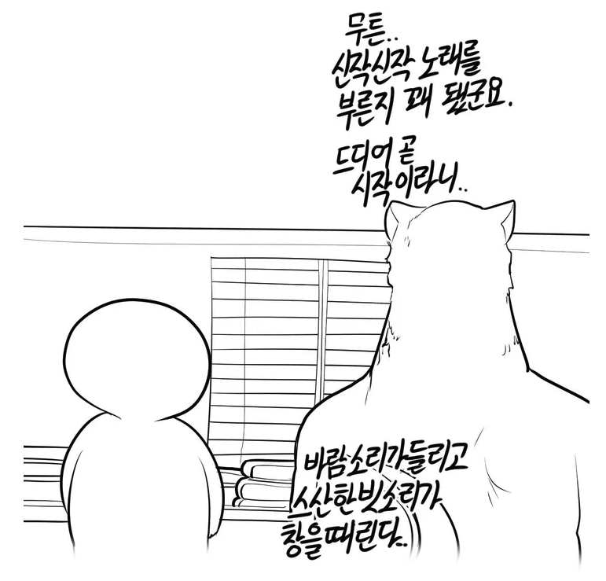
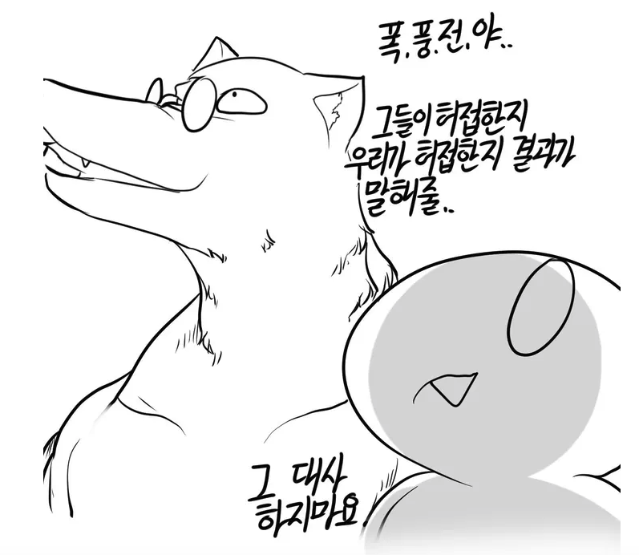
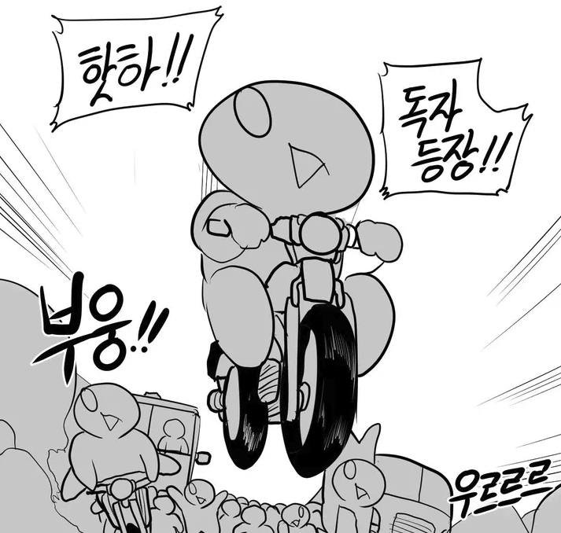
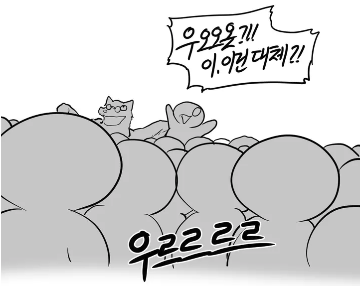
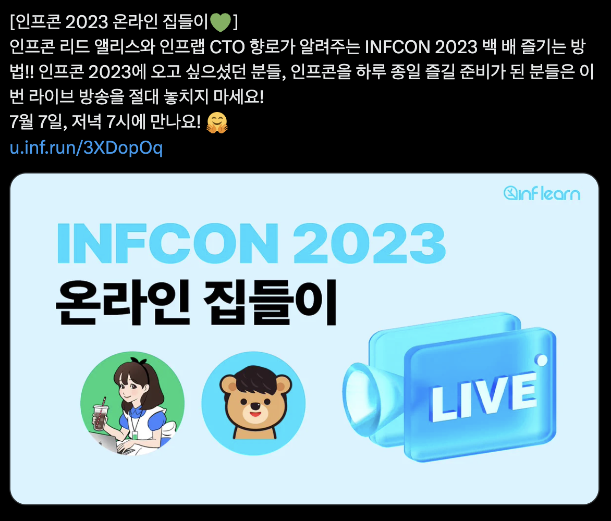
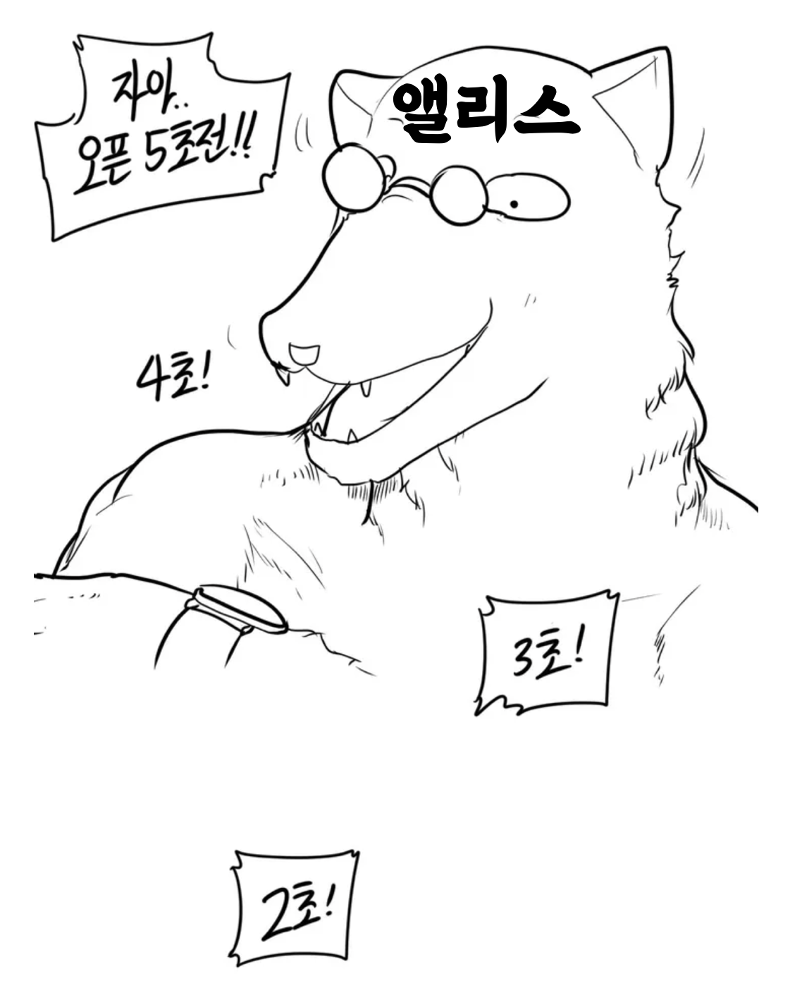
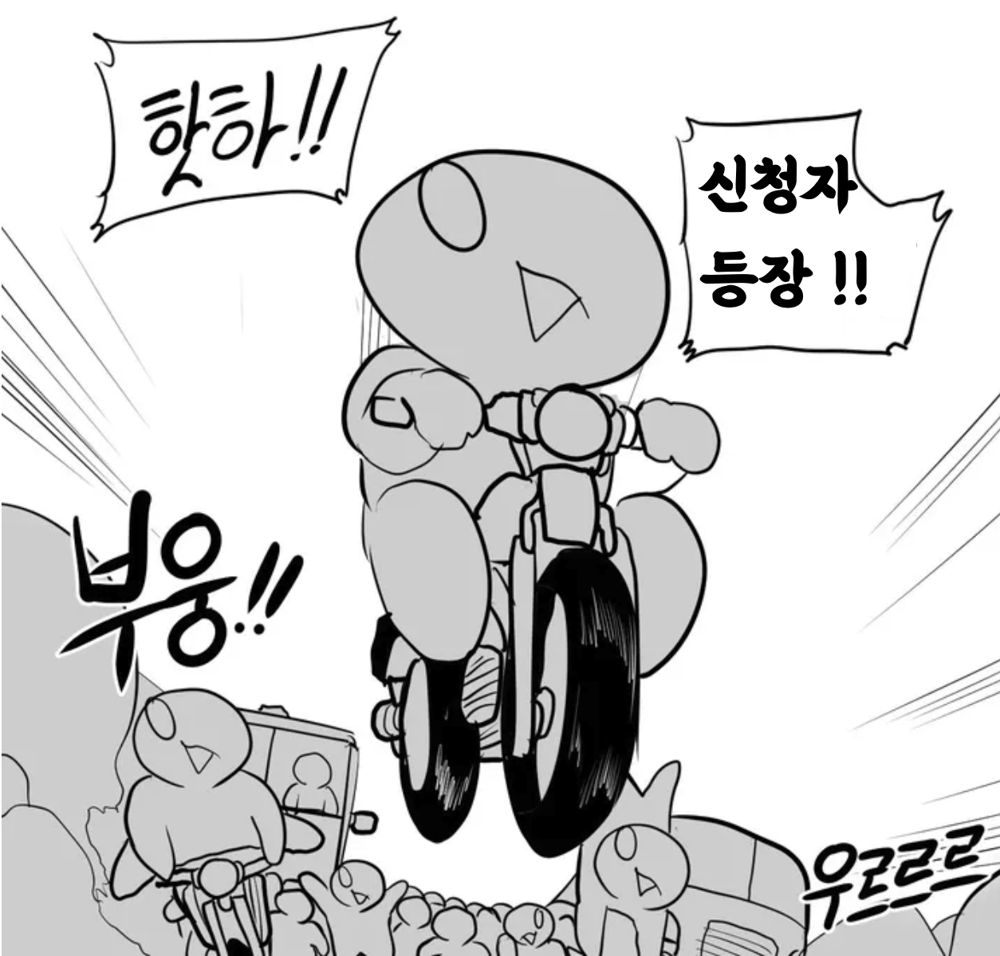
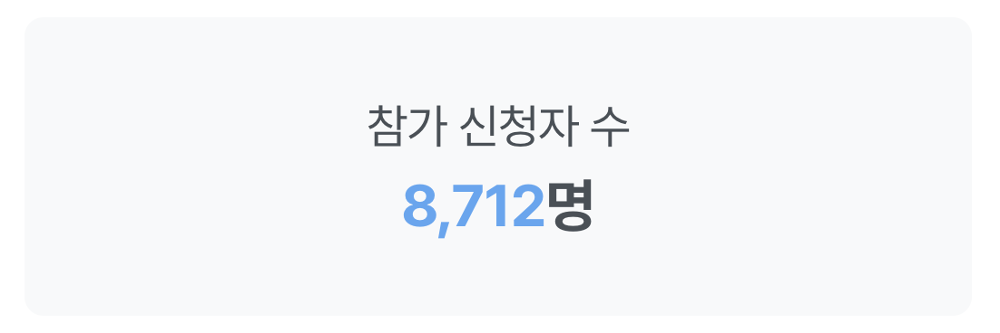
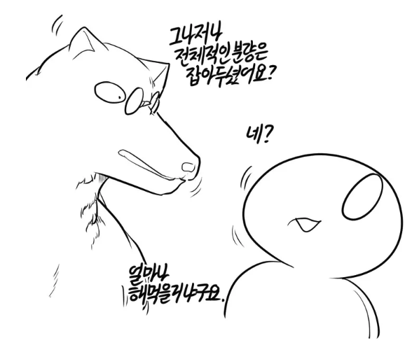

# 2023 인프콘 회고

올해 2월부터 준비한 인프콘이 2023.08.15 에 성황리에 마무리 되었다.  

> 인프콘의 모든 발표는 [인프런에 무료로 공유](https://www.inflearn.com/course/%EC%9D%B8%ED%94%84%EC%BD%982023-%EB%8B%A4%EC%8B%9C%EB%B3%B4%EA%B8%B0)되어 있다.

회고 써야지 써야지 하다가, 이제야 쓴다.  

인프콘 컨퍼런스 운영에 대해서는 관여를 하지 않았다.  
TF 멤버분들이 100% 진행해주셔서 감사할 따름이다.  
그래서 인프콘을 어떻게 준비했는지 그 과정이 궁금하신 분들은 아래 회고들을 참고해보면 좋다.

- [인프콘 2023 현장 스케치](https://www.inflearn.com/pages/infcon-2023-sketch)
- [인프콘 TF 회고](https://story.inflab.com/%ec%9d%b8%ed%94%84%ec%bd%982023-%eb%b9%84%ed%95%98%ec%9d%b8%eb%93%9c-%ec%8a%a4%ed%86%a0%eb%a6%ac/)
- [인프콘 TF 리드 - 앨리스의 회고](https://yeoneui.com/archives/1098)

이번 후기는 인프콘 사이트 개발과 개인 발표자로서의 회고이다.

## 인프콘 사이트 준비

작년 인프콘 준비 기간 동안 개발 리소스가 거의 없어서, 공식 사이트 개발을 **DevOps와 디자이너 두명이서 워드프레스로 테마 골라서 만들자**로 결론내고 진행했었다.  
그리고 FE 2분이 **본업을 하면서 필요하면 테마를 수정**하는 방식을 선택했다.  
  
그리고 그 결과 작업자들의 고통의 외침을 보내더라.

(이것외에도 회고에 가득했다.)  
  
- (해당 테마의 문제겠지만) 사이트를 열어두면 지속적으로 유튜브 영상을 가져와서 네트워크가 계속해서 증가했다. (5분정도 켜두면 1GB 네트워크를 쓰더라)
  - 물론 결국엔 테마의 PHP 코드들 삭제해가면서 해결하긴했다.
- CMS에서 편집하다가 동시에 저장하면 한쪽의 데이터가 휘발된다.
  - 그래서 사이트 편집좀 하려면 다 같이 순번을 정해서 편집해야만 했다.
- 개발 환경과 운영 환경을 구축하기가 어렵다.
  - CMS 기반이라 일반적인 웹 서비스처럼 코드를 배포하는 것이 아니라, 개발환경의 변경 내용을 운영에 반영하기가 굉장히 어려웠다.
  - 작업자가 개발에서 했던 수기작업을 운영 환경에 동일하게 해야만 했는데, 이게 너무 노가다처럼 느껴져서 결국 테스트 환경 구축을 하지 않았다.
- 원하던 커스텀한 기능을 넣기가 어려웠다.

작업자분들의 워드프레스 숙련도가 낮아서 발생한 문제겠지만, 결과적으로 다들 너무 고통스러워했다.  

그래서 올해 담당 개발 TF에서는 워드프레스가 아닌 Next에 대한 이야기가 나왔다.  
다만, 이야기 나누면서 Next 보다는 **Gatsby & CloudFront로 정적 사이트**로 만들자고 의견을 모으고 진행했다.  

공식 사이트의 여러 스펙을 확정하는 회의때 **작업자들의 아이디어 대부분을 반려**했다.  
  
여러 욕심 나는 아이디어들이 많았지만, **우리 같이 작은 스타트업에서 이정도 규모의 인력이 몇달간 행사 페이지에만 올인할 수는 없었다**.  
하고 싶어도 못한다.  
버그나 장애등으로 인프콘 준비에 완전히 몰입할 수 없기 때문이다.  

그래서 이건 인프콘 TF 멤버들을 다 모은 자리에서 **기본 기능만 먼저 구현하자**고 했다.  
제안한 아이디어들 모두 다 너무 좋고 재밌어 보이지만, 여기에 완전히 집중하면서 하기가 힘든 환경이라고 말이다.  
기본 기능을 구현하고, 기간이 남으면 이 중에서 가장 하고 싶은 순서대로 하나씩 추가 구현하자고 이야기하고 그렇게 진행되었다.  
  
이야기하면서도 이렇게 이야기하면 구성원들의 사기를 꺾는 것이라서 조심해야하는 것을 알면서도 할 수 밖에 없다는 것이 죄송했다.  
  
그리고 이정도 일정에 다들 다른 프로젝트와 겸직을 하는 것이라서 기본 기능 외에 추가 구현이 힘들것이라고 생각했다.  
  
그렇지만, 우리팀의 역량은 내 예상을 뛰어넘었다.  
그래서 이번 인프콘 사이트에서 가장 많은 사람들이 좋아해주신 세션 스케줄 기능까지 구현되었다.

  

공식 사이트는 잘 준비되었으니, 이제 

### 컨퍼런스 신청 페이지 성능 준비

현재 우리 레거시 시스템에서는 수강신청에 대한 트래픽 처리양이 현저히 낮다.  
(수치 공개는... 나중에...)  
  
2023 스프링캠프 보다는 무조건 높은 신청수가 될 것이라, 이에 대한 준비가 필요했다.  
  
백엔드 팀에서는 개발 여유가 있던 상황은 아닌지라,  

> 인프콘 신청 페이지와 유사한 사례인 올해 우리 인프런에서 진행한 2023 스프링캠프의 선착순 신청을 위한 성능 개선 사례인 [기적의 4일! Go-성능 선착순 예매 시스템 구현](https://www.inflearn.com/course/lecture?courseSlug=%EC%9D%B8%ED%94%84%EC%BD%982023-%EB%8B%A4%EC%8B%9C%EB%B3%B4%EA%B8%B0&unitId=177920&tab=activity-log) 를 참고해봐도 좋다.

여러 성능 테스트를 하면서 신청일을 준비했다.

(출처: [레바툰](https://www.lezhin.com/ko/comic/revatoon/204))

막상 신청일이 다가오는데 신청자가 생각보다 적으면 어떡하지? 등의 걱정도 되었다.  
공휴일 + 유료 컨퍼런스라는 악조건이 얼마나 영향을 끼칠지 예상이 안됐기 때문이다.  

그래서 사전 라이브 방송 등도 진행했다.

대망의 신청 당일날이 되었다.

(출처: [레바툰](https://www.lezhin.com/ko/comic/revatoon/204))

결국, **공휴일 + 유료라는 악조건에도 8,712분**이나 신청해주셨다. 

최종 합격 인원분들을 제외하고, 나머지 수천명의 탈락되신분들을 신청,주문,결제 취소까지 대량 처리를 잘 처리하면서 TF팀이 정말 고생 많이 했다.

## 발표 준비

작년과 달리 이번에는 개발바닥 라이브를 진행하지 않았다.  
여러가지 이유가 있었지만, 코엑스 2층까지 세션이 있던 상황이였고, 여러 네트워킹도 준비되어 있어서 이번에는 개발바닥 라이브에 많은 사람이 모이게 하기 보다는 새롭게 준비한 여러 행사에 많은 사람들을 분배시키는 것을 목표로 했다.  

### 키노트

매년 키노트를 준비할때마다 참고하는 발표가 있는데, 그건 바로 [금강선 디렉터님의 로아온 발표](https://youtu.be/71PeqtjEpuM?t=3768)이다.  
  
(뭐가 닮았냐 웃기고 있네 라고 하실 수 있겠지만...) 금강선 디렉터님의 발표는 IT 제품인데도 굉장히 공감력있고, 여유가 느껴졌다.  
특히 **고객의 언어로 발표**를 한다는게 강하게 느껴졌다.  
보통 키노트는 CEO 분들이나 그에 준하는 높은 직급에 계신 분이 발표를 하시고, 그러다보니 **고객의 단어와 언어가 아닌 경우**를 자주 보는데, 그럼 그냥 교장선생님 훈화 말씀처럼 안듣게 된다.  
  
그에 반해 금강선 디렉터님의 발표는 내가 쓰는 단어, 이 게임을 즐기는 유저들이 즐겨 쓰는 단어, 즐겨쓰는 문장, 즐겨쓰는 장면들을 쓴다.  
난 그게 참 좋았다.  
  
그래서 최대한 그걸 참고하고 싶었다.  
  
하지만 맘처럼 잘 안됐다.  
어쩔수 없지 뭐...  
  
내년에 더 잘해야지.
내년엔 [네이버 단 23 컨퍼런스에서 최수연 CEO님의 발표](https://tv.naver.com/v/39568301)를 많이 참고해야겠다.  
(키노트 발표를 너무 멋지게 하시더라.)

### 인프콘 아키텍처

올해도 인프콘 아키텍처에 대한 발표를 진행했다.  
  

(출처: [레바툰](https://www.lezhin.com/ko/comic/revatoon/204))

## 마무리

(내년에도, 내후년에도 계속해서 멋진 행사가 될 수 있도록 매출 많이 올리도록 노력하겠습니다~~!)