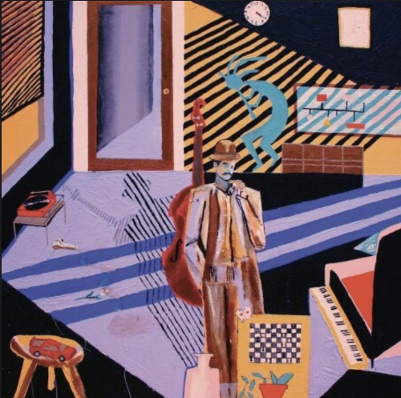

# [일기] Mild High Club - Homeage 

퇴근 후에 깨끗하게 샤워하고 거실 불을 끄고, 테이블 전등만 켠 채로 적당히 늘어지는 음악도 들으면서 코드 작업이나 글 쓰는 시간을 좋아한다.  

오늘은 유달리 날이 되게 추운데 바깥 야경이 또렷하게 보였다.  
반짝반짝 빛나는 야경은 또 왜 이렇게 예쁜걸까.  

언젠가 이 집을 떠나는 날이 오더라도, 매일 근사한 감동을 주었던 이 밤들을 잊지 못할것 같다.  
  
오늘은 무슨 노래를 들을까 하면서 유튜브를 찾다가 우연히 [알렝 드롱의 리즈 쇼츠](https://www.youtube.com/shorts/-92F0KpyUto)를 보게 되었다.
여기서 나온 노래가 너무 마음에 드는 것이다.  
적당히 늘어지고, 뭔가 7080 같은 느낌도 들고 말이다.  
  
그래서 좀 더 찾아보니 [Mild High Club 의 Homeage](https://www.youtube.com/watch?v=4u7kNELI76A) 란 노래였다.  

노래가 너무 몽환적이라서 무슨 가사일까 궁금했다.

> Someone wrote this song before  
> And I could tell you where it's from  
> The 4-7-3-6-2-5-1 to put my mind at ease  
> Please just have a laugh with me  
> Cause you know I'm borrowing by now  
> These sounds, have already crowned  
> Come on, it's a silly dream  
> Dreaming of the imagery unfound  
> 
> 예전에 누군가가 이 노래를 썼어요  
> 그리고 난 그게 어디서 왔는지 말해 줄 수 있어요  
> 마음을 편하게 해주는 4-7-3-6-2-5-1  
> 저와 함께 웃어주세요  
> 왜냐면 내가 지금쯤 빌리고 있다는 걸 알잖아  
> 이 소리는 이미 왕관을 썼어요  
> 자, 이건 어리석은 꿈이야  
> 찾을 수 없는 이미지를 꿈꾸며  

Homeage - 우리말로는 "경외" 라고 한다.  
이 노래는 Mild High Club가 **옛 사람들에게 얼마나 영감을 받으면서 곡을 써왔는지**에 대해 이야기하면서 **그들을 경외한다**는 의미의 가사라고 하는데,     
왜 여러 리즈 시절에 대한 쇼츠의 배경음으로 이 노래가 선택된 것인지 알 것 같았다.  
  
오늘 DevOps 분들과 스크럼을 하면서 한 팀원이 오랫동안 준비해온 과제에 대해 기술 블로그로 정리해보라고 이야기드렸다.  
그 팀원분은 "기존에 많은 책들에서 언급했던 내용들이 많아서 오리지날 내 이야기가 아닌 것 같아서 선뜻 쓰기가 어렵다" 는 걱정을 하셨다.  
  
"**모든 새로운 지식들은 과거에 선배들이 만들어놓은 토대 위에서 더 쌓아가는 것이라서 그런 걱정하지말고 선배들이 이야기한 내용을 본인은 어떻게 해석하고 실전에 적용했는지를 오리지널리티로 가져갔으면 좋겠다**"고 이야기드렸다.  
  
마침 오늘 이 노래를 알게 된 것을 보면 인연이란건 정말 존재하는 것 같다.    
  
최근에 절판 된 책들을 계속해서 주문했다.  

[Agile Project Management with Scrum](https://www.yes24.com/Product/Goods/109206361)    
[데드라인](https://www.yes24.com/Product/Goods/110835805)  
[스크럼으로 소프트웨어 제품 관리하기](https://www.yes24.com/Product/Goods/94236029)  
  
출간된지 10년이상 지난 책들인데,  
나는 여전히 이렇게 오래전 선배들이 만들어주신 책들을 통해 많이 얻고 적용하고 나만의 이야기를 쌓아간다.  
  
이 노래가 들릴때마다 그간에 영감을 주셨던 많은 선배 개발자분들에게 "경외"의 감정을 느낄 것 같다.