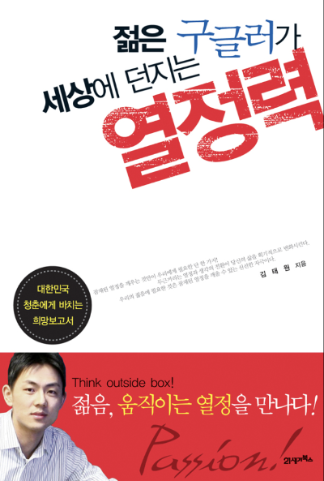

# 두근두근

대학교를 다닐때 학교 공부는 하지 않고, 도서관에서 자기계발서를 한참 읽던 시기가 있었다.  
그때 읽었던 책 중에 하나가 [젊은 구글러가 세상에 던지는 열정력](https://ridibooks.com/books/117000162)이라는 책이었는데, 200X년에 구글코리아에 입사하신 김태원님이 쓰신 책이다. 

자기계발서가 

그 중에서 "두근두근" 이라는 챕터에 나온 이야기이다.

> 교회는 이미 사람들로 꽉 차 있었고, 사진기자와 나는 교회 뒷문에 진을 칠 계획으로 언덕에 올랐다. 
> 그때 나는 마침 따르는 기자들 없이 경호원 두 명과 걸어가는 지미 카터를 보았다. 
> 그들은 막 교회로 들어가려던 참이었고, 내 심장은 빠르게 뛰었다.
> 이런 기회가 오리라고 예상하지 못했던 나는 아무런 준비도 되어 있지 않은 상황이었다. 
> 하지만 이것이야말로 절호의 기회였다. 
> 나는 하이힐을 신은 채 잔디 위를 뛰었고, 전직 대통령과 일대일 인터뷰를 따냈다.
> 기회는 생기게 마련이다.  
> 심장이 두근거리다고 해서, 긴장된다고 해서 그 기회를 놓쳐서는 안 된다.
> 수잔 베이츠 [사람을 움직이는 리더의 대화법](https://product.kyobobook.co.kr/detail/S000001301432) (더난, 71p)

이 이야기와 함께 김태원님의 대학시절 긴장되어 두근거렸던 일화가 소개 되었다.  
수잔 베이츠의 저서에 나온 이 이야기를 읽고 나서부터 나는 **두근두근** 이라는 단어를 굉장히 좋아했다.
