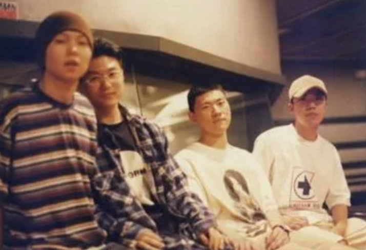

# 선뻥 후 노력

[언니네 이발관](https://namu.wiki/w/%EC%96%B8%EB%8B%88%EB%84%A4%EC%9D%B4%EB%B0%9C%EA%B4%80)이 결성된 계기를 참 좋아한다.

([이미지 출처: 나무위키](https://namu.wiki/w/%EC%96%B8%EB%8B%88%EB%84%A4%EC%9D%B4%EB%B0%9C%EA%B4%80))

> 아래 이야기는 [루리웹](https://bbs.ruliweb.com/community/board/300779/read/45134336?)에서 가져온 것이지만, 대부분의 커뮤니티에서 이미 공개되어 있는 이야기이다.

PC통신시절 하이텔 메탈음악동호회에는 mypsb라는 전설의 악플러가 있었다.  
지 맘에 안드는 뮤지션은 이 놈 저 놈 가릴것없이 닥치는대로 까내려서 악명이 자자했다.
당시 하이텔 동호회에는 현역 뮤지션들이 상당히 많았는데 음악평론활동(혐오물타기)을 하며 이들에게 꿀리기 싫었던 mypsb는 자신이 록밴드의 리더라고 입을 털고 다녔다.
물론 실제로는 **밴드는 개뿔 악기 하나 다룰 줄 모르는 문외한**이었다.  
거짓말에 너무 심취한 나머지 현실과 망상의 경계가 모호해지는 수준에 이른 mypsb는 급기야 KBS라디오 '전영혁의 음악세계'라는 프로그램에 출연까지 해서 **공식적으로 자신이 이러이러한 밴드의 리더라고 소개하는 뒷감당도 못할 짓을 저지른다**.
이렇게 대책없는 사고를 쳐버린 mypsb는 구라를 수습하기 위해 실제로 예비멤버까지 모집해버리는데, 이 때 모인 놈들이
키보디스트 (사실 키보드 칠 줄 모름)
베이시스트 (사실 베이스 칠 줄 모름)
그렇다. **이놈들도 악기 다룰줄 모르면서 구라를 치고 들어온 것이다**.
이것이 한국 모던록의 아버지이자 인디밴드의 전설, 언니네 이발관의 시작이었다

> 언니네이발관의 5집은 [100BEAT가 선정한 2000년대 100대 명반에서 2위](https://namu.wiki/w/100BEAT%20%EC%84%A0%EC%A0%95%20%EB%B2%A0%EC%8A%A4%ED%8A%B8%20%EC%95%A8%EB%B2%94%20100)에 랭크되기도 했다.

최근 인연이 된 부트캠프를 이제 막 수료하신 분과 이야기를 나누었다.  
아무래도 부트캠프를 수료하고나서 이제 뭘 해야할지 혼란스러울 수 밖에 없어서, 가능하면 스터디나 사이드 프로젝트 등으로 **다른 사람들과 함께 무엇을 해보는 것**을 하는게 좋을것 같다고 말씀을 드렸다.  
  
해당 조언을 들으시고 그 분은 "실력이 부족한 내가 다른분들과 함께 스터디나 사이드를 하다가 폐를 끼치는게 될까봐 걱정이다", "공부를 좀 해서 같이 할 실력이 되면 그때 하겠다" 등의 답변을 해주셨다.  
  
비단 이 분뿐만 아니라 많은 취준생,수료생들을 만나 이야기를 나눠도 비슷하다.  
"함께 할 자격을 갖추고 함께 하겠다" 가 많은 분들의 생각이셨다.  
  
그런 의미에서 나는 언니네이발관의 결성 계기를 좋아한다.  
무슨 일을 하든 항상 자격을 갖추고 진행되는 일은 없다.  
내가 자격을 갖추었을때는 그 기회와 인연이 없을 수도 있다.  
  
내 주머니에 맞지 않는 것을 담아야할때, 주머니가 커지고 나서 담으려다가는 이미 도망가고 난뒤이다.
주머니가 찢어지는걸 기워가면서 담아가야한다.