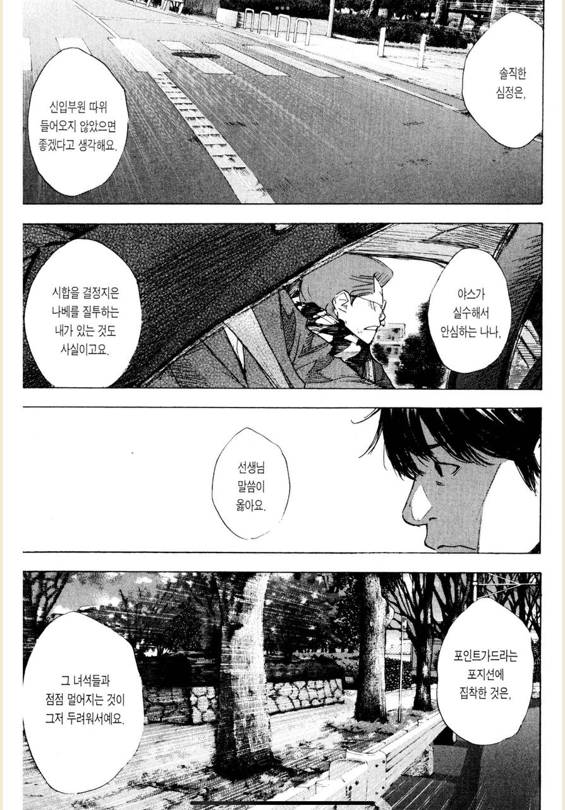
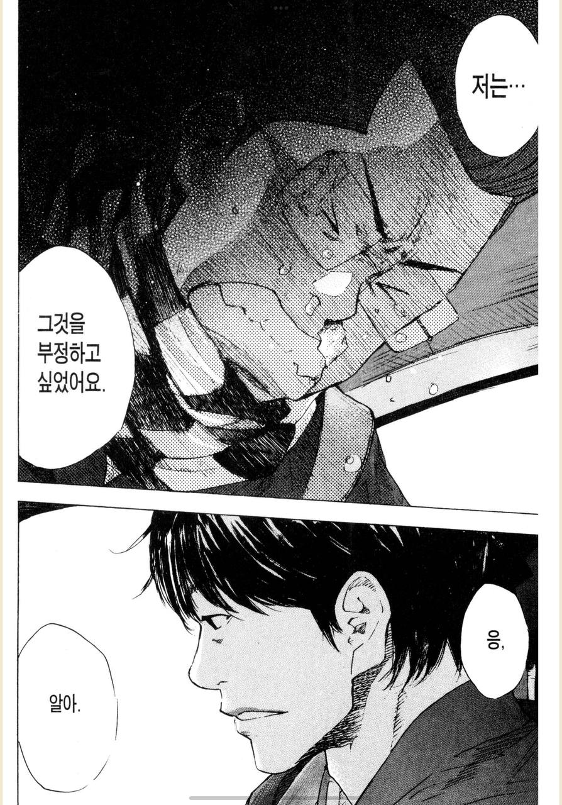
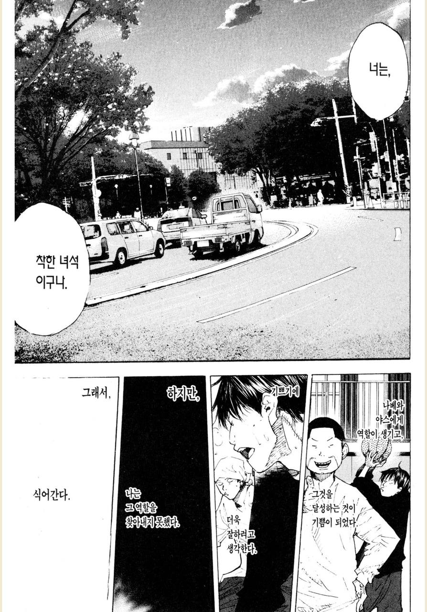
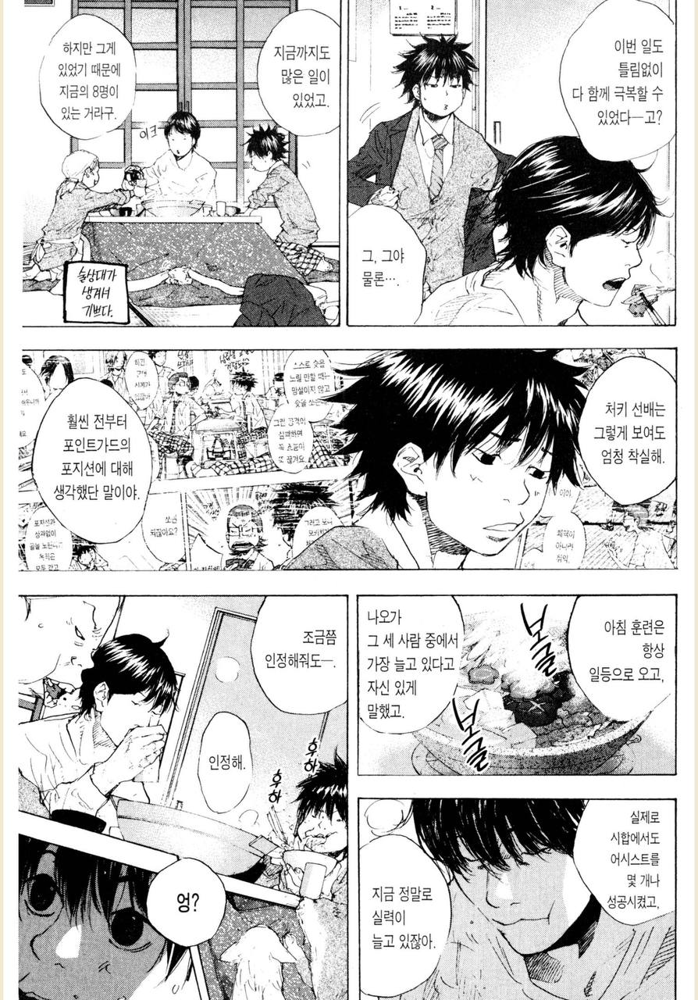

# 원하는 기회를 갖고 싶을때

조직(팀)에서 일을 한다는 것은 어떤 역할을 맡아야하는 것을 의미한다.  

예를 들어 굉장히 흥미가 가는 프로젝트를 팀에서 진행한다면 그 프로젝트에 꼭 참여하고 싶다고 생각할 수 있다.  

원하는 프로젝트가, 기회가 있을때 그 프로젝트 혹은 기회를 얻기 위한 가장 설득력 있는 방법은 **그 프로젝트의 적임자가 나라는 것을 증명하는 것**이다.  
  
동호회가 아닌 곳이라면, 조직에서 그 기회를 나에게 주지 않은 것은 이유가 분명히 있다.  
어텀이 플레이어 프로젝트에 참여하고 싶다면,
플레이어에 대해 충분히 훈련을 한 상태라는 것을 저에게 보여주세요.

물론 리더에게 그런 기회를 갖고 싶다고 이야기하는 것은 엄청난 용기가 필요한 일이다.  
그래서 그런 용기를 낸 것 만으로도 이미 한걸음 전진한 것이다.  
칭찬받아 마땅할 일이다.  
이 다음 한걸음은 **프로젝트 전에 충분한 준비를 하는 것**이다.  

어떤 기회를 얻고 싶거나 프로젝트에 참여하고 싶다면 그에 대한 충분한 준비가 된 사람이라는 것을 리더에게 보여주자.  
그러면 말하지 않아도 리더는 그 프로젝트를 맡길것이다.

본인팀의 리더는 아마도 그 단계까지를 기대하고 있을 것이다.  
개발자는 그렇게 한걸음씩 조금씩 성장해나가는 것 같다.

아래는 가장 좋아하는 농구만화인 [소라의 날개](https://namu.wiki/w/%EC%86%8C%EB%9D%BC%EC%9D%98%20%EB%82%A0%EA%B0%9C#s-4.3) 28권에 나온 일화이다.
시합에서 부족한 점을 보인 선수가 감독님께 용기내어 다음 시합에서도 스타팅멤버를 부탁드린 것인데, 이 일화가 나에게는 많은 교훈을 줬었다.

농구부원 '사키' 는 주전 멤버는 아니지만, 종종 스타팅 멤버로 경기를 출전했다.  
이번 경기에서도 스타팅에 출전했지만, 잦은 실수로 경기에 패배했다.  

아참 

