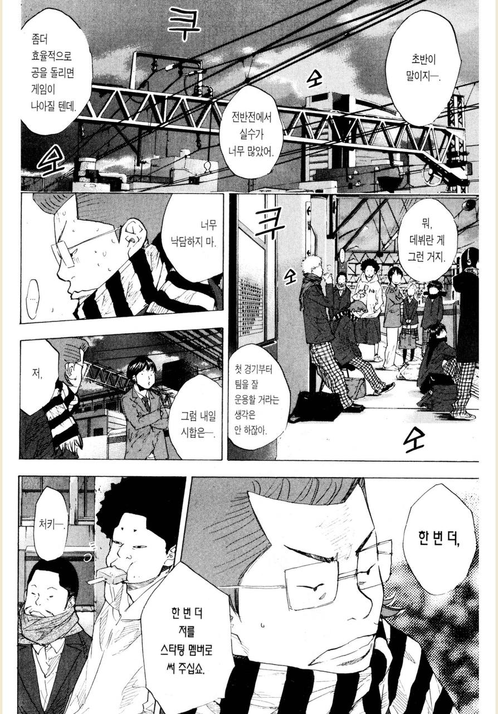
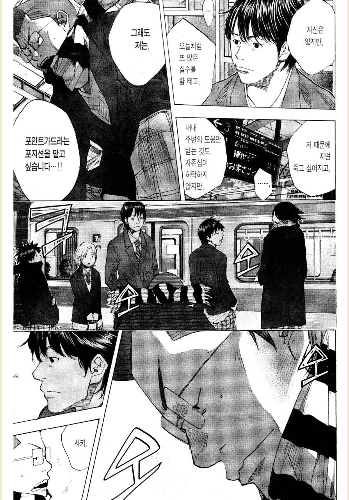

# 원하는 기회를 갖고 싶을때

팀에서 일을 하다보면 어떤 프로젝트가 진행될때 나도 함께 하고 싶을때가 종종 있다.  
  
누가 봐도 커리어에, 성장에 도움이 될 것 같은 그런 프로젝트들이 진행되고 나 역시도 그런 프로젝트에 참여 하고 싶은 그런 경우 말이다.  
  
리더가 그 프로젝트에 나를 포함시켜준다면 가장 좋겠지만, 보통은 그렇지 않고 다른 멤버가 프로젝트에 포함된다.  
  
내가 그 프로젝트에 너무 참여하고 싶다면 어떻게 해야할까?  
  
용기를 내는 것 부터 시작이다.  
**리더에게 이야기를 해야한다**.  
그 기회를 얻고 싶다고.  
  
하지만, 동호회가 아닌 회사라는 조직에서는 그것만으로는 기회를 얻진 못한다.  
**항상 일은 가장 적합한 사람에게 맡긴다**.  
모든 팀원이 하고 싶은 일을 하는 곳이 아니다.  

"잘해낼 수 있을까 걱정이 되지만 그래도 참여하고 싶다" 라는 말은 겸손한 말일 수도 있지만, 어떤 의미에서는 **그만큼 준비는 안되었지만 의욕은 있다**라는 것이다.  
**해내기 위해 어떤 노력을 했는지 보다, 충분한 준비가 안되었음을 먼저 전제하는 사람에게 기회를 주는 것은 쉽지 않다**.

마찬가지로 어떤 회사에 입사할때도 비슷하다.  
지금은 부족하지만, 입사를 하면 잘하기 위해 노력할 것이다라는 메세지만으로 채용하는 곳은 거의 없다.  
  
드라마나 영화처럼 **용기만 내면 준비가 안된 사람에게도 엄청난 능력이 생기거나 하는 일은 현실에 없다**.  

아래는 가장 좋아하는 농구만화인 [소라의 날개](https://namu.wiki/w/%EC%86%8C%EB%9D%BC%EC%9D%98%20%EB%82%A0%EA%B0%9C#s-4.3) 28권에 나온 일화이다.
시합에서 부족한 점을 보인 선수가 감독님께 용기내어 다음 시합에서도 스타팅 멤버를 부탁하는 것인데, 이 일화가 나에게는 많은 교훈을 줬었다.

농구부원 '사키' 는 주전 멤버는 아니지만, 종종 스타팅 멤버로 경기를 출전했다.  
이번 경기에서도 스타팅에 출전했지만, 잦은 실수로 경기에 패배했다.  

물론 **충분한 준비가 되어야만 리더에게 의견을 전달해야한다는 것은 아니다**.  
**리더에게 그런 기회를 갖고 싶다고 이야기하는 것 그 자체만으로도 엄청난 용기가 필요한 일**이다.  
그래서 그런 용기를 낸 것 만으로도 이미 한걸음 전진한 것이다.  
칭찬받아 마땅할 일이다.  
  
첫 단계를 해결했으니 이제 다음 한걸음이 필요하다는 것이다.  
그리고 그것이 **프로젝트 전에 충분한 준비를 하는 것**이다.  
**그 기회에 충분한 준비가 된 상태임을 리더에게 보여줘야한다**.  
  
그 프로젝트에 필요한 기술을 미리 연습을 해보던가,
그 프로젝트를 혼자서 간단하게라도 미니 사이즈로 진행해보던가 등등.  

**내가 그 프로젝트를 하기에 충분한 사람이라는 것을 충분히 증명해보자**.

예전에 기존 레거시를 새로운 시스템으로 교체해야하는 프로젝트의 멤버로 선택된 적이 있다.  
해당 프로젝트가 시작되기까지는 약 한달간의 시간이 있었다.  
그래서 혼자서 신규 시스템의 미니 버전을 처음부터 끝까지 미리 다 구현해봤다.  
도메인 설계, 데이터 설계, 인프라 아키텍처, API 디자인, 배포 파이프라인 등을 고민해보고 AWS 로 구축까지 진행했었다.  
  
물론 동료와 토론 하지 않고 혼자서 고민한 것이고, 기존 레거시에 대한 분석 없이 진행하다보니 실제 프로젝트와는 큰 차이가 있었고, 그대로 적용된게 많지 않았다.
그럼에도 **미리 전체 사이클에 대해 고민하고 다 구현해봤더니 프로젝트 내내 많은 부분에서 도움을 받을 수 있었다**.  
  
그리고 그 부분을 좋게 봐주신 팀장님은 TF가 시작될때 TF 리더를 위임해주셨다.  
미리 연습한 것만으로 제대로 된 프로젝트의 리더 경험을 해볼 수 있었던 것이다.    

원하는 기회를 얻고 싶다면 그에 대한 충분한 준비가 된 사람이라는 것을 리더에게 보여주자.  
그러면 말하지 않아도 리더는 기회를 줄 것이다.

아참 위 만화의 감독님이 너무 매정하지 않냐고?  
사실 그 감독님은 그 선수를 신뢰하고 있었다.

조직의 리더도 아마 당신에게 그 단계까지를 기대하고 있을 것이다.  
그렇게 한걸음씩 성장해나가는 것 같다.