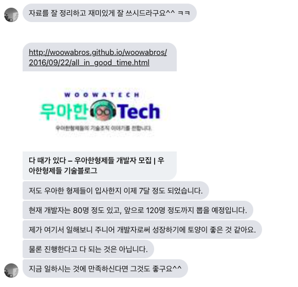

# 인연은 어디서나 (배민)

최근에 영한님을 만나서 2~3시간 이야기를 나누었다.  
영한님 차 타면서 집으로 가는 길에 예전에 함께 일하던 때에 대한 것들을 다루다보니 과거 생각이 많이 났다.  
그러면서 그때 참 같이 일해서 좋았고, 선물 같은 시간이였다는 이야기를 나누었다.
  
[다른 곳에서도 몇번 언급](https://jojoldu.tistory.com/309#%EB%91%90%EB%B2%88%EC%A7%B8-%EC%9D%B4%EC%A7%81-%EC%A4%80%EB%B9%84)했지만, 영한님과의 인연은 페이스북 DM으로부터 시작이였다.  

그 전까지는 컨퍼런스, 책으로만 뵙던 분을 DM으로 연락을 받았던 것이다.  
그것도 내 블로그를 보시고 나서 말이다.  
  
당시에 잘 다니고 있던 회사가 있었지만, 영한님을 비롯해서 당시에 유명하신 많은 분들과 함께 일할 수 있는 경험은 다시 없을것 같단 생각에 합류를 하게 됐다.  
그리고 스타트업에서 성장하는 경험, 엔지니어링이 조직에 기여하는 법, 회사와 조직원이 동반 성장하는 경험 등 4~5년의 시간을 압축적으로 보낼 수 있었다.
  
입사후에 영한님과 인프런 강의에 대해 이야기를 나눈 적이 있다.  
2018년에 인프런 강의를 찍어보니 꽤 재미난 경험이였어서, **영한님도 마침 관심있어 하시는 것 같아서 강의 촬영을 추천**드렸다.  
인프런 대표님과의 만남이 추진되었고, 첫 강의가 오픈되고 나서 영한님은 인프런 최고의 지식 공유자가 되셨다.   
그리고 영한님은 이제 배민을 나오시고, 교육자로서의 길을 걷게 되셨다.  
  
네이버 카카오 밖에 모르던 내가 영한님의 DM 으로 스타트업을 경험하고 나서는 다음 선택지로 훨씬 어려운 문제가 많은 규모가 작은 스타트업을 선택했고,  
배민에서 충분히 인정을 받고 다니시던 영한님은 나와 커피마시면서 나눈 인프런을 계기로 교육자로의 선택을 하게 되셨다.  
(물론 영한님은 이전에 이미 국비교육 강사를 하셨기 때문에 그 티타임이 아니였더라도 언젠가는 교육자를 하셨을 것 같다.)  

정말 인연은 어디서 시작될지 모른다.  
지금 내가 내린 선택은 수많은 인연들 속에서 발생한 우연들의 결과라는 생각을 많이 한다.  
  
당시에 같이 일했던 많은 분들이 이제는 회사를 떠나서 각자가 원하는 새로운 선택들을 했다.  
 
누군가가 초기 스타트업으로 합류하는 것을 보고,  
누군가가 사이드 프로젝트를 시작하고 이후에 창업으로 확장되는 것을 보고,
조직 내에서 서비스를 발전시키는 것을 보고,  
  
등등 여러 계기가 많은 분들의 결정에 큰 영향을 끼치는 것을 봤다.  
  
항상 건강한 태도로, 열려있는 커뮤니케이션을 해야겠다는 생각이 들었다.
어디서 인연이 되어 새로운 기회가 또 열릴지 모르니 말이다.