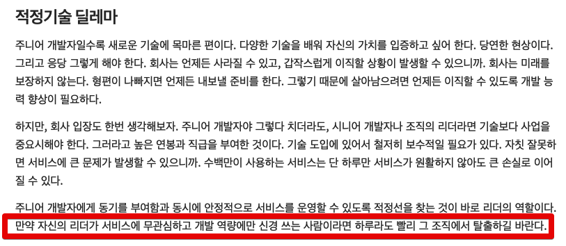

# 동기부여 찾기

인프콘 막바지에 준비하시는 팀원들과 함께 저녁식사를 했다.  
같은 테이블에 앉은 팀원분들과 이런 저런 이야기를 하다가, "향로는 정산 시스템을 할때 어떻게 동기부여하셨어요?" 라는 질문을 받았다.  

나는 새로운 기술이나 라이브러리 사용으로 동기부여 하는 것을 최대한 조심하라고 팀원들에게 이야기한다.  

예를 들어 매일 하는 회사일이 지겨워서 핵사고날 아키텍처를 적용한다거나 갑자기 HttpClient를 큰 회사가 사용하는 것으로 교체하는 등을 진행한다면 어떻게 될까?  
  

그래서 동기부여를 자꾸 밖에서 찾으려고 하면 앞으로 나아갈 수 있는 길이 제한된다.

- 고객의 피드백, 트래픽이 있어야만 동기부여 받을수 있다면 B2B 서비스쪽은 전혀 커리어로 삼기가 어렵다.
- 네이티브 앱이 주력이라 네이티브 앱 개발에 관심도가 높은 회사라면 웹 프론트엔드

새로운 기술을 적용하는 것이 항상 가능한 것도 아니며, 그게 진짜 개발자로서의 성장이 되어서 

내가 일하는 방식이나 일하는 환경 등 

요즘 팀원들과 1 on 1 을 하면서 자주 나누는 고민이 **동기부여**에 대한 것이다.  
  
팀 내에서 새로운 기술을 적용해본다던가, 컨퍼런스나 책에서 본 아키텍처를 적용해본다던가 하는 것은 한계가 있다.  

예를 들어, 네이티브 앱이 주력인 조직에서 웹 프론트엔드 개발자라면 나 혼자서 새로운 기술을 써본다고 

비즈니스의 중요성을 아는 개발리더라면 무턱대고 프로젝트에 새로운 기술을 적용하는 것을 허락하기가 쉽지 않다.

(출처: [카카오엔터테인먼트 FE 기술블로그](https://fe-developers.kakaoent.com/2023/230112-appropriate-technology/))

뿐만 아니라, 새로운 기술만으로 동기부여 하려는 노력은 조금만 지나치면 기술 힙스터가 되어서 도리어 본인과 조직에게 더 힘든 시간이 될 수도 있다.

새로운 기술이나 라이브러리, 구조 등 보다는
내가 일하는 방법을 개선해나가는 것도 좋다.  
미뤄두었던 생산성에 대한 점검을 해보는 것도 좋고,  
[Hammerspoon](https://johngrib.github.io/wiki/hammerspoon-tutorial-00/) 등으로 본인의 개발환경을 개선해나가는 것도 방법이다.  

다만, 항상 이야기하는 것은 **동기부여가 될때만 열심히 해서는 안된다는 것**이다.  

재미있을때 열심히 하는 것은 누구나 한다.  
점점 시간이 지나면서 재미없는 구간에 왔을때도 열심히 할 수 있느냐가 중요하다.  
  
동기부여가 되든 안되든 꾸준히 해야한다.