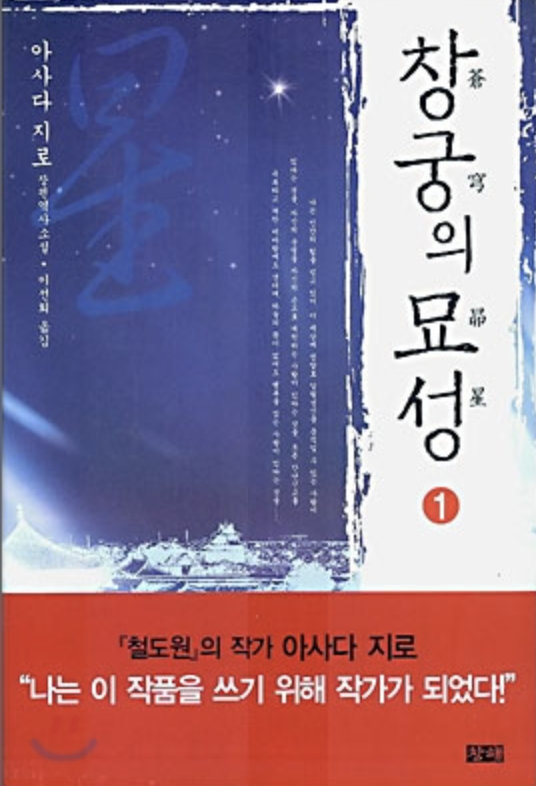
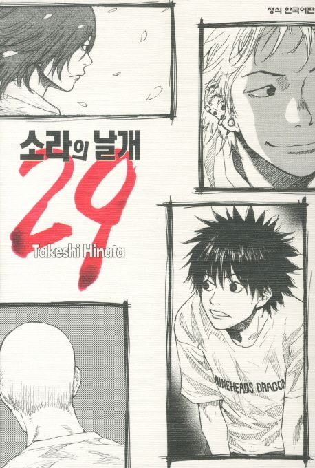

# 주인공에 대입하기

고민 상담을 하다보면 자존감에 대한 고민을 많이 듣는다.  

- 타인과의 비교
- 타인의 비난, 시기, 질투
- 내가 어쩔 수 없는 상황에 대한 불안감

등등 부정적인 감정을 만나게 될 때가 많다.  
  
그래서 나는 그 감정과 그 상황을 어떻게 잘 넘기는지에 대한 질문이 이어졌다.  
  
내가 잘 넘기는 편인가 싶었는데 

어디까지나 처음이냐 몇번 경험했던거냐다
남의 시기 질투 비난등이 처음일땐 낯설고 두렵다.
이걸 낯설지않게하는건 미리 경험하는것이고
그건 소설책을 통해 간접 경험 할 수 있다.
역경을 이겨내는 주인공에 몰입한다.

특히 이런 소설, 만화는 절대 Shorts 로 봐서는 안된다.  

