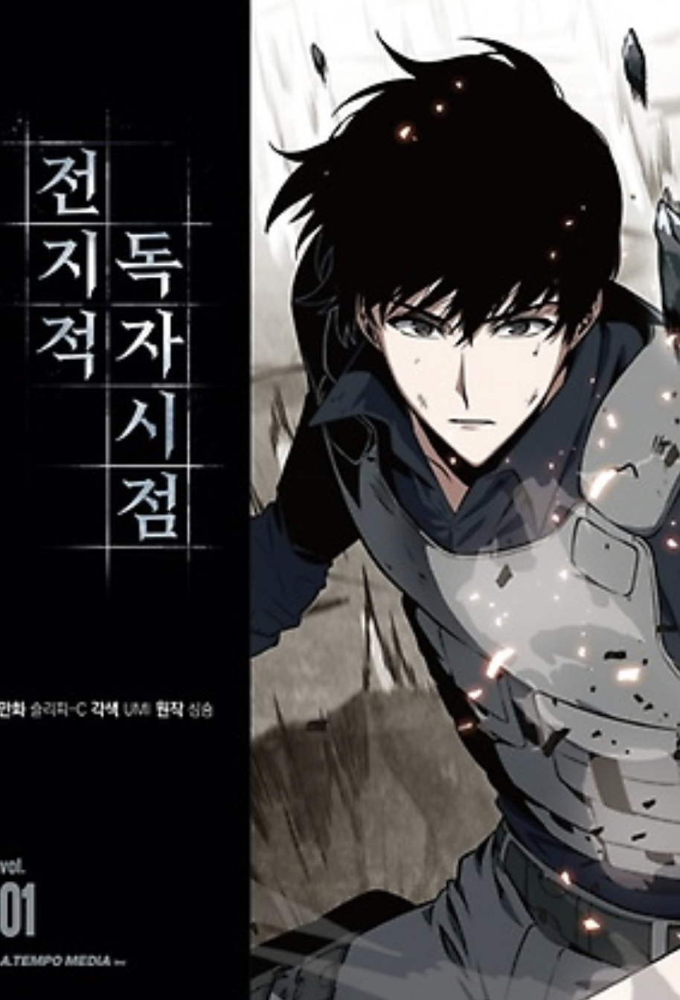

# 영웅의 서사

웹 소설 [전지적 독자 시점](https://comic.naver.com/webtoon/list?titleId=747269)을 몇 번이나 다시 읽을 정도로 좋아한다.  
  

이 소설의 세계관이 너무 마음에 들기 때문인데,  
**그 인물이 어떤 서사를 쌓아왔는지에 따라 강함이 결정 된다**.    
  
세계관 속 인물의 타고난 강함이 있더라도,  
계속해서 서사를 쌓지 않으면 그 인물은 더이상 강해지지 못하고 약해지기 시작하여 언젠가는 소멸한다.  
  
더 많은 모험을 즐기고, 더 많은 사건을 거친 인물일수록 더 강해지는 것이다.  
그래서 12과업을 달성한 헤라클래스나 제천대성, 필마온등으로 수많은 이야기를 쌓은 손오공 등이 최강의 캐릭터로 묘사된다.  
  
그래서 이 세계관 속 주인공과 동료들은 어마어마한 험난한 여정을 걸어간다.  
  

더이상 스테이지를 클리어하지 않고 평화롭게 지낼 수 있는 스테이지를 무너뜨려야 한다거나  
동료들에게 죽임을 당해야만 다음 스테이지로 갈 수 있다거나  
등등 "왜 이렇게까지 해야하나" 싶은 스테이지들을 주인공과 그 동료들은 하나씩 해결해나간다.

예전에 ["창준님의 워크샵 - 당신은 영웅의 여정을 걷고 있습니까"](https://www.facebook.com/cjunekim/posts/pfbid0gQDdqYoRzURcPVCbMYEK42TxFPKWJ8WZcbkwJk4s8EAZbokvz8us6U3poR79dLZMl)에 참석했다.  
  
해당 워크샵에서 아래의 내용을 소개 받았다.  
"**본인의 삶이 소위 영화나 소설에서 보는 영웅의 여정과 유사하다고 느낄수록 이 삶의 의미가 높다**"는 연구 결과가 있다는 것이였다.  
  
신기해서 찾아보니 정말 있었다.  

- [Seeing Your Life Story as a Hero’s Journey Increases Meaning in Life](https://www.researchgate.net/publication/367377960_Seeing_your_life_story_as_a_Hero's_Journey_increases_meaning_in_life)
  
영웅의 여정에는 7가지 핵심 요소로 "주인공, 변화, 퀘스트, 동맹, 도전, 변혁, 유산" 이 있는데, 이 중   
  

"전지적 독자 시점" 의 "김독자" 처럼
"소라의 날개" 의 "소라" 처럼  
"원피스" 의 "루피" 처럼  
"드래곤 퀘스트 타이의 대모험" 의 "타이" 처럼  

내가 겪는 모든 사건 사고, 고난들을 이들이 겪는 모험의 여정과 같다고 생각한다면 이 모든 것들은  

## 함께 보면 좋은 글

- [소설에 몰입하기](https://jojoldu.tistory.com/735)

