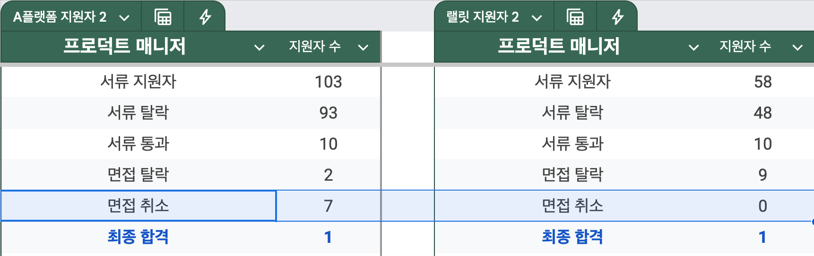
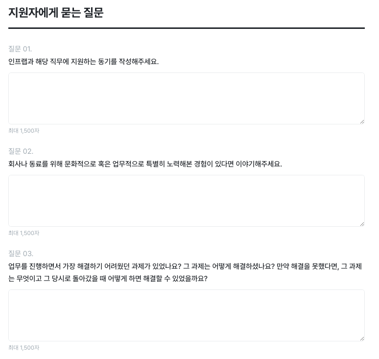

# 10명 중 7명이 불참하는 면접

4개월간 진행된 PM 직군의 채용이 마무리 되었다.  
원래 TO는 1명이였지만 너무 훌륭한 분들이 많이 지원해주셔서 2분을 뽑게 되었다.  
최종 합격한 2분 외에도 훌륭한 분들이 많으셔서 다음에 기회가 된다면 또 뵙고 싶다는 이야기를 전달드렸다.  
  
개발직군에 비해 PM 직군은 지원자수가 많지 않기에 최대한 많은 분들에게 전달하고자 [랠릿](https://www.rallit.com/companies/7) 외에도 타 플랫폼도 함께 사용했다.  
  
2개의 채용 서비스를 이용한 채용은 전체 161분이 지원해주셨고 그 결과 수치는 다음과 같다.

놀랍기도 하고, 힘들기도 했던 것은 **A 플랫폼을 통해 진행된 채용 과정에서는 지원자에 의한 면접 취소가 70% (7/10) 나 되었다**.  
면접 취소의 대부분도(5/7) 당일 취소였다.

- 면접 취소 7건 중 **4건은 당일 취소**
- 면접 취소 7건 중 **1건은 당일 잠수 (연락 두절)**

수많은 지원자분들의 서류를 보고나서 좋은 분들을 추리고, 면접 일정을 위해 다른 일정들을 조율하고 사전 질문을 준비하는 등 면접을 준비하는데 많은 시간을 들였는데 **당일 취소, 당일 잠수**를 들으면 정말 기운이 빠진다.  
(오죽하면 A플랫폼 면접일에는 HR과 "오늘은 오시겠죠...?" 라는 이야기를 매번 했다.)  
  
다행히 랠릿을 통한 지원자분들은 모두 다 면접에 참여해주셔서 좋은 분들을 채용하는데 있어 어려움은 없었는데, A 플랫폼에서는 "**서류 합격자의 70%가 당일 면접 취소를 하는 이유는 무엇일까?**" 를 진지하게 고민하게 되었다.  
  
"우리쪽 채용 공고가 매력적이지 않았나?"  
"우리 회사의 매력 어필이 부족했나?"  
등등 우리쪽의 채용 공고와 회사 소개에 대해서 많이 고민하다가 외부의 다른 분들을 통해 원인을 알게 되었다.  
  
A 플랫폼에서는 **한 회사에 지원 완료 하면 같은 직무에 대한 채용 공고 목록을 보여주고, 이들을 체크만 하면 일괄 지원**할 수 있었다.  

즉, **채용 공고를 상세히 보지 않아도 하나의 회사만 지원하면 여러 회사를 동시에 지원**할 수 있었던 것이다.  
그러니 채용 공고에 아무리 힘을 써도 지원자분들 입장에선 내가 의도하고 직접 찾아보고 지원한 회사가 아니라 **수많은 자동 지원된 회사 중 하나일 뿐**이였다.  
  
이 사실을 알기 전까지 의문인 부분이 많았다.  
이를테면, 우리는 서류외 이 분을 좀 더 잘 알기 위해 지원자에게 묻는 질문란이 있다.
(직무마다 다름)    

그래서 채용공고에도 이 질문에 대해 꼭 답변을 함께 달라고 남겨두는데, 랠릿 외 타 플랫폼은 이걸 강제화할 수단이 없었다.  
그래서 이 **질문에 대한 답변을 이력서에 포함해서 제출하신 분은 4.8% (5/103)** 밖에 되지 않았고, 나머지 95.2% (98/103) 분들은 질문 답변 없이 제출하셨다.  
이 질문에 답하기 싫으면 지원안할텐데, 왜 답은 하지 않으시고 지원만 하시지? 라는 의문이 생겼다.  
  
너무 많이 답변을 안하셔서 답변을 하지 않은 분들 중에서도 면접을 보기로 하였는데, 예상처럼 **답하지 않고 이력서만 제출하신 분들은 대부분 불참하셨다**.  
  
반면에 **랠릿의 경우 제출 전 해당 질문을 필수 항목으로 설정할 수 있어서 질문을 답하지 않으면 지원이 불가능**하다.  
그래서 랠릿을 통해 지원하신 분들은 모두 질문에 답해주셨고, **면접 불참이 1명도 없었다**.  
  
이것 때문에 알게 된 사실은 **채용 공고를 안봐도 지원할 수 있을 정도의 편의성은 높은 면접 불참율을 동반한다는 것**이다.  
지원할 회사에 대한 최소한의 고민할 거리도 주지 않는 프로세스는 그만큼의 이탈율을 보여줬다.

그래서 내린 결론은 다음과 같다.

- 채용 공고를 보지 않아도 될 정도로 간편한 프로세스는 많은 지원자를 받을 수 있다.  
  - **우리 공고에 지원자가 너무 적다면 이런 프로세스가 필요하다**.
  - 클릭 몇번만으로 지원할 수 있는 프로세스는 언제든 지원자가 이탈할 확률이 높다.
- 사전 질문처럼 서류 과정에서 최소한의 허들을 필수로 하면 지원자의 수는 위 과정보다는 적다.
  - 대신, **우리 회사에 대해 좀 더 진지하게 고민하시는 분들을 만날 확률이 높다**.
  - 우리 회사 지원자들이 이탈율이 높다면 이런 프로세스를 도입하면 이탈율을 크게 낮출 수 있다.
  - 지원자의 수는 마케팅을 통해 높인다.

채용 과정은 구직자, 구인 회사 양쪽이 모두 함께 합이 만나야만 좋은 경험을 할 수 있다.  
그러기 위해 양쪽 모두의 노력이 필요한데,
**너무 쉬운 프로세스는 서로에게 시간 낭비만 될 확률이 높아서 양날의 검**처럼 느껴진다.  
  
**이런 채용 과정의 고민들, 문제들을 랠릿을 통해 해결해나가야겠다**.