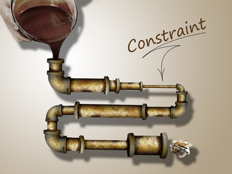

# 병목 지점을 해소하기

회사의 일에서는 항상 병목 지점이 생길 수 있다.  
그리고 이런 병목 지점이 항상 전체의 생산성에 영향을 끼친다.  
  
> 병목 (Bottlenecks) 이란, 특정 작업 단계에서 작업 처리 속도가 느려지거나 그 단계의 작업량이 과도하게 쌓이는 현상을 말한다.  
즉, 업무의 파이프라인에서 "좁은 구간"이 되어 다른 작업들이 진행되지 못하고 밀려 있는 상태를 의미한다.  
> 외부 의존성 (다른 팀 또는 클라이언트로부터 필요한 정보가 오지 않는 경우, 승인이 필요하여 승인을 기다리는 경우)등의 차단 요소 (Blockers) 와는 조금 의미가 다르다.

전체 시스템의 생산성을 개선하기 위해서 각 단계별 최적화를 하는 것은 효과가 미미하다.
  
- 병목 앞을 개선하는 것은 병목에 더 많은 WIP (Work In Process) 가 쌓이기만 하며 
- 병목 뒤를 개선해는 것은 병목에서 나오는 생산량에 변화가 없으므로, 병목 뒤 지점의 생산량에도 변화가 없다.

결국 가장 병목이 되는 지점을 해소해야만 전체의 생산성이 개선된다.  
(TOC, Theory of Constraints) 

(출처 - http://leanhealthcareconsortia.org/tools/)

팀의 목표를 명확하게 정의하는 것이 첫번째이다.  
팀의 목표가 명확한 상태에서 목표 달성을 가장 방해하는 요소를 찾아내고 이를 개선하여 전체 성과를 극대화하는 것이 리더가 해야할 일이다.  
가장 방해한다는 것은 제품 출시 과정 중에서 가장 생산성이 낮은 단계를 의미한다.  
해당 병목 지점의 생산성 개선을 위해서는 다른 단계에서의 지원이 필요하다.  

## 예시)

- 아이 1: 3km/h
- 아이 2: 3.5km/h
- 아이 3: 1km/h (느린 아이)
- 아이 4: 2.5km/h
- 아이 5: 4km/h

이 다섯 명의 평균 속도는 아래와 같다.

평균 속도: (1+3+4+2.5+3.5) / 5 =2.8km/h
실제 속도:

하지만 실제로 이 그룹의 전체 이동 속도는 병목(가장 느린 아이, 즉 아이 1)의 속도에 의해 결정된다. 
아이 1이 1km/h로 걷기 때문에, 그룹 전체가 더 빠르게 이동하고 싶어도 아이 1의 속도인 1km/h로 제한된다.

이유:
병목이 제한을 가함: 앞서 설명한 것처럼, 가장 느린 아이가 그룹의 속도를 결정한다. 아이 1이 느린 속도로 걷기 때문에 나머지 아이들은 아이 1을 기다릴 수밖에 없다. 그 결과, 그룹 전체가 평균 속도인 2.8km/h로 걷는 것이 불가능해진다. 그룹의 실제 이동 속도는 병목에 의해 1km/h로 제한된다.

앞서가면 기다려야 함: 아이 2부터 아이 5까지는 더 빠른 속도로 걷지만, 결국 앞서가면 계속 아이 1을 기다리게 되어 속도 차이가 무의미해진다. 그룹의 전체 성과는 병목(아이 1)의 속도에 좌우된다는 것이 TOC 병목 이론의 핵심이다.

병목 해결 방법:
병목을 해결하기 위해선 아이 1의 속도를 개선하거나 다른 아이들이 도움을 주어야 한다. 만약 아이 1이 1km/h로 걷는 이유가 무거운 배낭 때문이라면, 다른 아이들이 배낭을 나눠 들게 되면 속도가 2km/h로 올라갈 수 있다. 이때 그룹의 전체 속도는 2km/h로 증가하게 된다.

결론:
따라서 평균 속도 2.8km/h는 그룹의 실제 이동 속도가 될 수 없다. 시스템의 성과는 병목이자 가장 느린 부분에 의해 결정되기 때문이다. 이 개념은 생산, 프로젝트 관리, 개발 등 다양한 상황에서도 적용된다. 병목을 해결하지 않으면 전체 성과는 병목의 한계에 갇히게 된다.

  
보통은 다음과 같은 경우가 이에 속한다.

- 개발 작업을 처리하는 속도에 비해 QA(품질 보증) 팀이 처리하는 속도가 너무 느리면, QA 단계가 병목지점이다.
- 개발팀이 여러 일을 동시에 진행하다가 단일 작업 마다의 작업이 지연 된다면 개발 단계가 병목 지점이다.  

이를 개선하는 방법은 크게 2가지이다.  
하나는 병목자원이 대기하는 시간이 생기지 않도록 하는 것이고, 다른 하나는 병목자원에서 불필요한 일을 처리하지 않는 것이다. 
  
이 두 가지가 안되면 추가 인원을 채용 해도 큰 효과가 없다.  

## 함께 보면 좋은 글

- [개발자가 모자라요](https://youngrok.com/%EA%B0%9C%EB%B0%9C%EC%9E%90%EA%B0%80%20%EB%AA%A8%EC%9E%90%EB%9D%BC%EC%9A%94)
- [The Goal (더 골)(만화판) - 후기](https://jojoldu.tistory.com/807)