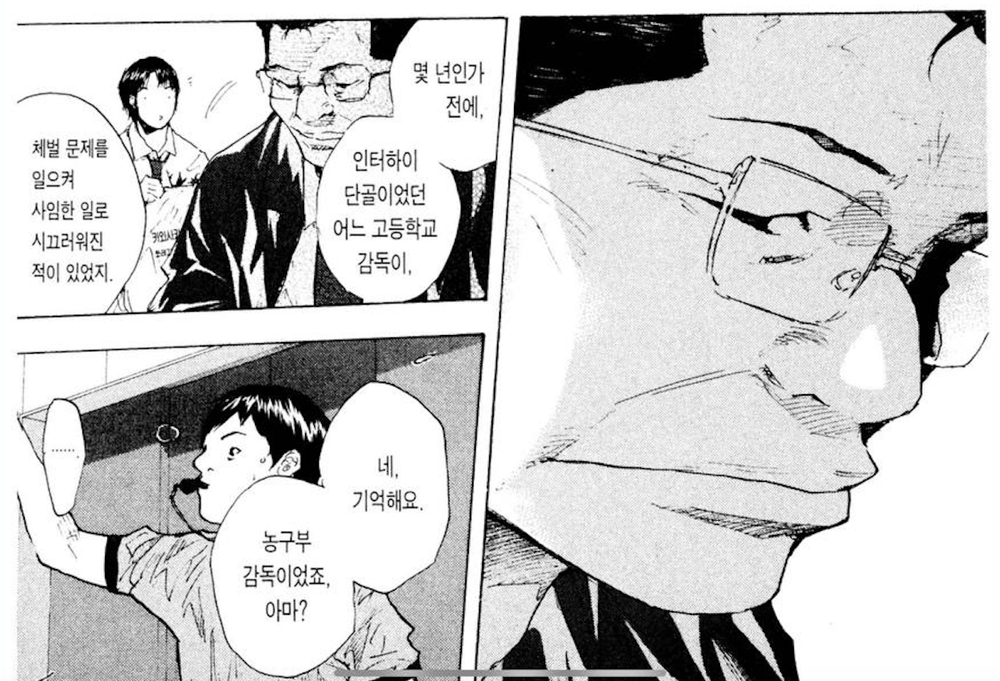
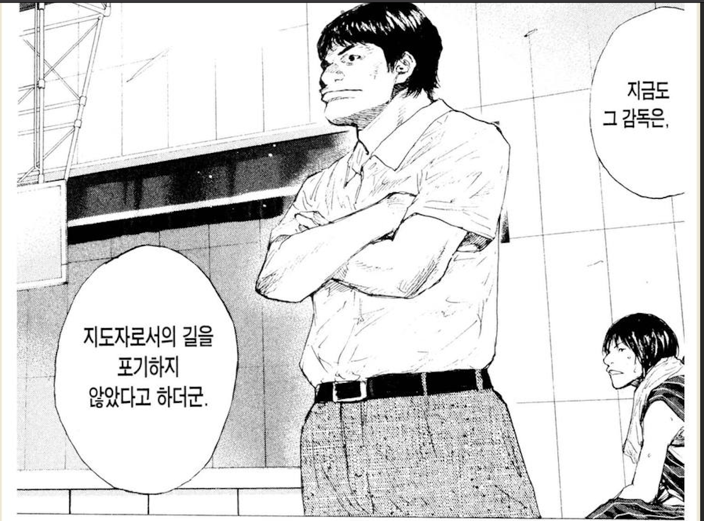

# 어떤 감독이 될 것인가?

소라의 날개 25 ~ 27권을 보면 남녀 농구부가 방학동안의 합숙 훈련 이야기가 나온다.  
새로 부임한 감독님은 농구부원들의 목표가 전국대회 진출임을 알고, **전국대회 진출을 위한 훈련을 준비**한다.  
  
전국대회 진출팀이 되기 위한 훈련은 당연히 높은 훈련 강도를 필요로 하고, 훈련 메뉴를 본 매니저 등은 높은 강도로 인해 우려를 표한다.  
**우리팀은 이 정도의 훈련을 처음 경험하니 낙오자가 너무 많고 효과가 적지 않겠냐고**.  
  
이때 감독님의 이야기가 와닿았는데,  
이 훈련을 통과하고 못하고 보다 더 중요한 것은 **처음 만나는 벽을 만났을때 어떤 마음가짐들을 하느냐**가 훨씬 중요하다는 것이다.

"무리를 해도 불가능한 일이라면, 처음부터 주문도 강요도 하지 않아.  
솔직히 말하면 이 합숙의 메뉴도 상당히 무리하게 짜놨어.  
한 명도 빠짐없이 전원 해내리라는 생각은 처음부터 하지 않았어.  
**다만, 눈 앞에 그런 벽이 놓였을 때, 처음부터 불가능하다고 생각하는 녀석은 아무리 애를 써도 뛰어넘지 못해**.  
중요한 것은 강한 팀이냐 약한 팀이냐가 아니라, **강해질 수 있는 팀이냐 아니냐야**"  

가능하면 이 높은 훈련 강도를 많은 부원들이 통과하기를 바랬지만,  
결과적으로 **농구부원들 중 일부는 체력 관리에 실패해 도중에 포기하고**

**일부는 몰래 도망친다**.  
그리고 같은 열망을 가지고 있을 것이라 믿었던 주장은 팀에게 큰 실망을 한다.

  
> 여기서 부주장의 "괜찮아. 다 함께 이겨내면, 그게 자신감이 될 테니까." 가 참 와닿았고, 굉장히 중요하다는 생각을 했다.
   
이 훈련 과정으로 인해 학부모분들의 항의로 교장 선생님과 면담도 진행하지만,  
**감독님은 이 강행군을 계속 진행**한다. 

결과적으로 남/녀 농구부는 성과를 낸다.  
여자 농구부는 전국대회 진출은 실패했지만, 역대 가장 높은 성적을 냈고, 남자 농구부는 전국 대회로 진출하게 된다.  
  
다만, **높은 훈련 강도로 농구부를 떠난 부원들, 병원에 실려간 부원을 생각하며 새 감독님은 본인이 감독이란 역할에 어울리는 사람인가에 대한 고민**을 한다.  
  
그리고 38권에서 이에 대해 그를 응원하는 선생님과의 대화가 나온다. 

"저로 인해 그만둔 부원도 있었고,  
합숙 중에 기권자가 나와서 보호자에게 사과한 적도 있었죠.  
그래도 더 강하고, 엄하게 대했지만, 속으로는 꽤나 마음 졸였거든요.  
어디까지 하면 되는지,  
어디까지 해야 하는지,  
만약 여기서 결과를 내지 못하면 어떡하지 싶어서...  
저는 지도자에는 별로 맞지 않는 것 같아요."  

그 말을 듣고 그를 응원하는 선생님의 메세지가 참 좋았다.  
  
"몇 년인가 전에,  
인터하이 단골이었던 어느 고등학교 감독이, 체벌 문제를 일으켜 사임한 일로 시끄러워진 적이 있었지.  
지금도 그 감독은, 지도자로서의 길을 포기하지 않았다고 하더군.  
신념을 관철시킨다는 것은 이 세상에서 가장 가혹하고 고독한 일일걸세.  
하지만 그것에 닿기 위해서는, 누군가는 꼭 해야만 하는 일이기도 하지."

꼭 소라의 날개에서만 그런게 아니라,  
스포츠 만화를 보다보면 항상 이와 유사한 에피소드가 나온다.  
  
승패 보다는 모두가 즐겁게 농구를 하는 감독이 될 것 인가,  
전국대회 진출을 목표로 하는 감독이 될 것 인가.    
  
만화가 아니더라도 실제 세상에서도 **혹사의 아이콘 김성근 감독님**이 있고 말이다.  
  
예전부터 참 신기했다.  
많은 야구 기자, 분석가분들이 김성근 감독님의 혹사에 가까운 훈련 방식이나 시합 전개 방식에 대해서 비판을 많이 한다.  
  
근데 김성근 감독님 밑에서 함께 했던 선수들은 모두 김성근 감독님을 은사로 여기고 항상 감사의 마음을 표한다.  
  
<iframe width="560" height="315" src="https://www.youtube.com/embed/EdfpjPKkH4Q?si=0Y1XZn8osigYjalO&amp;start=93" title="YouTube video player" frameborder="0" allow="accelerometer; autoplay; clipboard-write; encrypted-media; gyroscope; picture-in-picture; web-share" referrerpolicy="strict-origin-when-cross-origin" allowfullscreen></iframe>
  
왜 그런걸까?  
최강야구를 볼때도 그렇고, 김성근 감독님의 경기나 훈련을 봐도 위플래쉬처럼 가스라이팅으로 선수들을 강요하거나 하진 않는다.  
**성과를 내고 싶은 열망이 있는 사람들에게 강도 높은 훈련을 시키고 피드백을 주면서 성과를 낼 수 있도록** 했기 때문이 아닐까 생각했다.  
(실제로 옆에서 본건 아니라서 잘 모르지만)  
  
김성근 감독님의 방식이 옳으냐 아니냐는 직장인에겐 가치 판단의 문제라고 본다.  
결국 더 높은 성과를 내고 싶은 사람들에겐 그 강도 높은 훈련을 원할 것이고,  
그럴 마음이 없는 사람들에겐 빨리 떠나야 할 팀이 될 뿐이고.  
  
결국 모든 리더들은 선택해야하는 것 같다.  
  
승패 보다는 모두가 즐겁게 농구를 하는 감독이 될 것 인가,  
전국대회 진출을 목표로 하는 감독이 될 것 인가.  

> 다만, 한번도 높은 벽을 만나게 하지 않은 감독이 좋은 감독인가에 대해서는 생각해볼 필요가 있겠지만 말이다.

부원들이 이탈하는게, 미워하는게, 싫어하는게 무서우면 승패에 관계없이 즐겁게 농구를 하는 감독을 선택하면 되고,  
성과를 내지 못해서 열망 있는 부원들이 떠나는게 더 무섭다면 전국 대회 진출을 목표로 하는 감독을 선택하면 된다.  
  
어떤 선택이 더 좋은 선택인지는 사람마다 다르다.  
다만, 무슨 선택이든 결정 했다면 그에 따른 불편한 일들을 각오할 뿐이다.
    

## 함께 보면 좋은 글

- [이기는 팀 경험](https://jojoldu.tistory.com/760)
- [좋은 피드백 (절벽으로 몰아세우지 않기)](https://jojoldu.tistory.com/762)
