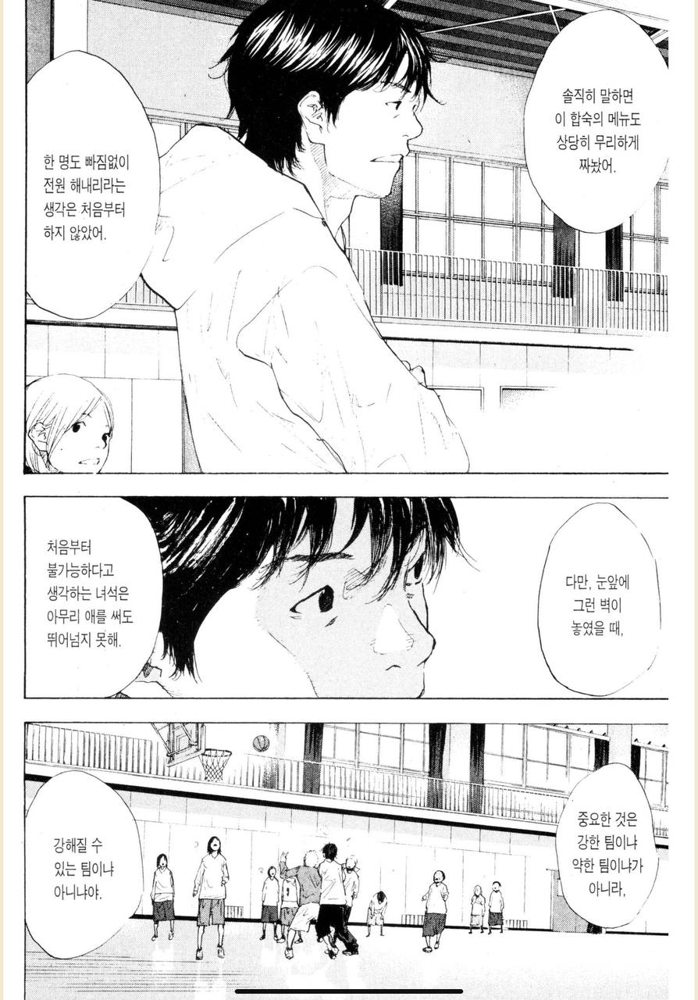
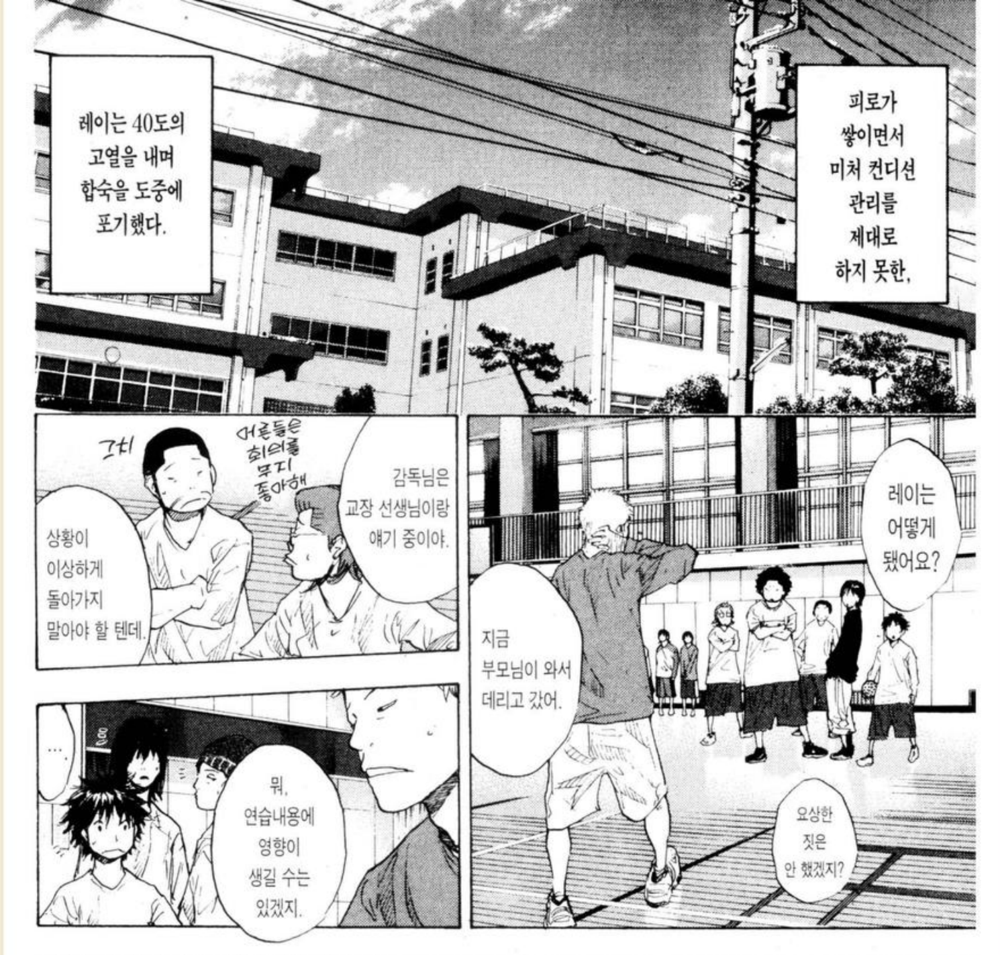
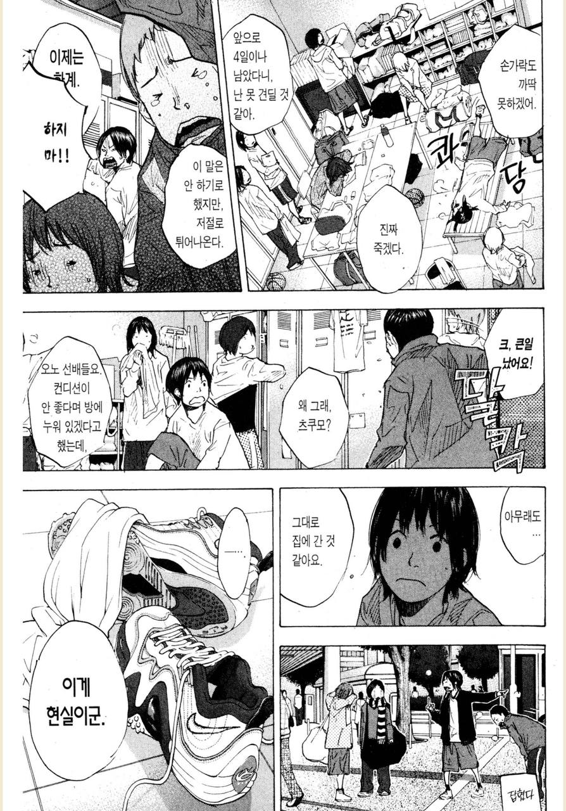
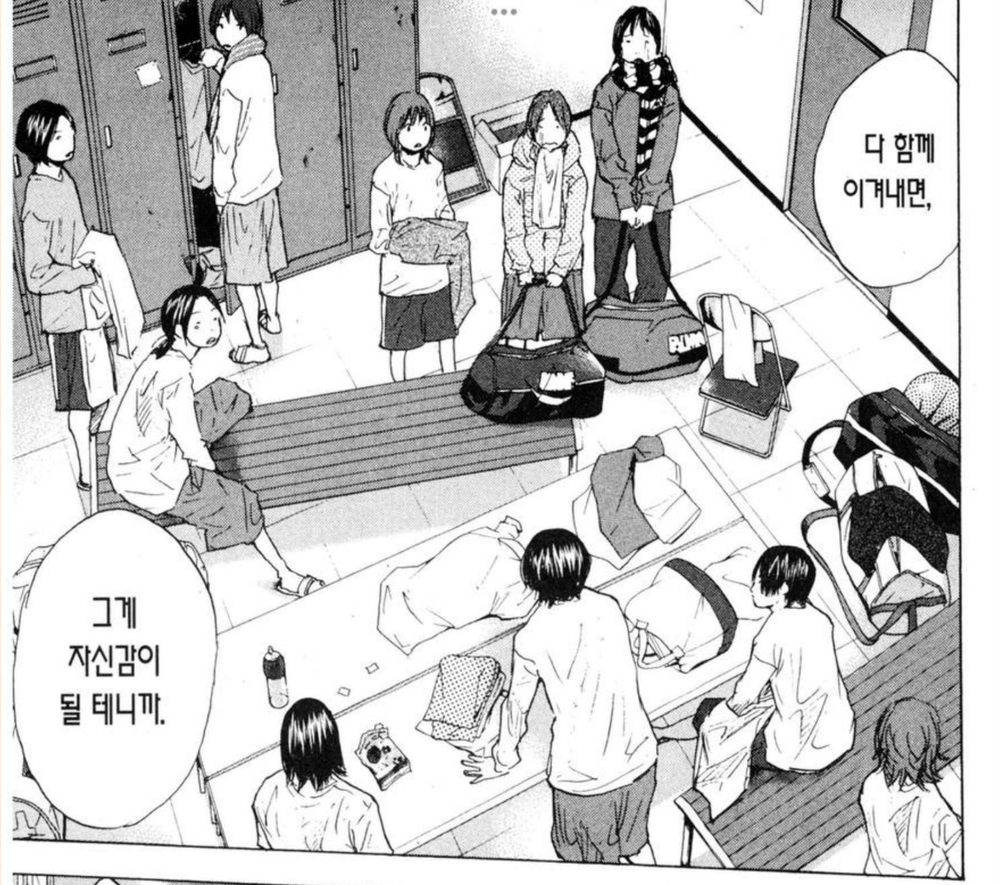
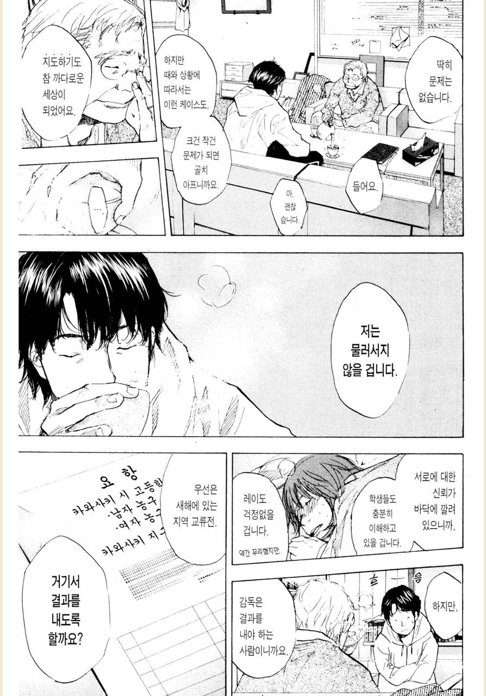
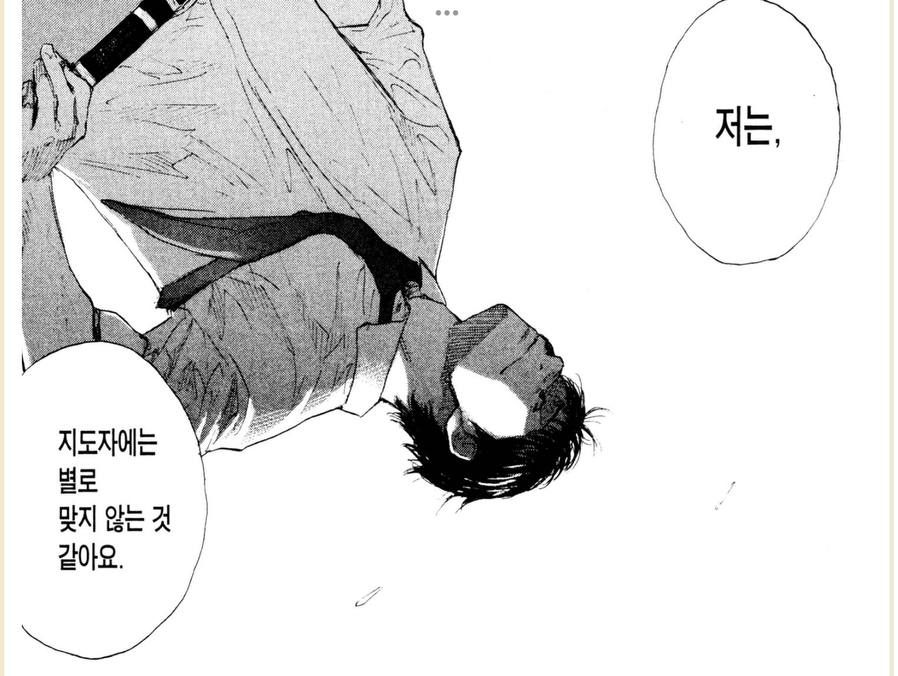

# 선택하기

소라의 날개 25 ~ 26권을 보면 남녀 농구부가 방학동안 합숙 훈련 이야기가 나온다.  
새로 부임한 감독님은 농구부원들의 목표가 인터하이 진출임을 알고, **인터하이 진출을 위한 훈련을 준비**하고 진행한다.  
  
높은 훈련 강도로 인해 매니저 등에서 우려를 표한다.  
그동안 이 팀들은 이 정도의 훈련을 처음 경험하니 낙오자가 너무 많고 효과가 적지 않겠냐고.  
  
이때 감독님의 이야기가 와닿았는데,  
이 훈련을 통과하고 못하고 보다 더 중요한 것은 **처음 만나는 벽을 만났을때 어떤 마음가짐들을 하느냐**가 훨씬 중요하다는 이야기를 한다.

"무리를 해도 불가능한 일이라면, 처음부터 주문도 강요도 하지 않아.  
솔직히 말하면 이 합숙의 메뉴도 상당히 무리하게 짜놨어.  
한 명도 빠짐없이 전원 해내리라는 생각은 처음부터 하지 않았어.  
**다만, 눈 앞에 그런 벽이 놓였을 때, 처음부터 불가능하다고 생각하는 녀석은 아무리 애를 써도 뛰어넘지 못해**.  
중요한 것은 강한 팀이냐 약한 팀이냐가 아니라, **강해질 수 있는 팀이냐 아니냐야**"  

가능하면 이 높은 훈련 강도를 많은 부원들이 통과하기를 바랬지만,  
결과적으로 **농구부원들 중 일부는 체력 관리에 실패해 도중에 포기하고**

**일부는 몰래 도망친다**.  
그리고 주장은 이에 대해 큰 실망을 한다.

  
> 여기서 부주장의 "괜찮아. 다 함께 이겨내면, 그게 자신감이 될 테니까." 가 참 와닿았고, 굉장히 중요하다는 생각을 했다.
   
학부모분들의 항의로 교장 선생님과 면담도 진행하지만,  
감독님은 성과를 내기 위해 이 강행군을 계속 진행한다. 

결과적으로 남녀농구부는 기존과는 달리 높은 성적표를 낸다.  
물론 원하는 성적만큼 내진 못했다.  
  
다만, 높은 훈련 강도로 농구부를 떠난 부원들, 병원에 실려간 부원을 생각하며 새 감독님은 본인이 그 역할에 어울리는 사람인가에 대한 고민을 한다.  
  
그리고 이에 대해 38권에서 감독님과 그를 응원하는 선생님과의 대화가 나온다. 

"저로 인해 그만둔 부원도 있었고,  
합숙 중에 기권자가 나와서 보호자에게 사과한 적도 있었죠.  
그래도 더 강하고, 엄하게 대했지만,  
만약 여기서 결과를 내지 못하면 어떡하지 싶어서...   
속으로는 꽤나 마음 졸였거든요.  
어디까지 하면 되는지,  
어디까지 해야하는지,  
저는 지도자에는 별로 맞지 않는 것 같아요."  

"몇 년인가 전에,  
인터하이 단골이었던 어느 고등학교 감독이, 체벌 문제를 일으켜 사임한 일로 시끄러워진 적이 있었지.  
지금도 그 감독은, 지도자로서의 길을 포기하지 않았다고 하더군.  
**신념을 관철시킨다는 것은 이 세상에서 가장 가혹하고 고독한 일**일걸세.  
하지만 그것에 닿기 위해서는, 누군가는 꼭 해야만 하는 일이기도 하지."

모두가 즐겁게 농구를 하는 착한 감독이 될 것 인가,  
인터하이에 진출할 수 있는 팀을 만들 수 있는 감독이 될 것 인가.  
  
일본의 스포츠 만화를 보면 항상 이 주제가 나온다.  
  
만화가 아니더라도 실제 세상에서도 **혹사의 아이콘 김성근 감독님**이 있고 말이다.  
  
예전부터 참 신기했다.  
많은 야구 기자, 분석가분들이 김성근 감독님의 혹사에 가까운 훈련 방식이나 시합 전개 방식에 대해서 비판을 많이 한다.  
  
근데 김성근 감독님 밑에서 함께 했던 선수들은 모두 김성근 감독님을 은사로 항상 감사의 마음을 표한다.  
  
## 함께 보면 좋은 글

- [이기는 팀 경험](https://jojoldu.tistory.com/760)
- [좋은 피드백 (절벽으로 몰아세우지 않기)](https://jojoldu.tistory.com/762)
