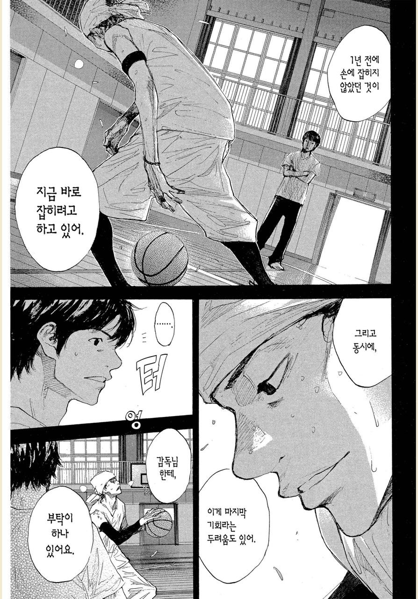
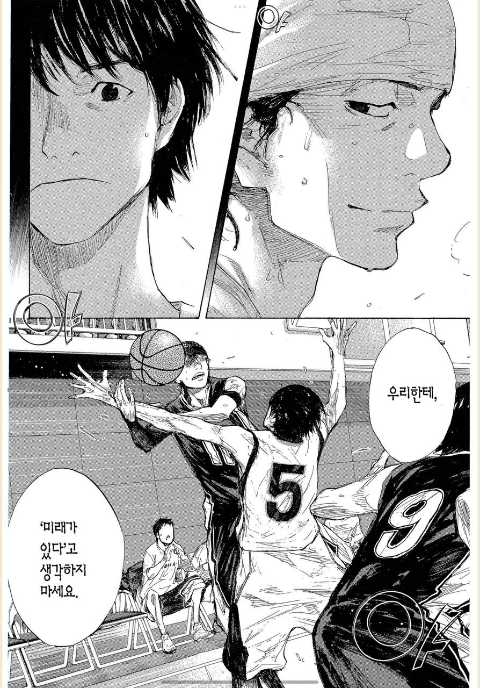
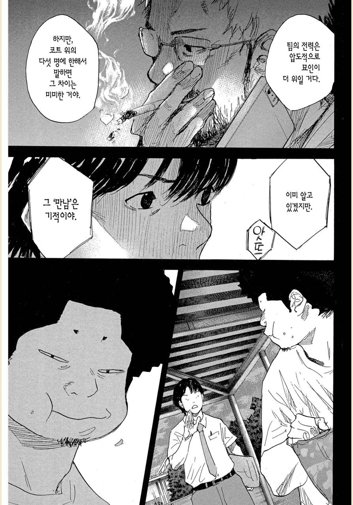
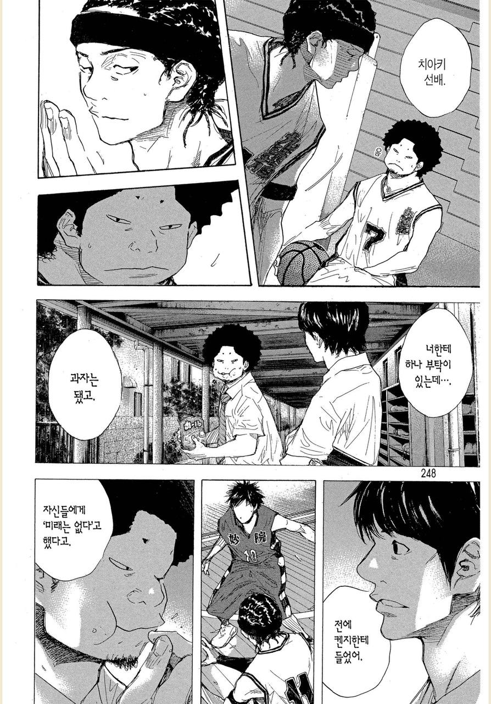

# 우리에게 미래가 있다고 생각하지 마세요

만화책 [소라의 날개](https://series.naver.com/comic/detail.series?productNo=4003487) 속 주인공 팀은 장/단점이 명확한 부원들이 모여있다.  

이를 테면 주인공은 
- 드리블도 엄청 낮고 빠르며, 3점슛을 만화 내에서 가장 잘 쏜다.
- 다만, 키가 150이라 슛이 막히기 쉽고 수비 역시 불안하다. 

재밌는 것은 같은 팀의 다른 멤버들 역시 장점과 단점이 명확하다는 것이다. 

- 누군가는 발이 느려 다른 가드와 같은 역할을 할 수 는 없다.
  - 다만, 패스를 정말 잘하며 슛터가 슛을 쏠 수 밖에 없게 정확하게 전달한다.
- 또다른 팀원은, 슛 정확도가 가장 낮아 게임 내내 슛을 거의 쏘지 못한다.
  - 다만, 리바운드를 누구보다 잘하여 실패한 슛을 항상 잡아준다.

이들로 인해 주인공은 본인의 단점을 상쇄시키고 장점을 극대화시킬 수 있게 된다.

- 블락 당하지 않을 위치로 정확하게 패스해주는 팀원이 있고
- 실패한 슛은 항상 팀원이 잡아준다.

그 외에도 개인주의가 강한 에이스 플레이어나 키는 2m 인데 체력과 근육이 부족해 몸싸움과 풀 경기를 뛰지 못하는 센터가 있다.  
  
이렇게 명확한 단점이 많은 사람들이지만,  
이들은 전국에서 가장 격전지인 본인들의 지역 예선에서 우승 후보팀을 꺾고 현 대회로 진출한다.  
  
우승 후보로 불리는 팀을 꺾고나서 팀의 주전인 켄지는 팀의 목표인 인터하이에 정말로 진출할 수 있을것 같다는 희망을 본다.    
그리고 감독님께 다음과 같이 이야기 한다.  
  
"우리에게 미래가 있다고 생각하지 마세요"

모두가 농구 선수로서 치명적인 단점을 가지고 있고, 그걸로 인해서 중학교때까지 제대로 된 농구 선수로서 활동하지 못했다.  
하지만 **서로의 단점을 상쇄시켜줄 사람들이 동시대에 같은 장소에서 만나 농구선수로서 꽃을 피울 수 있게 되었다**.  
  
동시에 3학년인 주전 선수들이 빠지면 완벽하게 돌아가는 이 톱니바퀴 역시 더이상 완벽해지지 않는 것을 알고 있다.  
서로가 아니였으면 지금처럼 농구를 할 수는 없다는 것을 알기에, 미래를 위한 준비보다 지금 최선을 다한다.  

  
그래서 계속 이기고 싶어한다.  
인터하이 우승을 목표로 하는 것이 아니라,  
**이 팀으로서 더 오래 오래 농구를 하고 싶기 때문에 지지않으려고** 노력한다.    
  
살다보면 얼마나 많은 우연과 우연이 겹쳐 "이런 사람들이 어떻게 이렇게 다 모였을 수가 있지" 하는 때가 있다.  
당시에는 몰랐지만, 지나고 보면 그건 정말 어마어마한 행운들이 겹친것이였다.  
  
지금의 "우리 팀이 만들어지는데 몇 번의 행운이 겹친 것일까" 하는 생각을 한다.  
다음에 또 이만큼의 행운이 겹칠 수 있을까?  
다른 회사에 가서 다시 이 정도의 팀을 구축할 수 있을까?  
  
모든 인연은 대단히 많은 우연과 우연이 겹쳐서 이루어 지고, 이를 오래 유지하는 것은 큰 노력이 필요하다.  
  
요즘 업계에 흉흉한 소식이 많이 들린다.  
어떤 팀이든 영원한 것은 없고, 언제든 헤어질 수 있다.  
  
언젠가는 이 팀과 헤어지는 시점이 온다.  
경영상 문제이든,  
개인의 사정이든,  
지금 이들과 함께 하는 것은 영원하지 않다.   
  
조금이라도 더 이들과 함께 하기 위해서라도 더 노력해야겠다.
