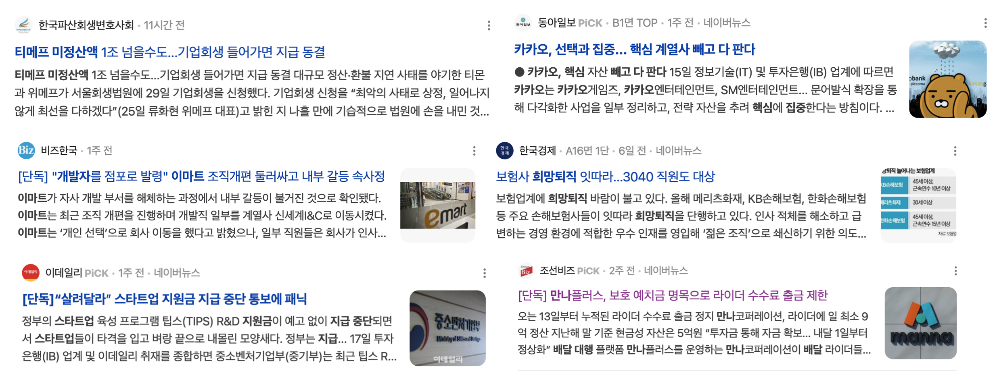

# 운이 따르는 조직

> 사내에 공유했던 글을 기록차 함께 남깁니다.

요즘 들어 부쩍 "어떻게 이렇게 타이밍이 잘 맞지" 라는 생각을 자주한다.  
  
작게는 1주일전 대표인 쭈의 이메일이 해킹 시도가 그런 경우였다.  
(실제로 해킹당한 건 아니지만) 다수의 로그인 시도가 있었고, 이미 2FA 등의 보안이 있었던 상태라 큰 문제는 아니였다.  
마침 쭈의 **이메일 해킹 공격이 있던 그 날은 이메일과 각종 계정 보안을 기존 보다 한 단계 높일 수 있는 DevOps 팀의 발표와 실습**이 있었다.  
  
최근 구글 계정 해킹 시도가 심해지고 있음을 알고 있었기에 DevOps 팀에서 빠르게 준비를 해주셨는데, 하필 그게 딱 쭈의 이메일 해킹 공격을 당한 날에 전사에 더 높은 계정 보안 방법을 공유드린게 타이밍이 참 공교롭다는 생각이 들었다.  
  
왜 지금 더 보안 레벨을 높여야하는지 **사내 전체가 공감할 수 있는 사건이 발표 당일날 발생하다보니 실습 시간의 집중력은 그 어느 때보다 높았다**.  
타사, 외부의 사례가 아니라, 실제 우리의 사례였으니 말이다.  
그래서 팀원들 전체는 갑자기 추가적으로 해야하는 일이 생겼지만, 다들 집중력있게 DevOps 팀의 가이드에 따라 보안 장치를 고도화 할 수 있었다.  
  
[경기 스타트업 캠퍼스 이사](https://www.hyungjoo.me/%ec%9d%b8%ed%94%84%eb%9e%a9-8%eb%b2%88%ec%a7%b8-%ec%82%ac%eb%ac%b4%ec%8b%a4-%ec%9d%b4%ec%82%ac-%ed%9b%84%ea%b8%b0/)도 그런 경우였다.  
원래 우리는 기존 건물에서 이사할 생각이 없었다.  
  
경기 스타트업 캠퍼스에서 넓은 공간의 사무실이 비어있다는 이야기를 들었고 입주를 잠깐 고민했지만 이사비용, 인테리어 비용 등등을 생각해보다가 하지 않았다.  
바로 다음날 기존 사무실의 계약 갱신을 하려고 하니 월세를 60% 올려달라고 했다.  
우리가 사용하는 사무실은 꽤 비싼 공간이기 때문에 계약 갱신권에 포함되지 않았고, 그러다보니 작년부터 올라간 판교 사무실 임대료를 제대로 맞게 되었다.      
  
다행히 직전에 알게 된 경기 스타트업 캠퍼스 사무실이 있었기 때문에 **큰 걱정 없이, 더 합리적인 가격과 더 넓고 좋은 곳으로 무사히 이사할 수 있었다**.  
  
만약 딱 그 시기에 경기 스타트업 캠퍼스 사무실이 없었다면, 이미 판교 전체의 월세가 50~60% 올라간 상황에서 250~300평 되는 사무실을 구하려면 많은 고생을 했을 것이다.  
판교가 아니라 아예 더 먼 경기도 지역으로 이사갈 수도 있었다.  
그렇게 어렵게 구했다고 해서, 더 멀리 구했다고 해서 더 좋은 사무실이 되리란 보장이 없다.  
  
결국 훨씬 더 먼 곳, 훨씬 더 열악한 사무실 환경을 훨씬 더 비싼 비용을 지불하고 지내면 알게 모르게 팀 전체의 생산성이 저하가 생길 수 있다.  
기존에 출퇴근하시는 분들이 더 어려움을 겪고, 채용에서도 문제가 생겼을 것이다.  
  
별일없이 지났기 때문에 이게 큰 행운이 아니라고 생각할 수 있겠지만, 이때 운이 좋다는 생각이 강하게 들었다.  
  
주변의 70인 이상의 많은 스타트업들이 사무실 문제로 골치아파하고 적정한 장소를 구하지 못해 문제가 되는 경우를 자주 봤었기 때문이다.  
근데 우리는 이런 문제를 전혀 겪지 않으면서 팀 규모에 따른 사무실 문제를 넘어갈 수 있었다.  
  
글로벌 준비도 비슷하다.
[글로벌 서비스는 회사 초기부터 계속 고려](https://www.inflearn.com/pages/why-global)가 되었지만, 이걸 언제해야하나 하는 고민이 있었다.  
AI의 엄청난 발전 속도를 보면서 모든 컨텐츠의 다국어화가 가능하겠다는 생각이 들었고, 실제로 PoC로 자막에 대한 다국어화를 진행해서 결과가 좋았다.  
  
그럼에도 **지금 글로벌로 진출하려는 것이 좋은 타이밍인가에 대한 고민**은 있었다.  
  
작년까지 한국 에듀테크 시장은 KDT (K 디지털 트레이닝) 의 영향으로 여전히 좋은 성장세를 보였기 때문이다.  

- [팀스파르타, 2024년 상반기 매출 297억 영업이익 65억… ‘창사 이래 역대 최대 실적 경신’](https://platum.kr/archives/232462)
- [구름, 23년 매출 144억원으로 전년비 61%↑…2년 연속 흑자](https://wowtale.net/2024/04/25/75744/)
- [데이원컴퍼니, 2023년 매출액 1166억원, 영업이익 11억원](https://www.ajunews.com/view/20240422083747514)

우리가 지금 글로벌 해야할때인가, KDT를 해야하는 것인가에 대한 고민도 많았다.  
글로벌 전환을 한다고 해서 당장 매출이 보장되는 것도 아니고, 성공할때까지 대단히 많은 시간이 필요하기 때문이다.  
  
그럼에도 작년 하반기부터 계속 국내 경제 상황이 쉽지 않다는 소식을 듣고, 점점 국내 경제가 악화될 수 있겠단 생각이 들었다.  
지금부터 하지 않으면 2025년에 손가락만 빨고 있어야하겠다는 두려움도 들었다.    
  
그래서 AI의 발전과 국내 시장의 악화 등을 고려해서 올해 초 부터 바로 글로벌 전환 프로젝트를 시작했다.  
  
그리고 정말 올 하반기부터 각종 국내 경제의 위험 신호가 계속 터지고 있고, 제 2의 IMF가 오는게 아니냐는 이야기도 여러 뉴스나 SNS를 통해 나오고 있다.

당장 우리가 글로벌을 한다고해서 어떤 실적이 바로 생기거나 하진 않는다.  
다만, 올해부터 도전하는 것과 내년에 도전하는 것에는 큰 차이가 있다.  
  
올해초부터 글로벌 전환 준비를 하지 못했다면, 우리는 아마 **올해 말에 시작해서 내년 말까지 준비만 하고** 있었을 것이다.  
  
그리고 1년 늦게 진행된 프로젝트는 결국 **국내 시장에 더욱 의존하게 만들어서 국내 시장 악화와 함께 회사 매출에 함께 문제가 생기고, 이 많은 인원들이 앞으로 함께 할 수 없었을지도 모른다**.  
  
이외에도 정말 많은 행운이 따라준 사건들이 많았다.  
영한님, 토비님, 루키스님, 이득우 교수님 등등 정말 좋은 지식공유자분들이 인프런을 선택해주신 것, 딱 필요한 시기에 정말 필요한 역량을 가지신 분들이 합류한 것 등등  
  
다른 회사에서는 1~2번만 발생해도 운이 좋았다고 할만한 일들이 우리에게는 유독 자주 발생했다.  
  
그런걸 보면 **지금 우리에게는 운이 따르고 있는 것 같았다**.  
  
운을 가진다는 것이 세상에서 가장 어려운 일이라고 생각한다.  
그리고 **가장 얻기 어려운 '운' 을 우리는 갖고 있으니,  
이제는 좀 더 쉬운 '노력' 만 하면 되겠구나** 싶었다.  
  
앞으로도 우리가 가는 길에는 수많은 행운들이 따라줄 것이라는 믿음이 생겨서, **이젠 이 행운을 어떻게 하면 더 크게 살릴 것인가만 고민하면 되는 것**이 좋았다.  
  
많이 노력하는 것은 다른 곳에서도 할 수 있겠지만,  
이 만큼의 행운이 또 따라줄지는 알 수 없다.  
그러니 **지금 최대한 이 행운을 등에 입고 갈 수 있는 한 가장 멀리 가보고 싶어졌다**.
다들 끝까지 이 행운을 함께 했으면 좋겠다.
