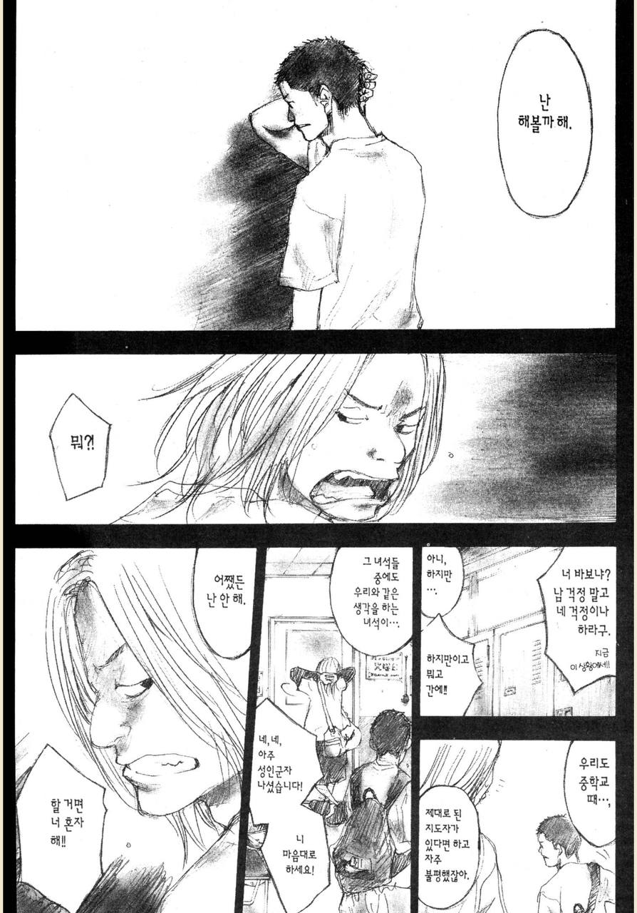
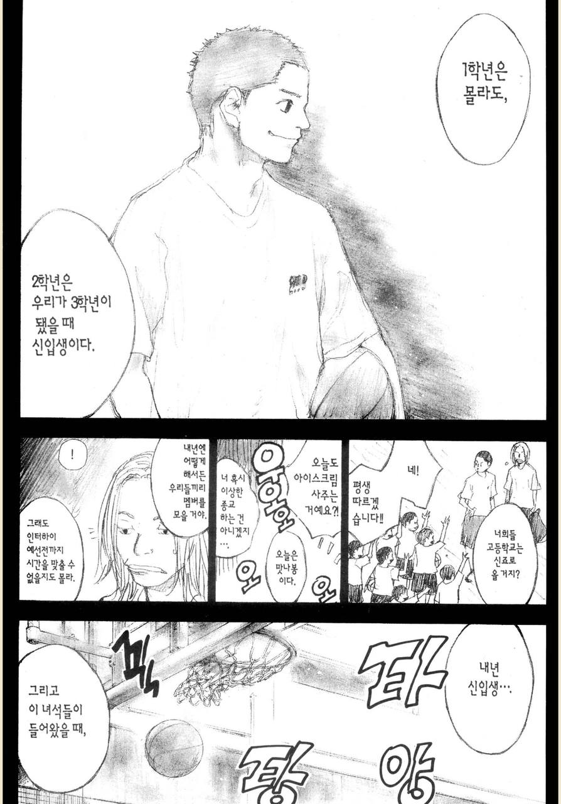
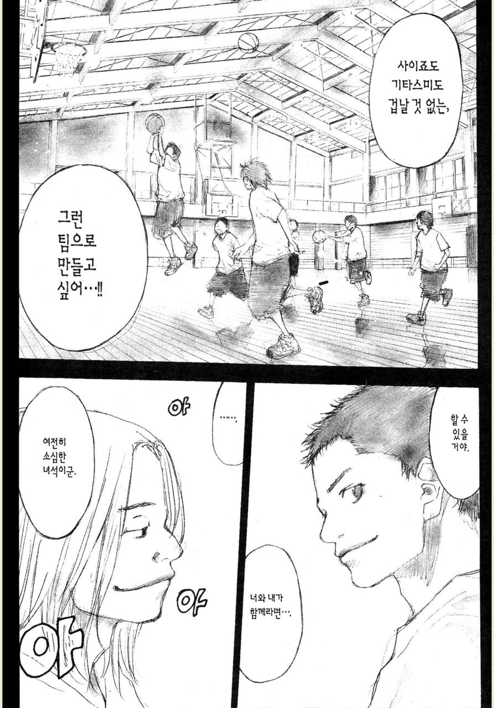
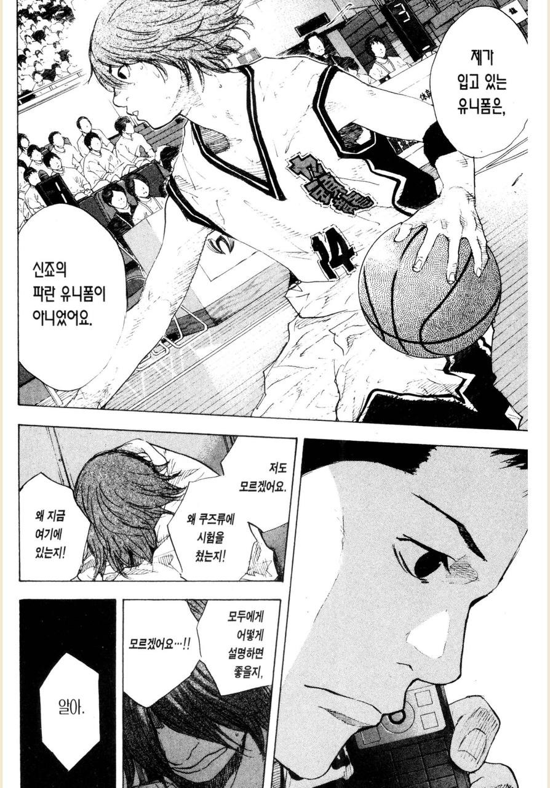

# 주니어 엔지니어 많이 채용하기

쉬는 중에 다음과 같은 링크를 공유 받았다.

- [시니어만 고용하는 것은 소프트웨어 업계에서 최악의 정책입니다](https://zaidesanton.substack.com/p/hiring-only-seniors-is-worst-policy)

글을 읽어보면 **시니어를 뽑지말아야한다는 것은 아니지만, 시니어만으로 팀을 꾸릴려고 해서는 안된다**는 이야기를 한다.  
대체적으로 내용에 꽤 공감을 했다.  
특히 "ambition, character and brains have little to do with experience." (야망, 성격, 두뇌는 경험과는 거의 관련이 없습니다.) 는 매우 공감이 갔다.
  
글을 읽다가 소라의 날개 10권에서 주인공 팀과 겨룬 [신죠 토와 고교 농구부](https://namu.wiki/w/%EB%8B%A4%EC%B9%B4%ED%95%98%EC%8B%9C%20%EC%B9%B4%EC%B8%A0%EB%AF%B8)가 생각이 많이 났다.  
신죠 토와 고교 농구부는 다카하시와 코지마 2명의 학생이 입학을 하면서 농구부가 없던 학교에 농구부를 신설하고, 부원들을 모집하면서 시작한다.   

하지만 무명 농구부에 합류할 학생들은 아무도 없었고, 매일 2명이서만 농구를 하던 중, **중학생 코치 기회가 생겼다**.  
교내에서는 농구팀에 합류할 사람들이 없으니 다카하시는 **이 중학생들이 본인의 학교에 입학을 하는 시점을 기회로 보고 가르치기 시작한다**.  

"내년 신입생, 그리고 이녀석들이 들어왔을때 사이죠도 기타스미도 겁날것 없는 그런 팀으로 만들고 싶어" 라는 이 말이 나에겐 굉장히 와닿았다.  

이 2명은 주인공은 아니지만, 그럼에도 이들이 한 선택은 **작은 팀이 할 수 있는 가장 좋은 선택지**가 아니였을까 생각해본다.  

- 팀내 경험자는 본인을 포함해서 단 둘밖에 없는 상황
- 팀에 합류할 농구 경력자는 기대할 수 없는 상황
- 그런 상황에서 인터하이라는 꿈의 무대를 목표로 하는 당사자들

그럴때 선택할 수 있는 방법은

- 지금은 경험(경력)자가 아닌 이들을 가르치고
- 이들이 충분히 성장하면서 팀을 만들어 나가는 것

물론 우여곡절도 많다.  
이렇게 가르친 중학생들 중 **가장 재능있다고 생각한 1명이 타 고등학교로 진학**한 것이다.  
그렇지만 그에 대한 아쉬움을 전혀 표현하지 않고 응원한다.

> 한동안 내 인터넷 프로필에 사용되던 짤이 이때 장면 중 하나이다.

본인들이 가르치던 중학생들 중 가장 잘했던 친구 2명은 모두 각자의 고등학교에서 1학년때부터 주전 선수급으로 활약한다.
재밌는 점은 이 학교의 농구부를 시작했던 2명인 다카하시와 코지마는 졸업후에도 **무명의 대학교에 진학하여 거기서도 제로에서 다시 시작한다**.  
  

좋은 태도와 좋은 커뮤니케이션은 사람에 따라 다른 것이지, 경력은 이를 절대 표현하는 기준이 아니였다.    
그리고 좋은 태도와 좋은 커뮤니케이션을 가진 사람들은 경력이 없어도 빠르게 성장할 수 있다.  

이제 막 사회생활을 시작한 신입 개발자,  
이제 막 19살, 20살이 된 어린 분들도 좋은 태도와 좋은 커뮤니케이션은 충분할 때가 많았다.   

  
이상하게 좋은 신입/주니어분들을 채용할 기회가 많았다.  
  
2번째 직장에서는 팀에 계신 분들이 모두 퇴사하거나 팀 이동을 해서 혼자 남게 되어서 낮은 연차임에도 면접에 들어갈 수 있었다.  
그 당시에도 네이버, 다음, 카카오, 쿠팡 등 좋은 회사가 많았기에 우리 회사, 거기에 개발자가 1명있던 우리팀에서 시니어를 뽑는 것은 거의 불가능했다.  
그래서 대부분 신입 개발자를 뽑았다.  
  
근데 희안하게 그 신입 개발자분들이 모두 좋은 분들이었다.  
그리고 시간이 지나보니 이 분들은 놀라울만큼 뛰어난 엔지니어가 되셨다.
 
- 최근 [InfoQ에서도 언급된 Building event-driven architecture for member system](https://www.infoq.com/news/2023/09/delivery-hero-uses-eda/) 을 쓰신 용근님
- 2023 우아콘에서 [대규모 트랜잭션을 처리하는 배민 주문시스템 규모에 따른 진화](https://www.youtube.com/watch?v=704qQs6KoUk) 을 발표하신 홍구님
- [네이버, 라인, 카카오 3군데를 모두 동시합격](https://www.youtube.com/watch?v=I1PQBKWQtJM) 하셨던 영재님

이후에 이직했던 3번째 회사도 마찬가지다.  
그 회사에서도 신입 엔지니어분들을 계속 채용했는데, 그 분들도 모두 좋은 분들이었다.  
태현님, 우빈님, 시영님이 팀에 합류했고, 3개월이 지난 시점부터 온전히 본인의 몫을 다하셨다.  
커뮤니케이션이나 협업, 태도 등은 합류하자마자 좋은 모습을 보여주셨다.  
  
1년이 지난 시점부터는 팀의 중요 프로젝트도 맡기기 시작했는데, 완성도 있게 프로젝트를 마무리했다.  
친절한 문서화 작업과 같이 일한 기획자들의 극찬에 가까운 평가는 물론 함께였다.    
  

우리팀의 가장 나이가 어린 엔지니어는 05년생이다.  
지금 인턴으로 일하는 2명의 엔지니어는 06년생이다.

중요한 것은 **신입, 주니어로 합류한 그 분들도 2~3년이 지나면 그토록 모셔오고 싶었던 경력 엔지니어가 된다**.  
2021년에 채용했던 만 2~3년의 주니어 개발자분들은 이제 만 5~6년 (즉, 6~7년차) 엔지니어가 되었다.  
우리 회사가 첫 회사였거나 경력이 1년이 안되서 합류했던 신입 개발자 분들도 벌써 3~4년차 엔지니어가 되었다.  
  

소프트웨어 회사에서 주니어를 채용하기 꺼려하는 가장 큰 이유는

엔지니어로서 욕심이나 태도, 커뮤니케이션은 경력과 무관했다.  
그리고 욕심과 좋은 태도, 좋은 커뮤니케이션을 가지면서 어느 분야의 일정 수준이상의 경험도 있고, 우리가 생각한 연봉 범위 내에도 있는 그런 유니크한 시니어는 거의 없다.

모든 조건을 만족하지 못한다면 그럼 무엇을 포기해야할까?  
나는 차라리 어떤 기술의 경험을 포기하더라도 좋은 태도, 좋은 커뮤니케이션을 가진 엔지니어를 뽑아야한다고 생각한다.  

